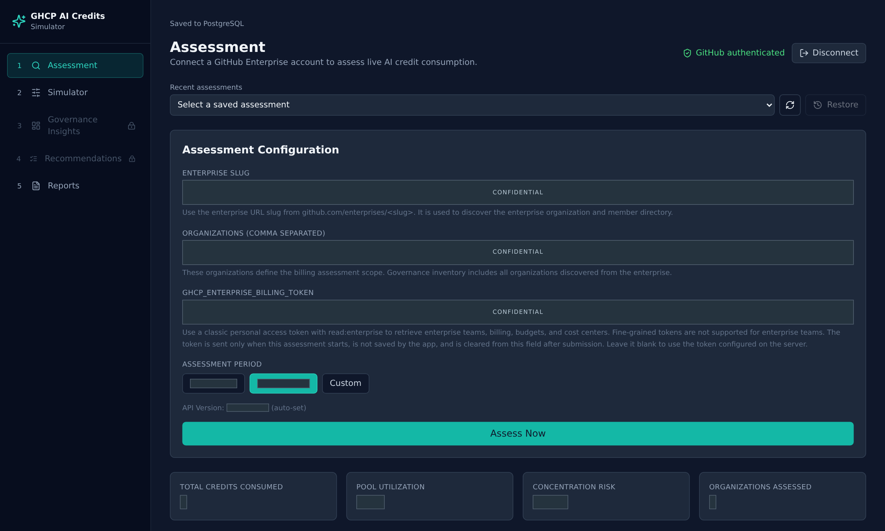
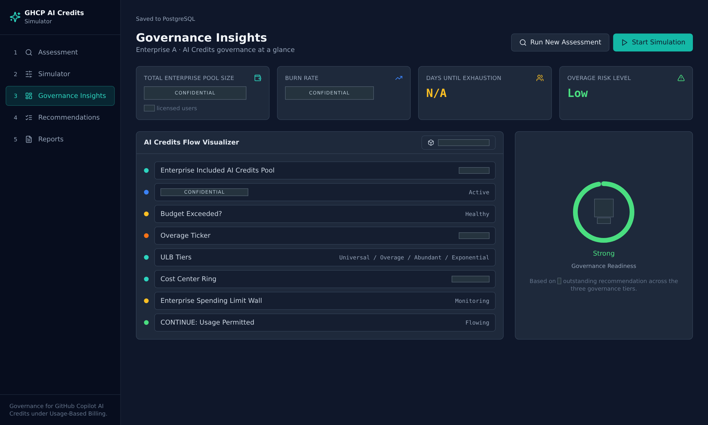
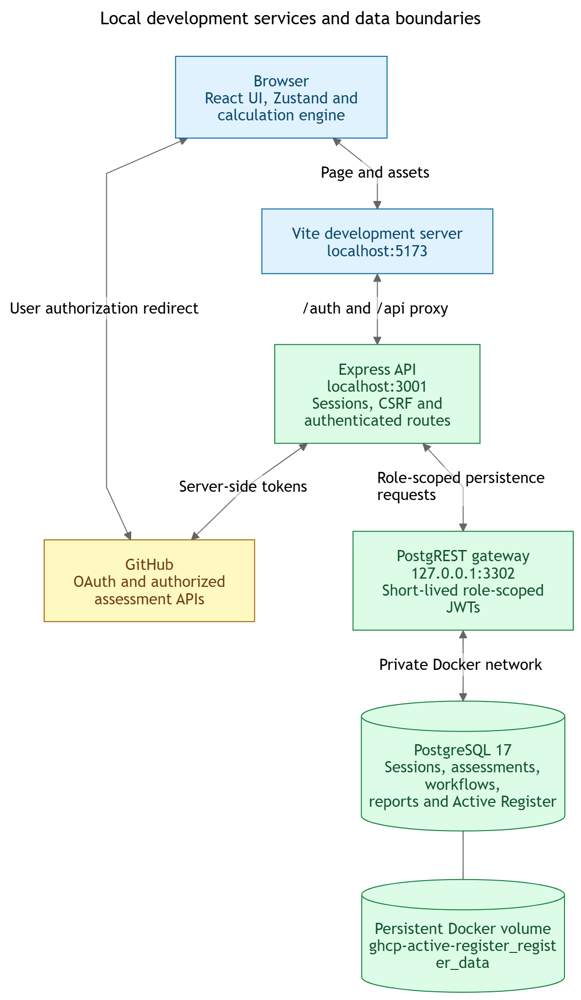
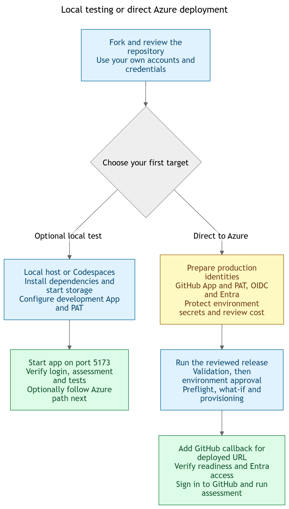

## Independent Analysis Disclaimer

This solution reflects independent analysis and opinions only. It does not
necessarily represent the views, positions, policies, or endorsements of the
author's employer, affiliated organizations, GitHub, Microsoft, or any service
provider.

The solution is based on official cloud-service and developer-platform
documentation available at publication, together with empirical examples from
the author's GitHub Enterprise Cloud development account. Capabilities,
pricing, policies, and availability may change. Verify current provider
information before making technical, operational, financial, legal, or
procurement decisions.

The solution is provided "as is," without warranties of accuracy,
merchantability, fitness for a particular purpose, non-infringement, or
availability. No liability, professional-services relationship, commitment,
endorsement, or guarantee is created, to the maximum extent permitted by law.

## Overview

The GitHub Copilot AI Credits Simulator is an assessment and planning
application for GitHub Enterprise customers managing AI Credit consumption
under usage-based billing.

[](LICENSE)
[](https://react.dev/)
[](https://www.typescriptlang.org/)
[](https://nodejs.org/)
[](https://azure.microsoft.com/products/container-apps)

The application combines live enterprise assessment, scenario modeling,
governance recommendations, interactive visualizations, and PDF reporting in a
React and Express workspace. A completed assessment establishes the context for
simulation and reporting, so downstream results remain tied to the selected
enterprise, license population, usage, budgets, and cost centers.

## Start Here

* [Run locally or in Codespaces](#choose-your-development-path)
* [Create your GitHub App](#github-app-setup)
* [Create and store the enterprise PAT](#enterprise-billing-pat-setup)
* [Deploy directly to Azure or promote after local testing](#local-first-or-direct-to-azure)
* [Validate the project](#validate-the-project) and [troubleshoot setup](#troubleshooting)

## Solution Use Notice

This repository supports planning, demonstration, and controlled evaluation.
It is not a substitute for current provider documentation, validated billing
data, security review, privacy review, legal advice, or procurement approval.

Do not use results as a guarantee of future consumption or cost. Validate API
behavior, pricing, calculations, governance controls, identity boundaries, and
operational requirements before using the solution with production data.

Never place real enterprise credentials in an untrusted fork, source file,
issue, pull request, chat transcript, or shared development environment. This
notice complements, and does not replace, the warranty and liability terms in
the [MIT License](LICENSE).

## Application Preview

| Assessment | Governance Insights |
| ---------- | ------------------- |
| [](docs/showcase/screenshots/01-assessment-overview.png) | [](docs/showcase/screenshots/09-governance-insights.png) |

Open either image at full size to inspect the interface. These existing captures
use pseudonymous identities and opaque redactions, not sample credentials.
Planning indicators are not proof of provider enforcement. See the
[capture manifest](docs/showcase/capture-manifest.json) for their provenance.

Begin with Assessment, then configure Simulator inputs. Governance Insights,
Recommendations, and Reports depend on the workflow state and available data;
they are not all populated on a fresh installation.

## Capabilities

| Area | Capability |
| ---- | ---------- |
| Assessment | Retrieves authenticated GitHub billing, budget, cost-center, organization, team, and license data available to the connected identity |
| Simulator | Models license pools, user populations, AI Credit burn rates, exhaustion points, and what-if scenarios |
| Governance insights | Summarizes projected credit posture, overage exposure, population, and governance readiness |
| Visualization | Presents AI Credit flow through charts, a 3D React Three Fiber scene, and a 2D fallback |
| Recommendations | Produces governance actions from assessed and simulated conditions |
| Reporting | Previews and generates a downloadable executive PDF report |
| Active Register | Persists governed records, revisions, evidence, decisions, and role-scoped access |

## Architecture

The repository is an npm workspace with separate client, server, and shared
packages. The Vite development server proxies `/auth` and `/api` requests to
Express. PostgreSQL stores sessions, assessments, workflows, allocation plans,
reports, and Active Register history.

<!-- markdownlint-disable-next-line MD033 -->
<details>
<!-- markdownlint-disable-next-line MD033 -->
<summary>Local services and data boundaries</summary>



[Open the full PNG](docs/images/local-architecture.png) or
[edit the Mermaid source](docs/diagrams/architecture-flowchart.mmd).

</details>

The browser uses port `5173`; Vite proxies `/auth` and `/api` to port `3001`.
Keep Express and the loopback PostgREST gateway private. The named Docker volume
persists data across restarts; deleting it is not a normal setup or reset step.

| Layer | Technologies |
| ----- | ------------ |
| Client | React 18, TypeScript, Vite, React Router, Tailwind CSS |
| State and validation | Zustand, React Hook Form, Zod |
| Visualization | Recharts, React Three Fiber, Drei, Three.js, Framer Motion |
| Server | Node.js, Express, TypeScript |
| Integration | Axios, GitHub OAuth, GitHub billing APIs |
| Persistence | PostgreSQL 17 and PostgREST |
| Reporting | React PDF Renderer |
| Security | Microsoft Entra admission, GitHub OAuth, CSRF protection, rate limiting, encrypted tokens, and managed identities |
| Azure runtime | Container Apps, Container Registry, Key Vault, Log Analytics, and private networking |

The production topology is defined in Bicep under `infra/`. The protected
GitHub Actions workflow validates the release, authenticates to Azure with
OpenID Connect, performs subscription preflight and what-if, deploys the
foundation, runs migrations, verifies internal admission, and then enables
public ingress.

## Prerequisites

### Required Tools

| Tool or access | Purpose |
| -------------- | ------- |
| GitHub account | Clone the repository and authorize the application |
| Git | Manage branches and changes |
| Node.js 22 and npm | Match the checked-in development and CI toolchain |
| npm | Install and run workspace packages |
| Docker with Compose | Run local PostgreSQL and build production images |
| Modern browser | Use the React interface and WebGL visualization |
| VS Code | Use the configured development container and MCP integrations |
| GitHub OAuth application credentials | Authenticate assessment users |
| GitHub Enterprise access | Read the enterprise data allowed to the connected identity |
| Azure subscription | Use the protected production deployment path |

### Permissions

The connected GitHub user must hold the roles required by each billing or
governance endpoint. GitHub App permissions do not expand the user's existing
enterprise or organization authority.

Production deployment also requires a protected GitHub environment, an Azure
OIDC service principal, least-privilege Azure RBAC, and a Microsoft Entra
admission application. See the [Azure deployment guide](docs/azure-deployment.md)
for the complete trust and configuration model.

## Choose Your Development Path



[Open the full PNG](docs/images/onboarding-flowchart.png) or
[edit the Mermaid source](docs/diagrams/onboarding-flowchart.mmd).

| Path | Typical setup | Best for |
| ---- | ------------- | -------- |
| GitHub Codespaces | 5-10 minutes | A repository-managed Node.js, Docker, Azure CLI, and VS Code environment |
| Local VS Code | 10-20 minutes | Developers with Node.js, npm, Git, Docker, and VS Code installed |
| Production deployment | Environment-specific | Reviewed releases through the protected GitHub Actions workflow |

### GitHub Codespaces

1. Open the repository in a Codespace.
2. Wait for the Dev Container setup to finish.
3. Configure the four required Codespaces secrets described in
  [Store Credentials For Your Target](#store-credentials-for-your-target).
4. Open forwarded port `5173` in a browser authorized to access the Codespace.
  Keep ports `3001` and `3302` private. Change `5173` to public only if your
  approved test setup requires it, and restore its visibility after testing.
5. Start PostgreSQL and the application.

```bash
npm run register:db:up
npm run dev
```

The application is available from the forwarded port `5173` URL. The server
derives the Codespaces origin and callback URL from the Codespaces environment.

### Local VS Code

```bash
git clone https://github.com/autocloudarc-digital-services/ghcp-ai-credits-simulator.git
cd ghcp-ai-credits-simulator
npm clean-install
npm run register:db:up
```

For live assessment, complete [GitHub App Setup](#github-app-setup) and
[Enterprise Billing PAT Setup](#enterprise-billing-pat-setup), then use
[Load Local Credentials](#load-local-credentials) before running `npm run dev`.
The server does not automatically load `.env` files; copying
[.env.example](.env.example) is not sufficient.

You can run `npm run dev` without GitHub credentials to check startup, liveness,
and storage readiness. Live assessment will not work, and downstream workspaces
remain gated until their prerequisites are completed. This is not a seeded demo.

Open <http://localhost:5173>. Configure the GitHub App callback as
`http://localhost:5173/auth/github/callback`.

## GitHub App Setup

Each operator creates their own GitHub App and credentials. Cloning this public
repository does not grant access to the author's app, enterprise, or Azure
subscription. Use separate app registrations and PATs for development and
production so a development credential cannot be reused against production.

### Choose The Owner And Callback

1. Choose the organization that will own the app. An organization owner or an
  authorized GitHub App manager must register it. A personal-account app is
  also possible, but it must permit installation on the target organizations.
2. Choose a globally unique name of no more than 34 characters, such as
  `acme-ai-credits-dev` or `acme-ai-credits-prod`. Replace `acme` with your own
  short identifier; do not reuse the example name unchanged.
3. Record the enterprise slug from `https://github.com/enterprises/ENTERPRISE`.
  This is not necessarily the organization slug or the enterprise display name.
4. Select the callback for your deployment from the table below.

| Target | Homepage URL | GitHub App callback URL |
| ------ | ------------ | ----------------------- |
| Local testing | Your fork's repository URL | `http://localhost:5173/auth/github/callback` |
| Codespaces | Your fork's repository URL | `https://CODESPACE-NAME-5173.FORWARDING-DOMAIN/auth/github/callback` |
| Azure | Your fork's repository URL, or the deployed HTTPS origin | `https://CONTAINER-APP-FQDN/auth/github/callback` |

For Codespaces, obtain the exact callback in its terminal:

```bash
printf 'https://%s-5173.%s/auth/github/callback\n' \
  "${CODESPACE_NAME}" "${GITHUB_CODESPACES_PORT_FORWARDING_DOMAIN}"
```

Replace all uppercase placeholders. Callback URLs must match the browser
origin and the exact `/auth/github/callback` path, with no wildcard, query,
fragment, or trailing slash. Do not use port `3001` as the browser callback.
GitHub permits multiple callbacks; remove obsolete Codespaces callbacks.

For direct-to-Azure deployment, you can create the app and obtain its client
credentials before the Container Apps hostname exists. Leave the callback empty
until the hostname is available, then add the exact HTTPS callback before the
first GitHub sign-in. Do not invent a hostname or leave a localhost callback on
the production registration. The deployment workflow updates the Microsoft
Entra callback, not this GitHub App callback.

### Register The App

1. In GitHub, open your organization's **Settings > Developer settings > GitHub
  Apps > New GitHub App**. For a personal app, use your own **Settings >
  Developer settings > GitHub Apps > New GitHub App** instead of **OAuth Apps**.
2. Enter the app name, homepage URL, and callback chosen above. Use a description
  such as `Enterprise AI Credit assessment and governance planning`.
3. Apply these settings, then configure the permissions in the next table.

| Setting | Value for this application |
| ------- | -------------------------- |
| Expire user authorization tokens | Enabled; the server supports refresh tokens |
| Request user authorization (OAuth) during installation | Disabled; start authorization from the running application so OAuth state and PKCE are present |
| Enable Device Flow | Disabled; this server uses the browser authorization-code flow |
| Setup URL | Empty |
| Redirect on update | Disabled |
| Webhook Active | Disabled; there is no webhook receiver |
| Webhook URL and secret | Empty when webhooks are disabled |
| Subscribe to events | None |
| Where can this GitHub App be installed? | Only on this account for a single owning organization; Any account only when installation into other organizations is necessary and approved |

| Permission category | Permission | Access | Purpose |
| ------------------- | ---------- | ------ | ------- |
| Organization | Members | Read-only | Organization member and team inventory |
| Organization | Administration | Read-only | Organization configuration visible to the authorized user |
| Organization | GitHub Copilot Business | Read-only | Copilot subscription and seat information where the endpoint supports GitHub App user tokens |
| Repository | Metadata | Read-only if GitHub adds it automatically | Basic installation metadata; no repository source access is needed |
| All other permissions | Unused permissions | No access | Do not grant Contents, Actions, Secrets, or write permissions for assessment |

UI labels and endpoint support can change. Check the current
[GitHub App registration guide](https://docs.github.com/en/apps/creating-github-apps/registering-a-github-app/registering-a-github-app)
and [Copilot API requirements](https://docs.github.com/en/rest/copilot/copilot-user-management).
App permissions do not override the signed-in user's roles. Organization
Copilot billing requires an organization owner; enterprise ownership alone does
not make that user an organization owner or member. Some enterprise APIs do not
accept GitHub App tokens, which is why the separate PAT is required.

### Install And Collect Credentials

1. Select **Create GitHub App**. On its settings page, record the **Client ID**,
  not the numeric **App ID** or an installation ID.
2. Under **Client secrets**, select **Generate a new client secret**. Put the
  value immediately in your approved secret manager. Never include it in a
  screenshot, configuration JSON, commit, issue, or chat.
3. Open **Install App**, choose each target organization, review the permissions,
  and select **Install**. An organization owner may need to approve the request.
  Restrict repository selection to the minimum allowed by the installation
  screen; this app does not need repository contents or write access.
4. If you later change permissions, have each installation owner approve the
  updated permissions, then sign out of the application and authorize again.
5. Configure the runtime values below and start the application. Initiate login
  from the application, not by navigating directly to the callback URL.

### Authentication And Certificate Properties

The server uses OAuth authorization code with PKCE (`S256`), a random state
value, and a confidential client secret. It stores the resulting user session
on the server. GitHub App permissions are configured on the registration, not
by entering classic PAT scopes in the OAuth login form.

| Credential or property | Required here? | Configuration |
| ---------------------- | -------------- | ------------- |
| OAuth Client ID | Yes | Nonsecret identifier from the GitHub App |
| OAuth Client secret | Yes | Server-side secret from the same GitHub App |
| App private key / PEM | No | Used for app JWT or installation-token authentication, which this runtime does not implement |
| X.509 certificate, subject, SAN, issuer, thumbprint, validity | No | Not applicable to this GitHub user-OAuth integration |
| HTTPS server certificate | Azure and Codespaces | Platform-managed TLS for the application URL; not a GitHub App signing credential |
| Session secret | Yes for production; generated locally when unset | Independent random value of at least 32 characters; preserve it between restarts |

This server uses the OAuth client ID and client secret, not an app private key
or X.509 certificate. Do not generate or upload a self-signed certificate to
make GitHub login work. If a manifest registration flow generates a PEM key,
do not copy it into this application's environment. Microsoft Entra admission
and GitHub Actions OIDC are separate Azure identities, not replacements for
these GitHub App credentials.

## Enterprise Billing PAT Setup

The server uses an additional **personal access token (classic)** for the
enterprise billing, cost-center, budget, seat, and enterprise-team requests
implemented in the billing service. It is not the user's login credential, the
repository `GITHUB_TOKEN`, an Azure credential, or an installation access token.

### Create The Token

1. Sign in as the approved GitHub user who can access the target enterprise's
  billing data and required enterprise inventory. Confirm the user's actual
  roles with the enterprise owner before generating the token. A token cannot
  grant a role its owner does not already possess.
2. Open your personal **Settings > Developer settings > Personal access tokens >
  Tokens (classic) > Generate new token > Generate new token (classic)**.
  Complete GitHub's reauthentication or MFA prompt when requested.
3. Set **Note** to a recognizable purpose and environment, for example
  `acme-ai-credits-dev-billing`. Record the owner and target enterprise in your
  internal credential inventory, not in a public issue.
4. Set **Expiration** to a short, policy-approved lifetime, for example 30 days
  for initial testing or a shorter organizational maximum. Do not choose
  **No expiration**. Schedule rotation before this date.
5. Select the scopes below. Do not select the broad parent `admin:enterprise`,
  `repo`, `workflow`, or `admin:org` merely to make a failing request succeed.
6. Select **Generate token** and store the one-time displayed value in your
  secret manager. If it is lost, create a replacement and revoke the old token.
7. If SAML SSO applies, use **Configure SSO > Authorize** for the relevant
  organizations. If that option is missing, sign in through the organization's
  identity provider first. Respect enterprise PAT, IP allow-list, and lifetime
  policies; do not bypass a policy that disallows classic tokens.

| Classic PAT scope | Why this implementation uses it |
| ----------------- | ------------------------------- |
| `manage_billing:enterprise` | Enterprise billing usage, budgets, and cost centers |
| `read:enterprise` | Enterprise teams, memberships, organization assignments, and enterprise Copilot seat inventory |

Do not add `manage_billing:copilot` by default: the enterprise seat reader can
use `read:enterprise`. This shared PAT is not an automatic fallback for every
organization API failure. Check the failed endpoint and the signed-in user's
GitHub App authorization before changing scopes.

> [!WARNING]
> `manage_billing:enterprise` is broader than read-only reporting even though
> this service uses it for GET requests. A classic PAT is not constrained to the
> enterprise named in the app's form. Limit the owner's authority, use a
> separate token per environment, and restrict access to the deployed service.

The [enterprise-team API](https://docs.github.com/en/rest/enterprise-teams/enterprise-teams)
explicitly requires classic tokens. A fine-grained token is not a drop-in
replacement for this implementation's complete enterprise assessment. If policy
forbids the required token type or authority, stop and review the integration
rather than broadening access. See
[GitHub's PAT creation and SSO guidance](https://docs.github.com/en/authentication/keeping-your-account-and-data-secure/managing-your-personal-access-tokens).

### Store Credentials For Your Target

| Value | Local process environment | Codespaces secret | Protected Azure `production` environment |
| ----- | ------------------------- | ----------------- | ---------------------------------------- |
| GitHub App Client ID | `GITHUB_APP_CLIENT_ID` | `GHCP_APP_CLIENT_ID` | Variable `GH_APP_CLIENT_ID` |
| GitHub App Client secret | `GITHUB_APP_CLIENT_SECRET` | `GHCP_APP_CLIENT_SECRET` | Secret `GH_APP_CLIENT_SECRET` |
| Classic enterprise PAT | `GHCP_ENTERPRISE_BILLING_TOKEN` | `GHCP_ENTERPRISE_BILLING_TOKEN` | Secret `GH_ENTERPRISE_BILLING_TOKEN` |
| Session secret | `SESSION_SECRET` | `GHCP_SESSION_SECRET` | Secret `SESSION_SECRET` |

For Codespaces, use **Repository Settings > Secrets and variables > Codespaces**
or account-level Codespaces secrets restricted to your fork. Restart the
Codespace after updating values. GitHub Actions secrets are not automatically
available in Codespaces, and the injected Codespaces `GITHUB_TOKEN` does not
replace the enterprise PAT.

For Azure, use **Repository Settings > Environments > production** in your own
fork. Add the Client ID under **Environment variables** and the other values
under **Environment secrets**. The workflow maps these names into Key Vault
and the server's runtime environment. Use production credentials, not your
development app's secret or PAT. Azure also needs the other identity, database,
and access-control settings in the
[deployment guide](docs/azure-deployment.md#github-production-environment).

### Load Local Credentials

Use an approved secret manager to inject the environment where available. For
a short local test, the following commands run in **Bash** and prompt without
echoing secrets or putting their literal values in shell history. In a zsh or
PowerShell terminal, start `bash` first and keep `npm run dev` in that shell.
Do not run with shell tracing (`set -x`) or in a recorded/shared terminal.

```bash
read -r -p 'GitHub App Client ID: ' GITHUB_APP_CLIENT_ID
read -r -s -p 'GitHub App Client secret: ' GITHUB_APP_CLIENT_SECRET; printf '\n'
read -r -s -p 'Enterprise billing PAT: ' GHCP_ENTERPRISE_BILLING_TOKEN; printf '\n'
export GITHUB_APP_CLIENT_ID GITHUB_APP_CLIENT_SECRET GHCP_ENTERPRISE_BILLING_TOKEN
export CLIENT_ORIGIN='http://localhost:5173'
export CALLBACK_URL='http://localhost:5173/auth/github/callback'
npm run dev
```

In development, leaving `SESSION_SECRET` unset lets the server create and reuse
its local secret. Do not delete it while retaining encrypted persisted data.
For production or Codespaces, generate a separate persistent value with
`openssl rand -hex 32` in a trusted, unrecorded terminal and store it in the
secret location above. Do not regenerate it on each application start.

### Validate Login And Enterprise Access

1. With both development processes running, verify
  <http://localhost:3001/healthz> and <http://localhost:3001/readyz> return HTTP
  `200`. Readiness checks storage, not GitHub permissions. In Azure, use these
  paths on the deployed HTTPS origin instead.
2. Open <http://localhost:5173> locally, or the forwarded/deployed origin. In
  Azure, first sign in through Microsoft Entra with an assigned group member.
3. Start GitHub login from the application, check the app name and requested
  permissions on GitHub, authorize, and confirm you return to the same origin.
  A callback visited directly fails state validation by design.
4. Enter your exact enterprise slug and run assessment. Inspect usage, budgets,
  cost centers, organizations, and teams. Resolve reported permission or
  endpoint errors; an empty result is not proof of successful authorization.
5. Verify access with your intended user roles. Active Register access remains
  deny-by-default until an operator maps verified numeric GitHub IDs to a
  tenant and role using the [Active Register guide](docs/active-register.md).

### Rotate Or Revoke Credentials

Create a replacement before the PAT expires, repeat any required SSO
authorization, update the same secret name, restart development or redeploy
through the protected production workflow, and repeat the assessment checks.
After the replacement works, revoke the old PAT. Follow the same overlap and
validation process for GitHub App client secrets. Do not rotate `SESSION_SECRET`
as routine PAT maintenance: it protects sessions and encrypted persisted data.

For suspected disclosure, revoke the affected credential immediately, replace
it, and review access logs. Keep the public JSON configuration free of tokens,
client secrets, PEM data, and private enterprise information.

## Declarative Configuration References

Use these separate, nonsecret JSON specifications to record and review the
settings before repeating setup in another environment:

* [GitHub App configuration](docs/configuration/github-app.json): name, ownership,
  authentication method, permissions, callbacks, certificate applicability, and
  credential destinations
* [Enterprise PAT configuration](docs/configuration/enterprise-billing-pat.json):
  token type, owner prerequisites, scopes, lifetime, SSO, rotation, and secret names

Replace the `YOUR-*` placeholders in your own private configuration inventory.
These files are declarative checklists, not executable API payloads, and this
application does not load them at startup. No client secret or PAT value belongs
in them. GitHub requires the PAT owner to create and approve their token; there
is no supported general-purpose API here for unattended classic PAT creation.

For a future app-registration automation, GitHub supports an
[owner-approved manifest flow](https://docs.github.com/en/apps/sharing-github-apps/registering-a-github-app-from-a-manifest).
An automation must translate the app specification into GitHub's native manifest
fields, provide a separate registration callback with state validation, and
exchange its temporary code within one hour. This repository does not implement
that registration service. Do not send a manifest conversion code to the
application's `/auth/github/callback`: that endpoint handles user login only.
Use the explicit manual instructions above for the supported first-run path.

## Validate The Project

Run validation from the repository root:

```bash
npm clean-install
npm run build
npm run lint --workspace=client
npm run runtime:test
npm run register:test
```

Run persistence integration tests with PostgreSQL available:

```bash
npm run register:db:up
npm run persistence:test
```

Build the production application and migration images locally:

```bash
npm run container:build
```

## Production Deployment

Production deployment is available through the manually dispatched **Azure
production deployment** workflow. The workflow requires an approved release
commit, the protected `production` environment, a current monthly estimate, and
an exact acknowledgement of the approved public-retail ceiling.

> [!CAUTION]
> The workflow performs Azure what-if and then continues to provisioning in the
> same approved job. Review the commit, configuration, expected cost, and
> environment approval before selecting **Approve and deploy**.

The approved topology uses Azure Container Apps, PostgreSQL Flexible Server,
Container Registry, Key Vault, managed identities, private networking, and Log
Analytics. Deployment occurs in stages so authentication and internal ingress
are verified before public ingress is enabled.

Use the [Azure production deployment guide](docs/azure-deployment.md) for
identity setup, environment variables, secrets, cost controls, preflight gates,
deployment steps, and recovery guidance.

### Local First Or Direct To Azure

Local testing is optional. Both paths converge on the same protected workflow;
neither copies your local database or development credentials to Azure.

1. Fork the repository into an account you control. Enable GitHub Actions in
  that fork and review the code and deployment workflow before providing secrets.
2. For local-first testing, follow the local setup above, validate GitHub login
  and assessment, and run the relevant build and persistence tests. For
  direct-to-Azure setup, skip this step; GitHub-hosted runners perform release
  validation and build the images without a local Node.js or Docker install.
3. Create a separate production GitHub App and PAT using this README. Obtain
  the client credentials now; add the generated Azure callback after deployment
  if the hostname is not known yet.
4. Have your Azure and directory administrators configure the deployment OIDC
  identity and the separate single-tenant Entra admission app, assigned security
  group, Graph consent, and subscription RBAC from the
  [identity prerequisites](docs/azure-deployment.md#authority-prerequisites).
  Federation must match your fork and `production` environment, including any
  organization-specific OIDC subject customization. Do not reuse this
  repository owner's IDs or weaken admission to work around a failed preflight.
5. Create the GitHub environment named `production`. Configure a required
  reviewer and restrict deployment to your reviewed release branch. Enter every
  [environment variable and secret](docs/azure-deployment.md#github-production-environment),
  including your own unique resource names, nonoverlapping CIDRs, digest-pinned
  PostgREST image, and verified GitHub numeric-ID access mapping. The baseline
  currently requires `eastus2`; region and capacity changes need code and cost
  review, not just a different variable value.
6. Recheck regional capacity, policy, budget authority, current pricing, and
  organizational approval. In **Actions > Azure production deployment > Run
  workflow**, choose the reviewed release branch and provide the inputs below.
7. Wait for **Validate release candidate** to pass. Open **Review deployments**,
  select `production`, review the commit, settings, estimate, and change reason,
  then select **Approve and deploy** as an authorized reviewer.
8. Monitor preflight, what-if, provisioning, image publication, migrations,
  internal admission verification, and public readiness. What-if runs after
  environment approval; there is no second automatic approval pause before
  provisioning. Do not bypass a failed gate with a direct Bicep deployment.
9. Open the `production` environment URL from the successful run. In your
  production GitHub App settings, add this exact origin followed by
  `/auth/github/callback`. The Entra callback ends in
  `/.auth/login/aad/callback` and is managed separately by the workflow.
10. Verify `/healthz` and `/readyz`, Entra admission, GitHub login, live
   assessment, and the intended tenant-role access. Test that an unassigned
   Entra user is denied. A green deployment checks infrastructure and storage;
   it does not prove GitHub billing permissions or your complete user workflow.

| Workflow input | Value |
| -------------- | ----- |
| `approved_public_retail_ceiling_usd` | Exactly `209.51`, only after accepting the checked-in baseline's ceiling |
| `verified_monthly_estimate_usd` | Your current verified USD estimate, greater than zero and no more than `209.51` |
| `change_reason` | An auditable reason for this release |

If your real estimate exceeds the ceiling, obtain a revised design and approval;
do not enter an artificially lower amount. Record the accepted commit, image
digests, settings inventory, credential owners and expiry dates, and validation
outcome for subsequent releases. For an interrupted run, correct the failed
prerequisite and rerun the reviewed commit; do not delete the resource group or
local database volume as a recovery shortcut. See
[Interrupted Deployments](docs/azure-deployment.md#interrupted-deployments).

## Useful Commands

| Task | Command |
| ---- | ------- |
| Start client and server | `npm run dev` |
| Build all workspaces | `npm run build` |
| Lint the client | `npm run lint --workspace=client` |
| Run runtime tests | `npm run runtime:test` |
| Build production images | `npm run container:build` |
| Start local PostgreSQL | `npm run register:db:up` |
| Apply database migrations | `npm run register:db:migrate` |
| Check database status | `npm run register:db:status` |
| Test the Active Register | `npm run register:test` |
| Check the Active Register | `npm run register:check` |
| Back up PostgreSQL | `npm run register:db:backup` |
| Verify database recovery | `npm run register:db:verify-recovery` |
| Run persistence integration tests | `npm run persistence:test` |
| Check repository status | `git status --short --branch` |

## Project Layout

```text
ghcp-ai-credits-simulator/
  client/                         React and Vite application
    src/
      components/                 Assessment, dashboard, simulator, and report UI
      engine/                     AI Credit calculation engine
      pages/                      Application routes
      store/                      Zustand workflow state
  server/                         Express and TypeScript API
    src/
      middleware/                 Security and request middleware
      persistence/                PostgreSQL persistence services
      register/                   Active Register access and history
      routes/                     Authentication, assessment, and report routes
      services/                   GitHub integration and domain services
  shared/                         Shared contracts and governance data
  infra/                          Subscription and workload Bicep modules
  scripts/                        Runtime, persistence, and deployment checks
  docs/                           Architecture, governance, deployment, and operations
  .github/workflows/              Protected production deployment workflow
  compose.register.yaml           Local PostgreSQL and PostgREST services
  Dockerfile                      Application and migration image targets
```

## Key Documentation

* [Azure production deployment](docs/azure-deployment.md)
* [Contributor guide](docs/contributor-guide.md)
* [Active Register](docs/active-register.md)
* [Governance budget controls](docs/governance-budget-controls.md)
* [Internal implementation guide](docs/implementation-guide-internal.md)
* [External implementation guide](docs/implementation-guide-external.md)
* [Architecture diagrams](docs/diagrams/index.md)
* [Naming standards](docs/naming-standards/naming-standards.md)

## Current Limitations

* GitHub endpoint availability depends on the target enterprise plan, billing
  platform, token scopes, app permissions, and the connected user's roles.
* Provider APIs may return partial data or hide inaccessible resources with a
  `404` response.
* Simulations and recommendations are planning outputs, not provider forecasts,
  invoices, approvals, certifications, or policy enforcement results.
* The 3D visualization requires WebGL; the application provides a 2D fallback.
* Production deployment assumptions and public pricing require revalidation
  before each release.

## Troubleshooting

| Symptom | Check |
| ------- | ----- |
| OAuth returns to the wrong host or port | Match the GitHub App callback to `CALLBACK_URL` and the browser origin |
| Login returns `503` or says OAuth is not configured | Export both App credential values before starting the server; the server does not load `.env` automatically |
| GitHub rejects the client credentials | Use the Client ID, not App ID; confirm the secret belongs to that registration and has not been revoked |
| Invalid or missing OAuth state | Restart login from the application in the same browser; do not open the callback directly or initiate OAuth during app installation |
| PAT-backed endpoints return `401` | Replace an expired or revoked PAT, update the secret, then restart development or redeploy production |
| Assessment endpoints return `403` | Check which credential the endpoint uses, the user's role, app installation/permissions, PAT scopes, SSO, IP policy, and rate limits |
| Enterprise endpoints return `404` | Verify the enterprise slug and whether the token can view the resource |
| Azure readiness passes but GitHub login fails | Add the deployed `/auth/github/callback` URL to the production GitHub App; Entra's callback is different |
| Codespaces uses stale credentials | Check the `GHCP_*` Codespaces secret names and restart; Actions secrets and `GITHUB_TOKEN` are not substitutes |
| Port `5173` returns an empty response in Codespaces | Confirm both development processes are running and your browser is authorized to access the forwarded port |
| PostgreSQL-backed tests fail | Start Docker and run `npm run register:db:up` |
| Active Register returns `403` after successful login | Verify the numeric GitHub ID, tenant, and role mapping; GitHub login alone does not grant register access |
| The 3D view is unavailable | Enable WebGL or use the 2D fallback |

## Contributing

Focused contributions to calculations, accessibility, integrations,
documentation, governance controls, and deployment safety are welcome. Review
the [Contributor Guide](docs/contributor-guide.md) before opening a pull request.

Run the relevant build, lint, and test commands for code changes. For
Markdown-only changes, run `git diff --check` and a Markdown linter when one is
available.

## License

[MIT](LICENSE)
