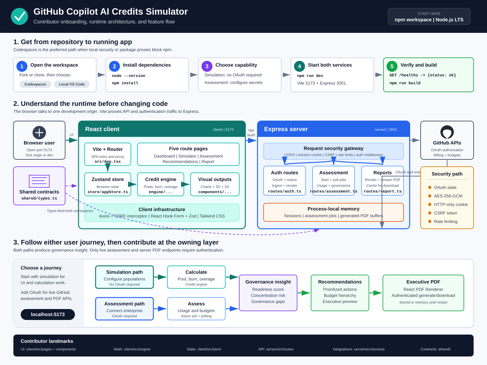
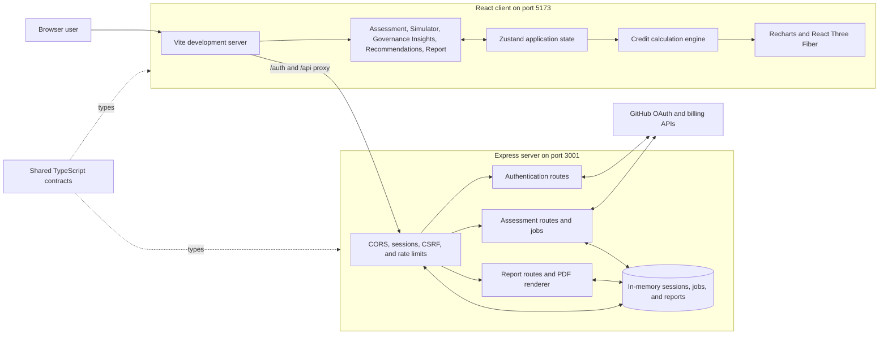

## Overview

The GitHub Copilot AI Credits Simulator is a self-service assessment and planning application for GitHub Enterprise customers.
It is focused on managing GitHub Copilot AI Credits under usage-based billing. It combines live enterprise assessment, scenario modeling, simulation, governance recommendations, and PDF reporting in one React and Express workspace.

[](LICENSE)
[](https://react.dev/)
[](https://www.typescriptlang.org/)
[](https://nodejs.org/)

The application follows one assessment-led workflow. Every user connects
through GitHub OAuth and completes a live enterprise assessment before the
simulator, governance insights, recommendations, or report become available.
Each operation unlocks the next step so downstream output always has the
required assessed and modeled context.

The resulting state drives tailored recommendations, a governance-readiness score, interactive charts, a 3D AI Credit flow visualization,
and an executive PDF report.



> [!IMPORTANT]
> This repository is a planning and demonstration tool. Validate calculations,
> GitHub API behavior, security controls, privacy requirements, and governance
> recommendations before using the results for production financial decisions.
> Do not use real enterprise credentials in an untrusted fork or shared
> development environment.

## Application Capabilities

| Area | Capability |
| --- | --- |
| Assessment | Retrieves authenticated GitHub billing, budget, and cost-center data for an enterprise |
| Simulator | Models license pools, user populations, burn rates based on what-if scenarios |
| Governance Insights | Summarizes projected credit posture, overage, population, and governance readiness |
| Visualization | Shows AI Credit flow through an interactive React Three Fiber scene with a 2D fallback |
| Recommendations | Produces governance actions based on simulated and assessed conditions |
| Report | Previews and generates a downloadable PDF executive report |

## Architecture

The repository is an npm workspace with separate client, server, and shared
packages. The Vite development server proxies `/auth` and `/api` requests to
Express, so the browser uses one origin during local and Codespaces development.



### Technology Stack

| Layer | Technologies |
| --- | --- |
| Client | React 18, TypeScript, Vite, React Router, Tailwind CSS |
| State and validation | Zustand, React Hook Form, Zod |
| Visualization | Recharts, React Three Fiber, Drei, Three.js, Framer Motion |
| Server | Node.js, Express, TypeScript |
| Integration | Axios, GitHub OAuth, GitHub billing APIs |
| Reporting | React PDF Renderer |
| Security | Express Session, Lusca CSRF protection, Express Rate Limit, AES-256-GCM token encryption |

## Prerequisites

### Required Tools

| Requirement | Purpose |
| --- | --- |
| GitHub account | Clone or fork the repository and create a Codespace |
| Git | Clone, branch, and preserve changes |
| Node.js 20 or 22 LTS | Run the client and server toolchains |
| npm | Install and run the workspace packages |
| Modern browser | Run the React UI and WebGL visualization |

GitHub OAuth credentials are required because a completed live assessment is
the prerequisite for every downstream operation.

### Permissions and Access

| Activity | Requirement |
| --- | --- |
| Use GitHub Codespaces | Codespaces must be enabled for your account or organization |
| Create a fork | Permission to fork into a personal or approved organization account |
| Run a live assessment | GitHub OAuth credentials and access to the target enterprise data |
| Push changes | Write access to your fork or the source repository |

If organization policy restricts Codespaces, public forwarded ports, OAuth
applications, or third-party npm packages, confirm access with an administrator
before setup.

## GitHub App Setup

Use this runbook to configure the GitHub App credentials required for the
Assessment and Report API flows.

### Step 1: Choose the callback URL pattern

Pick the callback URL based on where you run the app:

1. Local development: `http://localhost:5173/auth/github/callback`
2. Codespaces: run this command in the Codespace and use its output:

```bash
printf 'https://%s-5173.%s/auth/github/callback\n' \
  "${CODESPACE_NAME}" \
  "${GITHUB_CODESPACES_PORT_FORWARDING_DOMAIN}"
```

Use this exact local callback when running on your machine now:

* `http://localhost:5173/auth/github/callback`

For this project, use port `5173` for callbacks in development. The browser
origin is the Vite app, and Vite proxies `/auth` and `/api` to Express.

### Step 2: Create the GitHub App

1. Open GitHub.
1. Go to Settings.
1. Go to Developer settings.
1. Select GitHub Apps.
1. Select New GitHub App.
1. Set a unique app name.
1. Set Homepage URL to:

  `https://github.com/autocloudarc-digital-services/ghcp-ai-credits-simulator`

  If you are configuring this in your fork, use your fork URL instead.

1. Set Callback URL to the local value
  `http://localhost:5173/auth/github/callback` or the exact Codespaces value
  printed by the command in Step 1.
1. Disable webhooks for now because this app does not consume webhook events.
1. Configure these least-privilege app permissions:

| Permission category | Setting | Reason |
| --- | --- | --- |
| Repository permissions | No access | The backend does not call repository endpoints |
| Organization permissions | Administration: Read-only | Required for organization AI Credit usage and usage-summary endpoints |
| Account permissions | No access | The backend does not call user billing endpoints; Plan access is not required |

Leave every other repository, organization, and account permission set to No
access. The app only reads billing data and does not need write access.

1. Create the app.

### Step 3: Enable user authorization and install the app

1. Ensure user authorization is enabled for the app.
2. Install the app to the organization or account you will assess.
3. Grant access to the target organization and enterprise resources.
4. Authorize the app as a user who meets the role requirements for every API
  used by the assessment:

| Assessment data | Required role |
| --- | --- |
| Organization AI Credit usage and usage summary | Organization administrator |
| Enterprise budgets | Enterprise administrator or billing manager |
| Enterprise cost centers | Enterprise owner, billing manager, or organization owner |

For a complete assessment, use an enterprise owner or administrator who also
administers the target organization, or a billing manager who has the required
organization access. App permissions never grant access that the authorizing
user does not already have.

This backend requests OAuth scopes `read:enterprise,read:org` and calls
enterprise and organization billing endpoints. GitHub Apps use their
registered fine-grained permissions rather than OAuth App scopes, so these
legacy scope parameters do not replace the app permission and user-role
requirements above.

> [!NOTE]
> GitHub's GitHub App permission reference maps the organization billing
> endpoints to Organization Administration read-only access and supports user
> access tokens. It does not currently publish a separate GitHub App permission
> mapping for the enterprise budget and cost-center endpoints. GitHub's
> enhanced-billing automation guidance also documents personal access tokens
> (classic) and states that fine-grained personal access tokens are unsupported.
> Validate GitHub App user-token support against your target enterprise and API
> version. For a `403` response, inspect `X-Accepted-GitHub-Permissions` before
> granting any broader access.

### Step 4: Collect credentials

From the GitHub App settings:

1. Copy the Client ID.
2. Generate a new Client Secret.
3. Copy and store the secret immediately.

Map them to:

* `GITHUB_APP_CLIENT_ID`
* `GITHUB_APP_CLIENT_SECRET`

### Step 5: Set runtime environment variables

Minimum required values:

* `GITHUB_APP_CLIENT_ID`
* `GITHUB_APP_CLIENT_SECRET`
* `SESSION_SECRET`
* `CALLBACK_URL`
* `CLIENT_ORIGIN`

Generate a strong session secret:

```bash
openssl rand -hex 32
```

### Step 6: Configure for local or Codespaces

Local callback and origin values:

* `CLIENT_ORIGIN=http://localhost:5173`
* `CALLBACK_URL=http://localhost:5173/auth/github/callback`

Codespaces callback and origin values:

* `CLIENT_ORIGIN=https://${CODESPACE_NAME}-5173.${GITHUB_CODESPACES_PORT_FORWARDING_DOMAIN}`
* `CALLBACK_URL=${CLIENT_ORIGIN}/auth/github/callback`

In Codespaces, set port `5173` visibility to Public so GitHub can reach the
callback URL.

### Step 7: Validate sign-in flow

1. Start the app with `npm run dev`.
2. Open the app in the browser.
3. Confirm the application opens on the Assessment page.
4. Select **Connect GitHub Enterprise**.
5. Complete consent in GitHub.
6. Confirm return to `/` and that the connected enterprise is displayed.
7. Verify API health with `GET /healthz`.

### Step 8: Validate assessment access

1. Run an assessment job.
2. Confirm status polling succeeds.
3. Confirm results are returned.
4. Generate and download the PDF report.

If assessment calls fail after successful sign-in, verify app installation,
organization access, enterprise access, and user billing permissions.

### GitHub App troubleshooting

* Authentication failure at callback: callback URL mismatch between app settings
  and `CALLBACK_URL`
* Redirect lands on wrong host or port: `CLIENT_ORIGIN` mismatch
* Assessment APIs return unauthorized or forbidden: app not installed to target
  org or enterprise, or user lacks required visibility
* Codespaces sign-in worked earlier but now fails: Codespace name changed and
  callback URL was not updated

## Choose Your Setup Path

| Path | Typical setup time | Best for |
| --- | --- | --- |
| GitHub Codespaces | 5-10 minutes | Avoiding local runtime, proxy, or endpoint-security constraints |
| Local VS Code | 5-10 minutes | Developers with a working Node.js and npm environment |
| Local PowerShell | 5-10 minutes | Windows users who prefer explicit environment configuration |

## GitHub Codespaces Setup

Codespaces is the recommended path when local endpoint security or an internal
npm proxy prevents access to packages from the public npm registry. This
repository includes a dev container based on Node.js 22. It installs locked npm
dependencies, GitHub CLI, Docker with Compose, and the VS Code extensions used
for TypeScript, GitHub Actions, pull requests, Markdown, and dependency work.

### Create the Codespace

1. Fork the repository if you plan to commit changes outside the source
   organization.
2. Open the repository or your fork on GitHub.
3. Select **Code**, select **Codespaces**, and then select **Create codespace on
   main**.
4. Wait for VS Code and the `npm ci` post-create command to finish.
5. Verify the runtime and development tools from the repository root:

```bash
node --version
npm --version
gh --version
docker version
```

> [!NOTE]
> A new Codespace contains changes pushed to GitHub. It does not contain
> uncommitted files from another computer.

### Start the Application

Start both workspace applications:

```bash
npm run dev
```

When Codespaces detects port `5173`, select **Open in Browser**. The Assessment
page is the entry point. Configure GitHub OAuth before attempting to unlock the
remaining workflow.

### Configure GitHub OAuth in Codespaces

Use GitHub Codespaces secrets for long-lived sensitive values. Add these secret
names to the repository or organization Codespaces settings before creating or
rebuilding the Codespace:

* `GITHUB_APP_CLIENT_ID`
* `GITHUB_APP_CLIENT_SECRET`
* `SESSION_SECRET`

Generate `SESSION_SECRET` with a cryptographically secure value, for example:

```bash
openssl rand -hex 32
```

The Codespace name and forwarding domain are available as environment
variables. Configure the dynamic URLs in the Codespace terminal before starting
the app:

```bash
export CLIENT_ORIGIN="https://${CODESPACE_NAME}-5173.${GITHUB_CODESPACES_PORT_FORWARDING_DOMAIN}"
export CALLBACK_URL="${CLIENT_ORIGIN}/auth/github/callback"
npm run dev
```

Use the value printed by the following command as the callback URL in the OAuth
application settings:

```bash
printf '%s\n' "${CALLBACK_URL}"
```

The callback intentionally uses port `5173`. Vite proxies `/auth` to Express,
which keeps the OAuth session cookie on the same browser origin and returns the
user to the React `/` assessment route after authentication.

In the Codespaces **Ports** panel:

1. Find port `5173`.
2. Set its visibility to **Public** so GitHub can reach the OAuth callback.
3. Keep port `3001` private because Vite proxies browser requests to it.
4. Open the forwarded port `5173` URL.

> [!CAUTION]
> Public port visibility makes the development UI reachable by anyone who has
> its URL while the Codespace is running. Stop the Codespace when you finish and
> never print client secrets or session secrets in terminal output.

### Validate the Codespace

Run the health check in a second terminal while the app is running:

```bash
curl http://localhost:3001/healthz
```

Expected response:

```json
{"status":"ok"}
```

Build both packages before committing changes:

```bash
npm run build
```

Commit and push work that must survive deletion of the Codespace. Stop inactive
Codespaces to avoid consuming account quota.

## Local Setup

### Clone and Install

```bash
git clone https://github.com/autocloudarc-digital-services/ghcp-ai-credits-simulator.git
cd ghcp-ai-credits-simulator
npm install
```

If you are working from a fork, replace the clone URL with your fork URL.

### Start Locally

```bash
npm run dev
```

Open <http://localhost:5173>. The Express health endpoint is available at
<http://localhost:3001/healthz>. The application remains on the Assessment step
until GitHub OAuth is configured and a live assessment succeeds.

### Configure GitHub OAuth Locally

The `.env.example` file lists the supported variables, but the server does not
load `.env` files automatically. Export the values into the process environment
or use an approved secret-management tool before running the app.

For Bash:

```bash
export GITHUB_APP_CLIENT_ID="your-client-id"
export GITHUB_APP_CLIENT_SECRET="your-client-secret"
export SESSION_SECRET="$(openssl rand -hex 32)"
export CLIENT_ORIGIN="http://localhost:5173"
export CALLBACK_URL="http://localhost:5173/auth/github/callback"
npm run dev
```

For PowerShell 7:

```powershell
$env:GITHUB_APP_CLIENT_ID = "your-client-id"
$env:GITHUB_APP_CLIENT_SECRET = "your-client-secret"
$env:SESSION_SECRET = [Convert]::ToHexString([Security.Cryptography.RandomNumberGenerator]::GetBytes(32))
$env:CLIENT_ORIGIN = "http://localhost:5173"
$env:CALLBACK_URL = "http://localhost:5173/auth/github/callback"
npm run dev
```

Configure the OAuth application callback URL as
`http://localhost:5173/auth/github/callback` for local development.

### Environment Variables

| Variable | Required | Default | Description |
| --- | --- | --- | --- |
| `GITHUB_APP_CLIENT_ID` | For OAuth | Empty | Client ID used to start GitHub authorization |
| `GITHUB_APP_CLIENT_SECRET` | For OAuth | Empty | Client secret used to exchange the authorization code |
| `SESSION_SECRET` | Production and OAuth | Insecure development value | Signs session cookies and derives the OAuth token encryption key |
| `CALLBACK_URL` | For OAuth | `http://localhost:3001/auth/github/callback` | OAuth redirect URI; use the port `5173` proxy URL during development |
| `CLIENT_ORIGIN` | Recommended | `http://localhost:5173` | Allowed browser origin for CORS |
| `PORT` | No | `3001` | Express server port |
| `NODE_ENV` | No | Development | Enables secure cookies and static client serving in production |

> [!WARNING]
> The built-in `SESSION_SECRET` fallback is for development only. Always set a
> unique secret in any shared, hosted, or production-like environment.

## Application Workflow

1. Connect GitHub Enterprise and complete a live assessment of usage, budgets,
  cost centers, concentration, and governance gaps.
2. Review and confirm simulator assumptions for license counts and population
  tiers. These values are not returned by the assessment APIs, so the form is
  prefilled with planning assumptions that require explicit confirmation.
3. Review Governance Insights for projected credit posture, overage,
  visualizations, and governance readiness.
4. Review prioritized recommendations mapped to the Budget Profile Classes.
5. Preview and download the executive report.

Locked steps remain visible in the navigation with their prerequisite. Direct
navigation to a locked route redirects to the earliest incomplete step. Starting
a new assessment invalidates simulator confirmation and all downstream output.
Disconnecting resets the complete workflow.

Zustand automatically saves assessed data, simulator configuration, and workflow
progress in browser `sessionStorage`. A refresh in the same browser tab restores
progress after the server validates the OAuth session. Closing the tab clears
the browser copy. Assessment jobs, authenticated sessions, and generated reports
remain in server memory.

## API Reference

| Method | Route | Authentication | Purpose |
| --- | --- | --- | --- |
| `GET` | `/healthz` | No | Return server health |
| `GET` | `/auth/csrf-token` | No | Issue the current session CSRF token |
| `GET` | `/auth/github` | No | Start GitHub OAuth authorization |
| `GET` | `/auth/github/callback` | OAuth callback | Exchange the authorization code and create a session |
| `GET` | `/auth/status` | No | Report whether the current session is connected |
| `POST` | `/auth/logout` | Session | Revoke the token and destroy the session |
| `POST` | `/api/assessment/start` | Yes | Start an asynchronous enterprise assessment |
| `GET` | `/api/assessment/status/:id` | Yes | Poll assessment status |
| `GET` | `/api/assessment/results/:id` | Yes | Retrieve completed assessment results |
| `POST` | `/api/report/generate` | Assessment session | Generate and stream an executive PDF |
| `GET` | `/api/report/download/:id` | Owner session | Download a cached report by identifier |

State-changing requests require the CSRF token returned by
`/auth/csrf-token` in the `X-CSRF-Token` request header. The client configures
this behavior through its Axios CSRF interceptor.

## Security Model

The current implementation includes these development-oriented controls:

* OAuth state validation before exchanging an authorization code
* AES-256-GCM encryption for OAuth tokens stored in the server-side session
* HTTP-only, same-site session cookies with secure cookies in production
* Global request rate limiting and a stricter authentication-route limit
* CSRF protection for state-changing requests
* CORS restricted to `CLIENT_ORIGIN`
* Authentication middleware on assessment and report APIs
* Session ownership checks on assessment jobs and generated reports
* Completed-assessment requirement on report generation
* Generic API error responses with stack details omitted from production output

Secrets and OAuth tokens must never be committed. Review the security model,
GitHub application permissions, session storage, dependency posture, logging,
and data retention before deployment.

## Production Build

Build both workspaces from the repository root:

```bash
npm run build
```

The production Express server serves the compiled client from `client/dist`:

```bash
export NODE_ENV="production"
export SESSION_SECRET="your-production-secret"
export GITHUB_APP_CLIENT_ID="your-client-id"
export GITHUB_APP_CLIENT_SECRET="your-client-secret"
export CALLBACK_URL="https://your-host.example/auth/github/callback"
export CLIENT_ORIGIN="https://your-host.example"
npm run start --workspace=server
```

Production hosting also requires TLS, durable session storage, centralized
secret management, observability, dependency scanning, and an explicit scaling
and data-retention design.

## Useful Commands

| Command | Purpose |
| --- | --- |
| `npm install` | Install all npm workspace dependencies |
| `npm run dev` | Start client and server development processes |
| `npm run dev:client` | Start only the Vite client |
| `npm run dev:server` | Start only the Express server |
| `npm run build` | Build client and server |
| `npm run build:client` | Build only the client |
| `npm run build:server` | Build only the server |
| `npm run preview --workspace=client` | Preview the compiled client |
| `npm run start --workspace=server` | Start the compiled Express server |

## Project Layout

```text
ghcp-ai-credits-simulator/
├── client/                         React and Vite single-page application
│   ├── src/components/             Feature and visualization components
│   ├── src/data/                   Budget profile definitions
│   ├── src/engine/                 AI Credit calculation engine
│   ├── src/lib/                    Client infrastructure such as CSRF handling
│   ├── src/pages/                  Application route pages
│   ├── src/store/                  Zustand application state
│   └── src/types/                  Shared type re-exports
├── server/                         Express API and production web host
│   └── src/
│       ├── data/                   Server budget profile definitions
│       ├── middleware/             Authentication middleware
│       ├── routes/                 Auth, assessment, and report routes
│       └── services/               GitHub and PDF integration services
├── shared/                         Cross-workspace TypeScript contracts
├── .devcontainer/                  Codespaces and VS Code container setup
├── .env.example                    Environment variable reference
├── package.json                    Root npm workspace scripts
├── tsconfig.json                   Shared TypeScript defaults
└── LICENSE                         MIT license
```

## Current Limitations

* Express uses its default in-memory session store
* Assessment jobs and generated PDF buffers are process-local and disappear on
  restart
* Browser workflow autosave uses per-tab `sessionStorage` and is not durable
  across closed tabs or browsers
* The application has no database, distributed cache, job queue, or durable
  report storage
* The repository does not currently include an automated test suite
* Live assessment depends on GitHub API availability, permissions, and response
  compatibility
* Development OAuth should use the Vite proxy callback on port `5173`; the
  `.env.example` callback currently reflects direct server access on port `3001`

These constraints make the current implementation suitable for development,
demonstration, and design exploration. Address them before multi-user or
production deployment.

## Troubleshooting

### npm Returns a Package Feed 404

If npm requests packages from an internal feed such as
`packagefeedproxy.microsoft.io` and returns `404`, inspect the active registry:

```bash
npm config get registry
npm config get userconfig
```

The repository lockfile resolves public packages from `registry.npmjs.org`.
Follow organization policy before bypassing an internal feed. Use Codespaces
when local endpoint security blocks the public registry and the approved proxy
does not mirror a required package.

### npm Reports EBUSY on Windows

Stop running Node.js development servers, close processes holding files under
`node_modules`, pause sync activity if organization policy permits, and retry.
Avoid deleting locked dependency folders while another process is using them.

### OAuth Returns to the Wrong Port

Use the frontend URL for development callbacks:

```text
http://localhost:5173/auth/github/callback
```

In Codespaces, use the forwarded port `5173` URL with the same callback path.
The production callback should use the public production origin.

### The 3D Visualization Is Unavailable

Use a browser with WebGL enabled or select the application's 2D fallback. Remote
browser policy and GPU acceleration settings can affect Three.js rendering.

## Contributing

Create a focused branch, keep secrets out of source control, and validate the
full build before opening a pull request:

```bash
git switch -c feature/your-change
npm install
npm run build
git status --short
```

Include setup or behavior documentation when a change affects environment
variables, GitHub permissions, API contracts, calculations, or user workflows.

## License

This project is licensed under the [MIT License](LICENSE).
