## Audience, scope, and outcomes

This guide is for customer budget owners, service owners, security teams,
license managers, business owners, administrators, and assurance reviewers who
govern usage-based AI services.

No software integration, source-code package, or particular assessment tool is
required. Customers may use approved provider portals, exports, finance
records, spreadsheets, scripts, or other approved tools. The method matters
less than traceable sources, accountable decisions, controlled changes, and
verified outcomes.

AI Credit (AIC) means the provider-defined unit used to measure eligible AI
consumption. User-Level Budget (ULB) means a customer-defined per-user spending
or consumption boundary where the provider supports one. Confirm both terms
against current provider documentation before adopting them.

For GitHub Copilot, use the [verified budget control designations](governance-budget-controls.md).
Individual, cost center, and universal ULBs are per-user consumption controls;
cost center, organization, and enterprise metered budgets are separate USD
controls. GitHub does not designate them as numbered governance tiers.

The governance process should produce:

* A defined scope and accountable ownership model
* A reconciled consumption, entitlement, and cost baseline
* Configurable financial, user, cohort, and access-policy controls
* Approved profile assignments with evidence and review dates
* Tested alert, enforcement, exception, and rollback procedures
* An operating cadence that keeps records aligned with verified provider state

> [!IMPORTANT]
> Confirm current rates, entitlements, data availability, supported controls,
> control scope, precedence, alerts, and enforcement behavior from
> authoritative provider records and documentation. Use controlled tests to
> verify behavior in the customer environment before relying on any control.

## Governance architecture and workflow

Diagram [IG-EXT-01](diagrams/index.md#ig-ext-01) summarizes the customer
governance architecture and implementation workflow. The linked SVG is the
maintained diagram asset.

This flow is a decision method, not a guarantee of provider precedence or
enforcement.

## Evidence foundations

### Evidence source register

Maintain a customer-owned register for every source used in a decision. A
source is usable only when its owner, scope, retrieval time, and limitations
are known.

| Field                | Record                                                                   |
| -------------------- | ------------------------------------------------------------------------ |
| Source ID            | Stable customer identifier                                               |
| Source and owner     | Provider record, finance record, approved export, or other owned source  |
| Scope                | Account, organization, population, service, period, and exclusions       |
| Retrieval method     | Approved portal, export, query, spreadsheet, script, or other method     |
| Retrieval time       | Timestamp and applicable billing or reporting period                     |
| Authorization        | Access basis and responsible operator                                    |
| Data condition       | Complete, partial, delayed, unavailable, or disputed                     |
| Known limitations    | Coverage gaps, field definitions, aggregation, latency, or permissions   |
| Evidence location    | Controlled location and retention classification                         |
| Review date          | Next owner validation                                                    |

### Compact baseline worksheet

Use one worksheet per approved scope. Add rows when provider or finance
records distinguish additional services, populations, or charging paths.

| Measure                      | Value or status   | Source ID   | As of   | Owner   | Variance or limitation   |
| ---------------------------- | ----------------- | ----------- | ------- | ------- | ------------------------ |
| Eligible licenses            |                   |             |         |         |                          |
| Assigned licenses            |                   |             |         |         |                          |
| Included entitlement         |                   |             |         |         |                          |
| Gross measured consumption   |                   |             |         |         |                          |
| Included consumption         |                   |             |         |         |                          |
| Metered consumption          |                   |             |         |         |                          |
| Recorded cost                |                   |             |         |         |                          |
| Forecast exposure            |                   |             |         |         |                          |
| Existing control coverage    |                   |             |         |         |                          |

Record unknown values as `Unknown`, not as zero. Record zero only when an
authoritative source completed successfully, covered the intended scope, and
explicitly returned no measured value.

## Configurable governance model

Design four separate layers. Values, scope, and behavior remain customer
decisions supported by current evidence and controlled tests.

| Layer   | Control                                  | Purpose                                                           | Required decision evidence                                        |
| ------- | ---------------------------------------- | ----------------------------------------------------------------- | ----------------------------------------------------------------- |
| 1       | Enterprise financial guardrail           | Bounds aggregate financial exposure for the approved scope        | Forecast, risk tolerance, funding owner, and provider capability  |
| 2       | Universal per-user baseline              | Establishes the default boundary for eligible users               | Population need, expected usage, interruption tolerance, and cost |
| 3       | Approved higher-usage cohort override    | Grants a different boundary to a justified, owned cohort          | Business need, duration, forecast exposure, and review date       |
| 4       | Organization access-policy archetype     | Defines approved access posture for features and service options  | Security, entitlement, data handling, ownership, and validation   |

The organization access-policy archetype is separate from budgets. Do not
infer access rights from a financial limit or infer a financial limit from an
access-policy assignment. Record, approve, test, and review the two decisions
independently.

Before choosing precedence among layers, confirm the provider's current scope
and inheritance behavior. Test overlapping assignments, alert delivery, limit
transitions, and enforcement in a controlled population.

## Roles and prerequisites

| Role                       | Accountability                                                       |
| -------------------------- | -------------------------------------------------------------------- |
| Executive sponsor          | Accepts risk posture and material unresolved exceptions              |
| Enterprise budget owner    | Approves financial exposure, response options, and variance          |
| Service owner              | Owns the method, registers, evidence, reviews, and control health    |
| Security owner             | Approves access posture, data handling, and compensating controls    |
| License owner              | Validates eligibility, entitlement, inventory, and assignment        |
| Business owner             | Confirms need, affected population, duration, and interruption risk  |
| Cohort or cost owner       | Accepts cohort membership, funding, and review obligations           |
| Authorized administrator   | Applies and verifies approved provider changes                       |
| Assurance reviewer         | Reviews evidence, approvals, reconciliation, and control operation   |

Complete these prerequisites before design begins:

* Name role owners and escalation delegates
* Define account, organization, service, population, and period scope
* Approve evidence storage, retention, access, and data handling
* Confirm access to authoritative provider, license, and finance records
* Establish change, incident, exception, and rollback processes
* Define acceptable reconciliation tolerance and unresolved-data treatment
* Document current provider capabilities and planned controlled tests

## Design and assignment criteria

Use customer evidence and explicit business decisions. Do not assign a profile
solely because a user or group consumed more than an average.

| Criterion                   | Decision question                                                         |
| --------------------------- | ------------------------------------------------------------------------- |
| Customer evidence           | Are sources current, complete enough, owned, and reconciled?              |
| Business need               | What approved outcome requires this control or access posture?            |
| Forecast exposure           | What consumption and financial range is plausible during the term?        |
| Interruption tolerance      | What happens if alerts fire or usage is limited?                          |
| Security                    | Are data, feature, service, and integration risks accepted?               |
| License eligibility         | Is each person eligible and correctly entitled for the proposed profile?  |
| Ownership                   | Who funds, approves, operates, supports, and reviews the assignment?      |
| Duration                    | Is the assignment standing, temporary, pilot-only, or event-bound?        |
| Review date                 | When must evidence, need, value, and provider behavior be reassessed?     |

Reject or defer an assignment when material evidence is unknown, ownership is
missing, license eligibility is unresolved, or interruption impact has not
been accepted.

## Customer naming and profile register

Adopt names that follow the customer's approved naming method. Names should be
unique within scope, stable enough for audit, and readable by operators. Keep
the display name separate from the stable register ID so names can change
without breaking history.

| Profile field               | Required content                                                     |
| --------------------------- | -------------------------------------------------------------------- |
| Register ID                 | Stable customer-controlled identifier                                |
| Name and version            | Approved display name and immutable version                          |
| Layer and scope             | Governance layer, account boundary, and included population          |
| Assignment rule             | Explicit eligibility, exclusions, and duplicate-handling rule        |
| Value and unit              | Approved boundary, period, currency or measure, and effective date   |
| Access posture              | Approved options and restrictions, recorded separately from budget   |
| Owners and approvers        | Business, budget, security, license, and operating accountability    |
| Evidence references         | Source, reconciliation, decision, test, and change records           |
| Response settings           | Trigger definitions, recipients, actions, and escalation path        |
| Duration and review         | Start, expiry when applicable, and next review date                  |
| Status                      | Proposed, pilot, active, suspended, retired, or rolled back          |
| Prior version               | Previous active record and restoration reference                     |

## Lifecycle phases

Each phase is a gate. Record a named owner for every unresolved action before
moving forward.

| Phase      | Owners                                        | Actions                                                                    | Evidence                                                 | Exit criteria                                                          |
| ---------- | --------------------------------------------- | -------------------------------------------------------------------------- | -------------------------------------------------------- | ---------------------------------------------------------------------- |
| Prepare    | Service, budget, security, and license        | Set scope, roles, sources, handling, tests, success measures, and rollback | Scope, role matrix, source plan, and test plan           | Owners accept scope, authority, evidence handling, and decision rights |
| Baseline   | Service, budget, license, and administrator   | Collect sources, mark gaps, reconcile totals, and document variances       | Source register, worksheet, and reconciliation record    | Required values are reconciled or limitations are formally accepted    |
| Design     | Service, business, budget, security, license  | Propose four-layer profiles, assignments, responses, names, and reviews    | Draft profile register and impact assessment             | Every proposal has evidence, rationale, owner, duration, and review    |
| Approve    | Budget, security, license, business, sponsor  | Decide each profile, exception, pilot, support path, and change record     | Decisions, approvals, exceptions, and authorized change  | Each proposal is approved, rejected, or returned with a named owner    |
| Pilot      | Pilot lead, administrator, service, support   | Capture prior state, apply a limited change, test, monitor, and reconcile  | Before and after state, tests, measures, and feedback    | Success and tolerance criteria are met, or rollback is completed       |
| Rollout    | Service, administrator, change, and business  | Sequence waves, reconfirm evidence, communicate, apply, verify, and pause  | Wave records, verification, communications, and register | In-scope assignments match the active register and ownership is clear  |
| Operate    | Service, budget, security, license, business  | Review, reconcile, resolve alerts, control changes, and retire profiles    | Reviews, incidents, changes, exceptions, and trends      | Controls operate on schedule and verified state matches the register   |

## Monitoring and response

Set triggers from customer risk tolerance, forecast uncertainty, lead time,
and validated provider behavior. Do not assume that an alert blocks usage or
that a displayed limit is enforced.

| Stage           | Configurable trigger                                    | Response                                                          | Evidence                                                     |
| --------------- | ------------------------------------------------------- | ----------------------------------------------------------------- | ------------------------------------------------------------ |
| Early warning   | Customer-selected signal that leaves response lead time | Validate data, refresh forecast, notify owners, and confirm need  | Alert, owner acknowledgement, data check, and new forecast   |
| Critical        | Customer-selected signal requiring an owner decision    | Escalate, assess continuity, choose action, and communicate       | Decision, impact assessment, approval, and communication     |
| Limit reached   | Verified boundary event or equivalent provider state    | Follow tested enforcement, incident, exception, or rollback path  | Provider event, action record, approval, and reconciliation  |

For each stage, record trigger logic, source, evaluation frequency,
recipients, acknowledgement target, decision authority, supported actions,
and fallback communication. Validate alert timing and delivery with controlled
tests.

## Reconciliation and data quality

Use this procedure whenever sources disagree or coverage changes:

1. Preserve the original records, timestamps, scope, and warnings.
2. Classify each value by source and distinguish measured, calculated,
   forecast, and manually confirmed values.
3. Confirm period, account scope, population, service, entitlement, and rate
   basis from authoritative records.
4. Compare provider totals with finance, license, organization, and cohort
   records without treating unlike measures as interchangeable.
5. Separate expected coverage differences from unexplained variance.
6. Record the variance, cause, owner, tolerance decision, and due date.
7. Recalculate forecasts and reassess assignments with reconciled inputs.
8. Block approval when unknown data could change eligibility, exposure,
   precedence, interruption impact, or enforcement decisions.

Treat failed, unauthorized, unsupported, delayed, hidden, or partial results
as unknown. Never convert them to zero, an empty population, or evidence of no
consumption.

## Exceptions, change control, and rollback

Every exception must record the affected profile and population, business
reason, risk, compensating controls, forecast impact, approvers, start, expiry,
review date, and rollback trigger.

Use this change procedure:

1. Link the request to the active profile version and evidence baseline.
2. Capture current provider state and a tested restoration method.
3. Assess financial, security, entitlement, business, support, and
   interruption effects.
4. Obtain required approvals and create the proposed register version.
5. Validate through a controlled test or approved pilot.
6. Have an authorized administrator apply the approved change.
7. Independently verify scope, precedence, alerts, and enforcement behavior.
8. Observe for the approved period and reconcile results.
9. Close the change only after evidence and the active register agree.

Roll back when assignment is wrong, access is unauthorized, interruption is
unexpected, variance exceeds tolerance, evidence is incomplete, or approved
success criteria fail. Restore the captured prior provider state and prior
active register version. Preserve decision, incident, test, and reconciliation
history.

## Review cadence

Choose the cadence that matches exposure and operating maturity. More than one
cadence can apply.

| Option         | Review focus                                                                |
| -------------- | --------------------------------------------------------------------------- |
| Weekly         | Active alerts, pilots, high-exposure cohorts, incidents, and exceptions     |
| Monthly        | Entitlements, consumption, cost, forecast, assignments, and reconciliation  |
| Quarterly      | Profile design, access posture, ownership, evidence, training, and drift    |
| Event-driven   | Rate, entitlement, feature, organization, risk, incident, or control change |

At each review, confirm that source availability, rates, supported controls,
scope, precedence, alert behavior, and enforcement assumptions remain current.

## Getting-started checklist

1. Name the service, budget, security, license, business, and operating owners.
2. Define the first account, population, service, and reporting period.
3. Create the evidence source register and baseline worksheet.
4. Reconcile entitlement, consumption, cost, and existing control coverage.
5. Document provider-validation questions and controlled tests.
6. Draft one profile for each needed governance layer.
7. Approve a limited pilot, success measures, communications, and rollback.
8. Run the pilot, reconcile results, and decide whether to revise or roll out.
9. Start the selected review cadence and keep the active register current.

## Evidence checklist

Before approving a profile or closing a change, confirm the evidence set has:

* Defined scope, owners, period, exclusions, and authorization context
* Current provider documentation and authoritative records used for decisions
* Completed source register with limitations and retrieval timestamps
* Reconciled baseline and approved variance treatment
* Profile version, assignment rationale, values, owners, and review dates
* Business, budget, security, license, and operating approvals as applicable
* Controlled test results for scope, precedence, alerts, and enforcement
* Exception records with compensating controls and expiry
* Prior state, approved change, independent verification, and observation record
* Communications, incidents, rollback actions, and post-change reconciliation

## Glossary

| Term                      | Definition                                                                   |
| ------------------------- | ---------------------------------------------------------------------------- |
| AI Credit (AIC)           | Provider-defined unit for eligible AI consumption                            |
| User-Level Budget (ULB)   | Customer-defined per-user boundary where supported                           |
| Financial guardrail       | Approved control intended to bound aggregate financial exposure              |
| Cohort override           | Time-bound or standing profile for an approved higher-usage population       |
| Access-policy archetype   | Reusable access posture managed separately from financial controls           |
| Profile register          | Controlled record of profile versions, assignments, owners, and evidence     |
| Reconciliation            | Comparison that explains differences among authoritative and derived records |
| Unknown                   | Value that cannot be established from a complete, authorized source          |
| Controlled test           | Limited validation of actual provider behavior under approved conditions     |
| Rollback                  | Restoration of the captured prior provider state and active profile version  |
