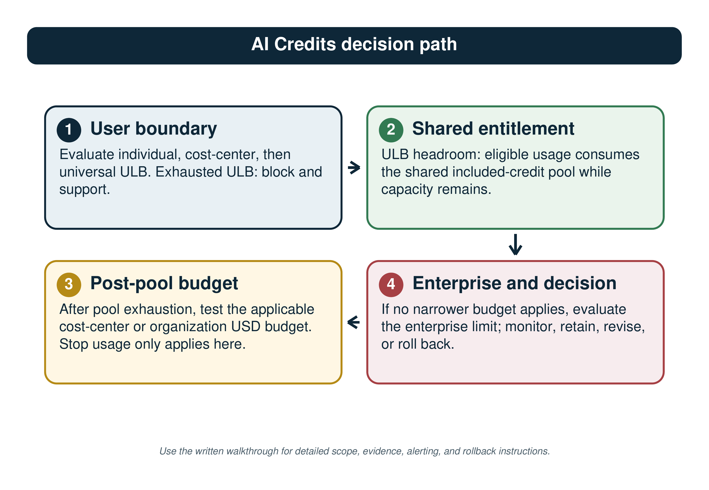
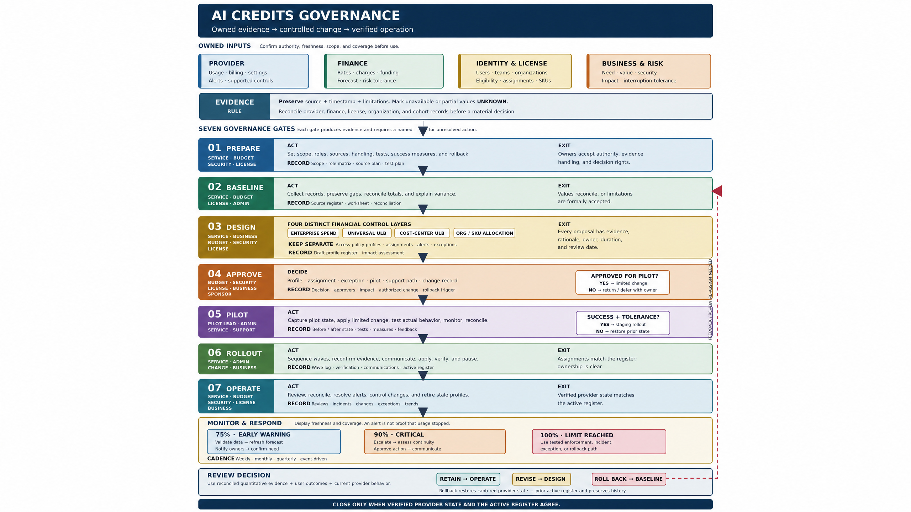
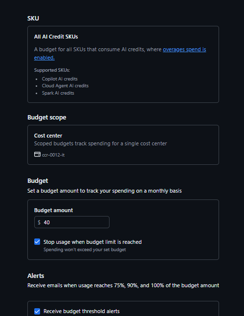
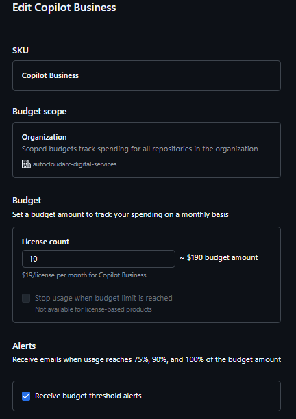
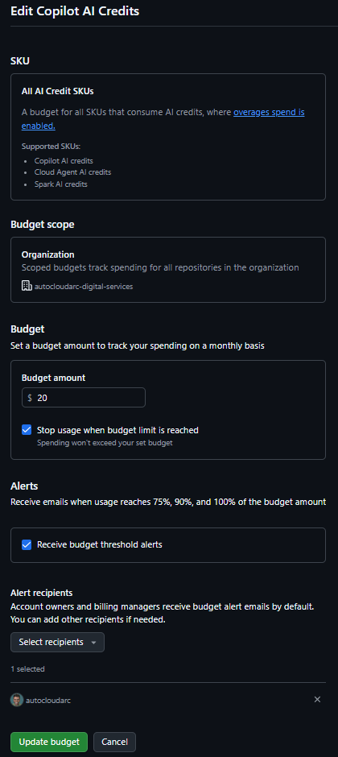

> [!NOTE]
> This is a Markdown transcription of the supplied 42-page publication.
> Source-page comments preserve traceability. Pagination and decorative formatting
> are not reproduced. The five figures are extracted losslessly from the
> [original PDF](github-ai-credits-governance-guide-2026-09-15.pdf) and linked at
> their source locations with captions and accompanying written explanations.
> Reference numbers link to the publication's original sources; provider claims
> have not been independently refreshed as part of this conversion.

<!-- Source page: 1 -->

## Enterprise AI Credits Governance

GITHUB ENTERPRISE CLOUD | IMPLEMENTATION GUIDE

### A phase-led operating model for budget controls, governance, and evidence

A practical guide to included AI-credit pools, per-user limits, metered budgets,
controlled rollout, monitoring, and accountable review decisions.

### Operating principle

Use the seven-phase governance model to move from evidence to design, approval,
pilot, rollout, operation, monitoring, and review. Treat every production change
as a typed Active Register record with a named owner, evidence, an effective
period, and a tested rollback path.

### Publication disclaimer

Independent analysis and opinions only; not necessarily the views, positions,
policies, or endorsements of the author's employer, affiliated organizations,
GitHub, Microsoft, or providers.

Based on official cloud-service and developer-platform documentation available
at publication, and empirical examples from the author's GitHub Enterprise
Cloud development account. Capabilities, pricing, policies, and availability
may change; verify current provider information before technical, operational,
financial, legal, or procurement decisions.

Provided "as is," without warranties (accuracy, merchantability, fitness,
non-infringement, or availability); no liability, professional-services
relationship, commitment, endorsement, or guarantee is created, to the maximum
extent permitted by law.

Preston K. Parsard

Contributor: AI

Last updated: September 15, 2026

Confirm product capabilities, billing behaviour, and administrative roles in
current GitHub documentation before production use.

<!-- Source page: 2 -->

## Contents

| Section | Purpose |
| --- | --- |
| [Read first](#read-first) | Audience, roles, architecture, financial-control model, and the governance lifecycle. |
| [01 Prepare](#01-prepare) | Set scope, owners, evidence sources, and the included-credit baseline. |
| [02 Baseline](#02-baseline) | Assess current provider state and establish the typed Active Register. |
| [03 Design](#03-design) | Define ULBs, budgets, naming, profiles, units, ownership, and tests. |
| [04 Approve](#04-approve) | Authorize a bounded change with evidence and a rollback decision owner. |
| [05 Pilot](#05-pilot) | Verify scope, precedence, enforcement, alerting, and rollback. |
| [06 Rollout](#06-rollout) | Apply profiles, ULBs, scoped metered budgets, and the enterprise boundary. |
| [07 Operate](#07-operate) | Run triage, reconciliation, analysis, learning, and the continuous Monitor & Respond / Review Decision overlay. |
| [Appendix A](#appendix-a-design-and-assignment-criteria) | Design and assignment criteria. |
| [Appendix B](#appendix-b-control-decision-sequence) | Control decision sequence. |
| [Appendix C](#appendix-c-lifecycle-and-evidence-checklist) | Lifecycle and evidence checklist. |
| [Appendix D](#appendix-d-monitoring-and-response) | Monitoring and response. |
| [Appendix E](#appendix-e-reconciliation-and-data-quality) | Reconciliation and data quality. |
| [Appendix F](#appendix-f-exceptions-change-control-and-rollback) | Exceptions, change control, and rollback. |
| [Appendix G](#appendix-g-review-cadence) | Review cadence. |
| [Appendix H](#appendix-h-getting-started-checklist) | Getting-started checklist. |
| [Appendix I](#appendix-i-governance-glossary) | Governance glossary. |
| [Appendix J](#appendix-j-active-register-schema-and-operating-guide) | Active Register schema and operating guide. |
| [References](#references) | Official GitHub documentation and FinOps source basis. |

<!-- Source page: 3 -->

## Read first

This guide is written for enterprise administrators, budget owners, service
owners, security owners, finance partners, product and procurement partners,
FinOps practitioners, and assurance reviewers who need one readable method for
governing GitHub Copilot AI Credits. It separates per-user AI-credit limits from
aggregate metered-spend budgets, and it keeps policy-profile configuration
distinct from financial control. [1] [2]

### AI FinOps scope

Use this guide as a GitHub Enterprise Cloud control implementation within a
broader enterprise AI FinOps practice. The FinOps Foundation frames AI spending
as granular, fast-moving, and often cross-category; this guide does not attempt
to govern every AI vendor or cost type. [7]

### How to use the guide

Follow the phases in order. Use the numbered procedures to configure or validate
a control. Use the appendices as supporting reference, not as a substitute for
phase exit gates. The Active Register is the single authoritative record for
profiles, User-Level Budgets (ULBs), metered budgets, rollout waves, tests, and
exceptions.

### Acceptance-test quick reference

P-01 verifies User-Level Budget (ULB) precedence; P-01a verifies a named policy's
effective behavior; P-02 verifies shared-pool and included-usage behavior; P-03
verifies ULB hard-stop behavior; P-04 verifies metered-budget alerting and Stop
usage behavior; P-05 verifies rollback. Phase 05 defines the full test methods.

### Where to host the Active Register

Use a controlled system with role-based access, change history, immutable
evidence links, and export capability. An ITSM/GRC record or repository-backed
YAML/JSON is preferred. A governed spreadsheet is acceptable only when it has
protected key columns, controlled picklists, mandatory-field validation,
restricted edit rights, version history, link validation, and an exportable
phase-exit snapshot. Record the system of record, record owner, and workspace
location in the Prepare evidence plan.

### Audience and outcomes

By the end of the guide, the organization will have a reconciled entitlement
baseline, documented control model, approved target state, pilot evidence,
controlled production rollout, and a recurring monitoring and review cadence.

The guide uses a running principle: first identify the applicable per-user ULB,
then the shared included-credit pool, then the relevant aggregate metered-spend
guardrail. A configuration must never be assumed to enforce because it appears
in a dashboard or screenshot. [1] [2]

### Roles and prerequisites

<!-- Source page: 4 -->

| Role | Accountability |
| --- | --- |
| Executive sponsor | Accepts risk posture and material unresolved exceptions. |
| Enterprise budget owner | Approves enterprise financial exposure, threshold posture, and escalations; typically an authorized enterprise owner or billing manager. |
| Service owner | Owns readiness, evidence, communications, and operational health. |
| Security owner | Approves security posture, policy-profile constraints, and compensating controls. |
| License owner | Validates entitlement inventory, eligible population, and license assignment; maps to the GitHub licensing or billing access needed for the selected scope. |
| Cost center owner | Accepts cost-center membership, funding, and review obligations. |
| Authorized administrator | An enterprise owner, billing manager, or appropriately authorized organization owner who applies approved provider changes and verifies configured state. |
| Finance / FinOps partner | Supports attributable reporting, forecast review, funding decisions, and value-aware governance; may coordinate an AI Investment Council or equivalent review forum. [7] |
| Product / portfolio owner | States the investment stage, intended outcome, and value hypothesis for material AI-enabled work. [7] |
| Procurement partner | Assesses acquisition channels, vendor commitments, and rate options when those decisions affect the approved scope. [7] |
| Assurance reviewer | Independently reviews evidence, reconciliation, and active-register integrity. |

### Prerequisite

Name the people, not just role titles, who approve, operate, receive alerts,
support users, and decide on rollback. Capture their delegates and escalation
route in the Active Register.

### Optional investment forum

For material or rapidly changing AI initiatives, use an AI Investment Council or
equivalent review forum to connect engineering, finance, product, procurement,
and leadership decisions. This is an operating recommendation, not a GitHub
product requirement. [7]

<!-- Source page: 5 -->

## Architecture and workflow

### Governance operating model

#### Scope of this section

This is a governance workflow and decision-path architecture, not a
platform-topology or systems-integration diagram. It shows how administrators
sequence controls, evidence, and decisions.

The first view explains the financial decision path. The second view turns that
path into a governed lifecycle with entry gates, evidence, and review decisions.
Use both views together: a budget setting is not complete until its scope, unit,
owner, evidence, enforcement behaviour, and rollback path are documented.

#### Decision-path walkthrough

| Step | Reader instruction |
| --- | --- |
| 1. User boundary | Evaluate individual, then cost-center, then universal ULB. If the applicable ULB is exhausted, the request is blocked. [2] |
| 2. Shared entitlement | If the ULB has headroom, usage draws from the shared included-credit pool while capacity remains; capture provider evidence rather than manually tallying usage. [1] |
| 3. Cost-center / organization route | If a cost-center included-usage cap is reached, record the configured behavior: block members at the cap or continue their additional usage as paid overage. This control has no aggregate-budget Stop usage toggle. When paid overage is permitted, determine the applicable cost-center or organization budget and its allocation evidence; see Section 3.4 and Appendix J.4. [2] [5] |
| 4. Enterprise and decision loop | If no narrower budget applies, evaluate the Enterprise spending limit. Record the signal and make a retain, revise, or rollback decision through the governance loop. [2] |

#### How to use the visual

The detailed reference visual on the following page is a map. Read the four
steps above first, then use the visual to locate the same decision points and
evidence nodes. The written walkthrough is the accessible operational
instruction.

<!-- Source page: 6 -->

### AI-credit budget and consumption decision path

*Figure 1. Simplified AI-credit budget and consumption decision path. Use the
written decision-path walkthrough on the preceding page as the accessible
operational instruction.*

<!-- Source page: 7 -->

### Recommended control-lifecycle gates

*Figure 2. AI Credits Governance operating model: seven lifecycle phases
supported by a continuous monitoring and decision loop.*

#### Sequence rule

A team moves through the seven lifecycle phases: Prepare, Baseline, Design,
Approve, Pilot, Rollout, and Operate. Monitor & Respond and Review Decision are
continuous governance-loop nodes: they may be triggered during any phase and
are sustained through Operate. They are not additional linear phases.

<!-- Source page: 8 -->

## Financial control and ownership model

### Five control layers

| Layer | Scope / unit | Enforcement and owner |
| --- | --- | --- |
| 1. User-Level Budget (ULB) | Per user; AI Credits; individual > cost center > universal. | Hard stop for supported AI-credit-consuming surfaces. Universal: enterprise budget owner approves. Cost center: cost center owner approves. Individual: enterprise budget owner approves. Named service owner supports. [2] |
| 2. Shared included-credit pool | Billing entity; AI Credits; monthly pooled entitlement. | Not a per-user assignment budget. License owner reconciles. [1] |
| 3. Cost-center included-usage control | Cost center; AI Credits; before the metered phase. | Provider-calculated cap based on assigned licenses. At the cap, record whether members are blocked or continue as paid overage; only the paid-overage route can use a downstream metered-budget record. It has no aggregate-budget Stop usage state. [2] [5] |
| 4. Scoped metered budget | Cost center or organization; US dollars (USD); metered phase only. | Alerts by default; a hard stop only if Stop usage is enabled. Cost center owner or organization owner operates. [2] |
| 5. Enterprise spending limit | Enterprise; US dollars (USD); metered phase only. | Final enterprise-wide paid-usage boundary; not total bill. Enterprise budget owner operates. [2] |

#### Layered-guardrail rule

Treat user, cost-center, organization, and enterprise controls as concurrent
guardrails rather than a top-down allocation hierarchy. Use the included-usage
phase to protect fair access to the shared pool, then use the metered phase to
govern approved additional spend. A ULB spans both phases; aggregate metered
budgets do not. [6]

### Control precedence and units

Use AI Credits for ULBs and shared entitlement. GitHub documents aggregate
additional-usage budgets in US dollars (USD); one AI Credit equals $0.01 USD.
Treat the dollar value as the provider budget unit and keep the AI-credit value
as consumption evidence. Do not create an internal alternate-currency
enforcement rule. [1] [2]

<!-- Source page: 9 -->

| Scenario | Controlling action |
| --- | --- |
| User reaches ULB | Block the request; verify individual > cost-center > universal assignment, remaining amount, and reset boundary. |
| ULB has headroom; pool remains | GitHub provider metering serves the request from the shared pool. Capture a provider evidence snapshot; do not manually tally usage. |
| Pool exhausted; cost center applies | Evaluate cost-center metered budget; block only if Stop usage is enabled and the budget is reached. |
| Pool exhausted; no cost center applies | Evaluate the relevant organization budget, then enterprise spending limit as applicable. |
| Several controls apply | Follow GitHub's documented flow: ULB, shared pool, then applicable cost-center, organization, or enterprise budget. The lowest remaining headroom can block first; preserve allocation/exclusion evidence and use P-04 to test the approved tenant scenario. [2] |

### Aggregate-budget routing after pool exhaustion

| Observed allocation path | Admin design and test rule |
| --- | --- |
| User directly assigned to a cost center | Plan and test the named cost-center included-usage control before the metered phase and the cost-center metered budget after pool exhaustion; Stop usage applies to the latter. [2] [5] |
| No direct cost center; license billed to an organization | Plan and test the organization metered budget for the billing organization. For multi-organization licensing, document the provider allocation evidence before relying on the organization budget. [2] |
| No applicable cost-center or organization budget | Plan and test the Enterprise spending limit as the enterprise-wide post-pool USD boundary. [2] |
| Several controls appear relevant at once | Use the documented flow: ULB, shared pool, then cost center, organization, or enterprise metered budget. Capture cost-center exclusion and allocation evidence, then use P-04 to validate the approved tenant scenario and any lower-headroom interaction. [2] |

#### Concurrent-control rule

GitHub documents the request flow and a lowest-remaining-headroom effect across
applicable controls. Use P-04 to preserve tenant-specific allocation,
cost-center-exclusion, alert, and interruption evidence; do not use a pilot to
override published control semantics. The enterprise budget owner resolves any
material evidence conflict before production change. [2]

### Ownership and control matrix

| Control record | Approving role | Operating owner | Rollback decision owner |
| --- | --- | --- | --- |
| Enterprise spending limit | Enterprise budget owner | Enterprise budget owner | Executive sponsor |
| Organization metered budget | Organization owner | Organization owner | Enterprise budget owner |
| Cost-center included-usage control | Cost center owner | Cost center owner | Enterprise budget owner |
| Cost-center metered budget | Cost center owner | Cost center owner | Enterprise budget owner |
| Universal ULB | Enterprise budget owner | Named service owner | Executive sponsor |

<!-- Source page: 10 -->

| Control record | Approving role | Operating owner | Rollback decision owner |
| --- | --- | --- | --- |
| Cost-center ULB | Cost center owner | Cost center owner | Cost center owner |
| Individual ULB | Enterprise budget owner | Named assigned owner | Service owner |
| Policy profile / rollout wave | Security + service owner | Authorized administrator | Executive sponsor |

### Role-to-control and configuration-surface map

| Control | Apply surface and guide role | Verify and approve |
| --- | --- | --- |
| Universal / individual ULB | Enterprise budget-control surface; enterprise budget owner directs an enterprise owner or billing manager. | Verify effective user record; complete ULB precedence and hard-stop tests; enterprise budget owner approves. |
| Cost-center ULB / included-usage / metered budget | Selected cost-center surface; cost center owner directs an enterprise owner or billing manager with confirmed cost-center privilege. | Verify direct-user allocation when relevant; complete ULB, P-02, or P-04 test; cost center owner approves. |
| Organization metered budget | Organization billing or budget surface; organization owner directs the provider role confirmed for that organization. | Verify billing scope and metered-budget test; organization owner approves. |
| Enterprise spending limit | Enterprise billing or budget surface; enterprise owner or billing manager applies it. | Verify US-dollar amount, scope, and metered-budget test; enterprise budget owner approves; executive sponsor accepts only exceptional exposure or rollback decisions. |
| Policy profile | Enterprise or organization Copilot policy settings surface; security owner directs an authorized administrator. | Verify configured and effective setting; security and service owners approve. |

#### Provider access check

GitHub roles and UI labels vary by account and scope. Before production change,
confirm the current provider path and privileges in GitHub documentation. This
guide's roles define accountability; they do not replace provider authorization.
[2] [3]

<!-- Source page: 11 -->

## 01 Prepare

SCOPE, OWNERS, AND EVIDENCE FOUNDATION

### Prepare phase purpose

Prepare establishes scope, authority, evidence sources, and the entitlement
baseline. It does not apply production budgets, policy profiles, or ULB
assignments.

### Prepare deliverables

* Named owners and delegates.
* Authoritative provider, license, finance, and evidence sources.
* Timestamped shared-pool entitlement baseline.
* Initial Active Register shell and evidence repository.

### Prepare exit gate

Scope, source responsibility, and evidence expectations are accepted;
configuration remains in design.

### 1.1 Capture the included-credit baseline

Credits are pooled at the billing-entity level, unused credits do not carry
over, and the shared included-credit pool resets at **00:00:00 UTC on the first
day of each calendar month**. Capture actual provider records rather than
estimates. [1]

For each billing entity, create an entitlement-baseline Active Register record.
Record the immutable billing scope, provider source or evidence URL, retrieval
timestamp, entitlement basis, included-credit amount when exposed, billing-cycle
start/end, observed next-reset date, time-zone evidence, named owner, and
`baseline_purpose` of forecast-only, reconciliation-only, or both. The
documented pool-reset rule does not remove the need to preserve tenant evidence,
especially when validating ULB reset behavior or reconciled reports.

1. Use the current enterprise Billing & licensing > AI usage or budget
   experience; labels can change, so confirm the current provider path and
   access role in References [1], [2], and [3].
2. Record billing entity ID, organization or enterprise scope, SKU label or ID,
   eligible license count, entitlement basis, billing-cycle start/end, observed
   next reset, time zone if shown, source page URL, and retrieval timestamp.
3. Capture a provider evidence snapshot. Preserve unknown, delayed, excluded,
   or restated values; do not silently replace them with estimates.
4. Reconcile the reported pool to the licensed population. Record differences,
   source freshness, accountable owner, next review date, and Appendix E
   data-quality status.

<!-- Source page: 12 -->

## 02 Baseline

CURRENT-STATE INVENTORY AND RECONCILIATION

### Baseline phase purpose

Baseline records what is configured and effective today before the target state
is designed. It protects the organization from building controls on assumed
provider behaviour.

### Baseline deliverables

* Current enterprise and organization policy inventory.
* Current budget, ULB, and assignment evidence.
* Attributable usage and cost evidence, or a documented source gap.
* Typed Active Register with source freshness and known gaps.
* Recorded exceptions and observed effective-state differences.

### Baseline exit gate

Current state, source freshness, attribution gaps, unknowns, and material
variances are recorded and reviewed.

### 2.1 Assess current policy and budget state

Retrieve the current enterprise and organization configuration. For each
policy, ULB, budget, and assignment, distinguish configured value from effective
behaviour. Record inheritance, overrides, exceptions, provider limitations, and
evidence source.

Do not assume equal configuration produces equal effective behaviour across
scope. Validate a representative user, affected organization, and billing record
during the controlled pilot.

Before optimizing budgets, model guidance, or policy profiles, create an
attribution view that maps available AI usage and cost evidence to the applicable
users, cost centers, organizations, and accountable owners. If a source cannot
support attribution, record the gap, its decision impact, and the owner/due date
rather than guessing. [6] [7]

#### Attribution before optimization

Use the available GitHub AI usage reporting and the organization's approved
reporting pipeline to establish who consumed what and at what cost before
right-sizing controls. Treat report freshness, allocation basis, and known
omissions as evidence attributes. [6]

<!-- Source page: 13 -->

### 2.2 Establish the Active Register

The Active Register is a single typed record set. Record types are
`policy-profile`, `ULB`, `entitlement-baseline`, `included-usage-control`,
`metered-budget`, `license-baseline`, `rollout-wave`, `controlled-test`, and
`exception`. The Profile Register is the filtered view of the Active Register's
`policy-profile` records.

| Field group | Required fields |
| --- | --- |
| Core identity | `record_type`; `enterprise_control_id`; `scope_id`; `provider_control_id` only when exposed (evidence/linkage, not key material). When no provider ID is exposed, capture `source_url` + `retrieval_timestamp`. |
| Ownership and support | `owner_primary` required from Prepare. `owner_delegate` and `support_contact` required before production approval. See Appendix J.2 for field definitions and lifecycle validation. |
| Conditional profile fields | `policy_or_profile` and `profile_version` only when a named control/profile pattern is used; otherwise use not-applicable / 0 in an export key suffix. |
| Assignment and period | `assignment_target`; `effective_start`/`effective_end`; `approval_id`. Timing fields (`billing_cycle_start`/`billing_cycle_end`; `observed_next_reset`; `timezone_source`) apply only where cycle/reset evidence is required: ULB, included-usage-control, and entitlement-baseline. See Appendix J.3/J.4. |
| Control values | ULB: `ulb_type`; `ulb_amount_ai_credits` (whole AI Credits). Entitlement baseline: `entitlement_basis`; `included_credits_amount`; `baseline_purpose`. Metered budget: `budget_amount_currency` (numeric-only, no symbol/text); `currency=USD`; `covered_ai_credit_sku` (one or more labels/IDs); `alert_thresholds` (ordered provider-supported values); `alert_recipients`; `response_sla`; `stop_usage_state`. License baseline: `license_baseline_amount` (numeric-only); `license_baseline_currency` (ISO code). Included usage: `downstream_metered_budget_reference` only when applicable; never `stop_usage_state`. See Appendix J.3/J.4 for allowed values and record-type rules. |
| Evidence and exceptions | `evidence_link`; `test_id`/`test_result`; observed behavior at included-usage cap; `exception_id`/`exception_expiry`; `support_contact`; `rollback_reference` |
| Provenance | `source_url`; `retrieval_timestamp`; `record_status`; `notes` |

#### Logical key

Use (`record_type`, `scope_id`, `enterprise_control_id`) as the base canonical
logical key. Append (`policy_or_profile`, `profile_version`) only when the
record uses a named profile or control pattern; otherwise represent the suffix
as not-applicable, 0 in an export. `enterprise_control_id` is the stable
internal identifier; `provider_control_id` is provider evidence, not key
material. Owner name is a required attribute, not key material. Starting in
Approve, require a rollback reference for every production-intended record;
Prepare and Baseline records may use a planning status until a rollback path is
designed.

#### Core identity and linkage example: metered-budget record

This is an identity/linkage excerpt, not a complete valid metered-budget record.
Use the full worked example in Appendix J.5 and the mandatory-field matrix in
Appendix J.4 before implementation.

| Field | Example value |
| --- | --- |
| `record_type` | metered-budget |

<!-- Source page: 14 -->

| Field | Example value |
| --- | --- |
| `enterprise_control_id` | ENT-CTRL-0003 |
| `scope_id` | ccr-0012-it |
| `provider_control_id` | budget-ccr-0012-it-ai-credit-v1 (when exposed) |
| `policy_or_profile` | ai-credit-guardrail |
| `profile_version` | v1 |
| `owner_primary` | cost-center-owner |
| `owner_delegate` | finance-delegate |
| `evidence_link` | <https://records.example/evidence/ccr-0012-it/2026-08-26> |
| `rollback_reference` | CHG-1042; prior-state snapshot 2026-08-25 |

<!-- Source page: 15 -->

## 03 Design

TARGET-STATE CONTROLS, STANDARDS, AND TESTS

### Design phase purpose

Design defines the target state. It makes scope, units, ownership, enforcement
intent, acceptance tests, and rollback requirements explicit before approval.

### Design deliverables

* ULB taxonomy, naming, and cohort mapping.
* Enterprise, cost-center, and organization metered-spend budget designs.
* Reusable enterprise and organization policy-profile designs.
* Typed Active Register records and a complete acceptance-test plan.

### Design exit gate

Every proposed control has scope, unit, owner, rationale, period, expected
behaviour, evidence, test, and rollback path.

### 3.1 Design User-Level Budget profiles

**Technical precedence.** A User-Level Budget (ULB) is a per-user AI-credit
boundary. Individual ULB overrides cost-center ULB; cost-center ULB overrides
universal ULB. The applicable ULB is a hard stop. [2]

**Operational design sequence.** Draft the universal ULB first, then approved
cost-center cohorts, then individual exceptions. Do not assign production users
until taxonomy, membership validation, and pilot plan are approved.

**Reset evidence.** Do not infer a calendar-month or time-zone boundary for a
ULB. Record tenant-observed next-reset evidence, the provider surface used, any
exposed time-zone information, and the controlled test used to verify reset
behaviour. The shared included-credit pool has a separately documented reset
rule in Section 1.1; do not apply that rule to a ULB without tenant evidence.

| Usage surface | Governing control and expected behaviour | Verification |
| --- | --- | --- |
| AI-credit-consuming Copilot features | ULB; AI Credits; hard stop at the applicable ULB. | Confirm current product coverage and run P-03 on each intended surface. [2] |
| Code completion, next edit suggestions, or any named product surface | Coverage must be confirmed in current GitHub documentation; no ULB or metered-spend coverage is assumed without dated evidence. | Record the exact provider product label, coverage decision, source URL, and retrieval timestamp before rollout. [2] |

<!-- Source page: 16 -->

| Usage surface | Governing control and expected behaviour | Verification |
| --- | --- | --- |
| Any unlisted AI product or surface | No coverage assumed. | Classify it in Design; record the coverage decision in the Active Register before rollout. |

#### Coverage warning

ULBs and aggregate budget controls apply only to supported AI-credit-consuming
usage. Do not assume they govern every Copilot feature, plan element, or other
AI service. Before rollout, record the intended product surface, provider SKU
label or ID, coverage decision, source URL, retrieval timestamp, and P-03 outcome
in the Active Register.

#### Taxonomy legend

`abd` = abundant-usage cohort. The `k` suffix means whole thousands of AI
Credits: 6k = 6,000. Add a cohort abbreviation only after it has an approved
definition and a matching naming example; do not maintain unused abbreviations.

| ULB type | Naming example | Design rule |
| --- | --- | --- |
| Universal | `user-universal-standard-6k` | Default per-user amount for eligible users. |
| Cost-center cohort | `user-cost-center-ccr-0012-abd-7k` | abd = abundant-usage cohort; stable cost-center ID + whole-thousand AI-credit band. |
| Individual exception | `user-individual-<user-id>-exception-8k` | Documented exception, named owner, expiry, and review date. |

### 3.2 Validate cost-center membership

Cost centers can contain users, repositories, organizations, and enterprise
teams; for Copilot AI-credit allocation, membership can be direct,
organization-derived, or enterprise-team-derived. Direct user assignment
controls allocation first. If no direct user assignment applies, allocation can
follow the organization that granted the user's Copilot license. Record the
supported membership type, allocation basis, current documentation or UI URL,
and retrieval timestamp for the selected setup. [2] [5]

**Blocking rule.** Before pilot or rollout, generate a user-to-cost-center
allocation report for the affected population. The report must show the
provider allocation basis, zero unresolved stale direct assignments, and any
organization-based fallback. An internal primary-cost-center field or HR/finance
tie-breaker is governance metadata; it does not override provider allocation
behavior. Record resolution and owner in the Active Register, and block the
wave until it is complete.

<!-- Source page: 17 -->

### 3.3 Design policy profiles

A policy profile is an internal governance bundle, not necessarily a GitHub
product object with that exact name. It maps to named GitHub enterprise or
organization Copilot policy settings, feature surfaces, assignments, and
documented effective behaviour. Record the actual provider settings and surfaces
in the Active Register.

Use reusable, versioned posture names. Enterprise profile:
`ent-ghcp-policy-set-<posture>-v<major>`. Organization profile:
`org-ghcp-policy-set-<posture>-v<major>`. The organization assignment belongs
in the Active Register, not in a reusable profile name.

Increment the major version whenever behaviour or scope changes materially
enough to need new approval, pilot evidence, or rollback treatment. Retain the
prior active version until rollout verification passes.

| Record | Example | Rule |
| --- | --- | --- |
| Enterprise profile | `ent-ghcp-policy-set-standard-v1` | Reusable enterprise posture; scope is ent. |
| Organization profile | `org-ghcp-policy-set-standard-v1` | Reusable organization posture; scope is org. |
| Actual assignment | `standard-v1` -> `autocloudarc-digital-services` | Assignment, owner, period, evidence, and rollback are register fields. |

### 3.4 Design included-usage and metered-spend controls

A cost-center included-usage control is distinct from a budget: it caps a cost
center's draw from included AI Credits before the metered phase and is
calculated from assigned licenses. Aggregate cost-center, organization, and
enterprise budgets activate only after the shared pool is exhausted, are
denominated in US dollars (USD), and do not extend a ULB. Stop usage is off by
default for aggregate budgets; enable it for every approved hard-stop guardrail
and verify effective behavior in P-04. [1] [2] [5]

#### Continuity-aware hard-stop decision

Use accountable owners and alert response as the primary guardrail. Approve Stop
usage only when the accepted financial exposure of continuing usage is
outweighed by the tested interruption risk to people, critical workflows, and
business continuity. This is a governance decision; P-04 must still verify
provider behavior for the named scope. [6]

#### Showback or chargeback decision

After attribution is established, choose whether to publish consumption to cost
owners (showback) or apply an approved internal cost allocation (chargeback).
Record the allocation basis, period, accountable owner, decision authority, and
known limits; neither practice changes GitHub provider control behavior. [6] [7]

<!-- Source page: 18 -->

1. For a cost-center included-usage control, record the cost center, directly
   assigned license evidence, provider-calculated included-credit cap,
   configured/observed behavior at the cap (block or paid-overage), owner,
   evidence, and P-02 test. If paid overage is allowed, record the optional
   `downstream_metered_budget_reference`; do not assign the aggregate-budget
   Stop usage state to the included-usage control.
2. For the enterprise spending limit, record billing entity, US-dollar amount,
   period, `covered_ai_credit_sku`, Enterprise budget owner approval, alerts,
   Stop usage intent, emergency response, and P-04 test. Record executive
   sponsor acceptance only for exceptional exposure or a rollback decision.
3. For a cost-center metered budget, record cost-center scope, AI-credit SKU
   coverage, USD amount, recipients, Stop usage state, owner, evidence, and
   reconciliation plan.
4. For an organization metered budget, record billing organization, applicable
   AI-credit SKU, USD amount, thresholds, Stop usage state, provider support,
   owner, allocation caveat, and P-04 test.
5. For each control, distinguish an informational license-spend baseline from a
   pre-metered included-usage cap and an enforceable post-pool paid-usage
   guardrail.

| Control | Scope / unit | When active and what to verify |
| --- | --- | --- |
| Cost-center included-usage control | Cost center / AI Credits | Before the metered phase; provider-calculated from assigned licenses. At the cap, record block or paid-overage behavior. Only the paid-overage route may reference a separate downstream metered budget; that budget, not this control, holds Stop usage state. [2] [5] |
| Cost-center metered budget | Cost center / USD | After pool exhaustion; alerts by default; enable Stop usage for a hard stop; validate in P-04. [2] |
| Organization metered budget | Organization / USD | After pool exhaustion for licenses billed to that organization; enable Stop usage for a hard stop; validate allocation in P-04. [2] |
| Enterprise spending limit | Enterprise / USD | After pool exhaustion; alerts by default; enable Stop usage for a hard stop; validate in P-04. [2] |
| License-spend baseline | License population / forecast amount | Informational forecasting and allocation; not an AI-credit enforcement control. |

<!-- Source page: 19 -->

### 3.4.1 Cost-center metered budget

A cost-center metered budget is an aggregate US-dollar guardrail after
shared-pool exhaustion. It is not a per-user ULB and does not change a member's
ULB. The configuration example below uses the `ccr-0012-it` cost center. [2]

*Figure 3. Cost-center metered budget configuration: cropped to the scope,
budget, and enforcement panels for A5 readability.*

| Field | What to verify |
| --- | --- |
| Budget scope | One accountable cost center; confirm membership and owner. |
| SKU | Selected AI-credit SKUs; record the exact provider SKU label or ID, configuration-surface URL, retrieval timestamp, and `covered_ai_credit_sku` evidence in Appendix J.3. |
| Budget amount | Active Register value: `budget_amount_currency=40` and `currency=USD`. A UI may display $40, but the record stores the numeric amount and currency separately. |
| Stop usage | Enable only when an approved hard stop is required and supported. |
| Alerts | Record `alert_recipients`, `response_sla`, response owner, evidence source, and review date. |

<!-- Source page: 20 -->

#### Contrast

A cost-center ULB cohort limits each member's AI Credits. A cost-center metered
budget limits the cost center's aggregate US-dollar spend after pool exhaustion.
Never use one control's unit, owner, or enforcement assumption for the other.

### 3.4.2 Organization metered budget and license baseline

Forecasting and paid-usage control are deliberately separate records. Treat the
license baseline (`record_type=license-baseline`) as an allocation and
forecasting input, then design the organization metered budget
(`record_type=metered-budget`) as the separate post-pool guardrail. [1] [2]

#### 3.4.2.a Forecasting: license-spend baseline, not an enforcement control

*Figure 4. Organization license-spend baseline configuration: cropped to the
relevant forecast and scope panels; forecast only, not an enforcement control.*

##### No Stop usage; informational only

A license-spend baseline forecasts eligible license charges. It neither limits
AI Credits nor blocks paid usage. Record it separately from every ULB and
metered-budget record.

<!-- Source page: 21 -->

#### 3.4.2.b Enforcement: organization metered budget

| Use case | Required record |
| --- | --- |
| License-spend baseline (`record_type=license-baseline`) | Organization, SKU, eligible licenses, monthly forecast amount, recipient, period, and variance owner. |
| Organization metered guardrail (`record_type=metered-budget`) | Billing organization, enumerated covered AI-credit SKU label(s) or ID(s) when available, USD budget amount, thresholds, `alert_recipients`, `response_sla`, Stop usage state, owner, allocation evidence, and P-04 test result. Retain any "All AI Credit SKUs" selector only as timestamped observed evidence. |

##### Decision rule

Use a license baseline for forecasting and allocation. Use an organization
metered budget for paid-usage control after pool exhaustion. Capture each as a
separate typed Active Register record and follow Appendix B for routing.

#### 3.4.2.1 Organization-scoped AI Credits budget example

The supplied configuration below fills the organization-scope gap between the
forecast-only license baseline and the enterprise-wide spending limit. It is an
organization-scoped metered AI Credits budget for
`autocloudarc-digital-services`, not a per-user ULB and not a license-spend
baseline. GitHub documents this control as capping metered charges for users
whose Copilot licenses are billed to that organization after the shared pool is
exhausted. The screen's repository wording is an observed configuration label,
not a universal enforcement statement. [1] [2]

*Figure 5. Organization-scoped AI Credits budget for
autocloudarc-digital-services; supplied configuration screenshot.*

<!-- Source page: 22 -->

##### Figure 5 configuration interpretation

| Configuration item | What the screenshot shows and what to record |
| --- | --- |
| SKU coverage | "All AI Credit SKUs" is the literal observed UI selector. The canonical `covered_ai_credit_sku` field stores enumerated provider labels or IDs when available; store the selector text only as observed evidence or notes with source URL and retrieval timestamp. |
| Budget scope | Observed screen: Organization: autocloudarc-digital-services. Record the immutable organization or billing-scope ID. Documented behavior: metered charges for users whose Copilot licenses are billed to that organization; do not treat repository wording as universal scope. |
| Monthly amount | $20 USD in the observed configuration. Treat this as an illustrative approved amount for the named organization and period, not a universal threshold. |
| Stop usage | Enabled in the supplied configuration. Before production use, record current support for the selected scope/SKUs, approval, evidence URL, and P-04 outcome; do not assume the posture applies beyond supported provider behavior. |
| Alerts and recipients | Observed in the supplied configuration: threshold alerts at 75%, 90%, and 100%; account owners and billing managers are shown as default recipients, with an additional named recipient selected. Verify actual defaults in current GitHub documentation and the configuration UI, then record primary owner, delegate, support contact, `alert_recipients`, and `response_sla`. |

##### Active Register record: organization metered budget

| Canonical field | Value / recording rule |
| --- | --- |
| `record_type` | metered-budget |
| `scope_id` | Immutable organization ID |
| `policy_or_profile` | organization-ai-credit-guardrail |
| `profile_version` | v1 |
| `budget_amount_currency` | 20 |
| `currency` | USD |
| `covered_ai_credit_sku` | Enumerated provider label(s) or ID(s) when available; retain observed "All AI Credit SKUs" selector only as evidence or notes with source URL and retrieval timestamp. |
| `alert_thresholds` | 75%;90%;100%: observed Figure 5 configuration; confirm current provider-supported values |
| `stop_usage_state` | enabled |
| `owner_primary` | Named accountable owner |
| `owner_delegate` | Named delegate |
| `support_contact` | Named support route |
| `alert_recipients` | Validated recipient set |
| `response_sla` | Approved response target |
| `evidence_link` | Current configuration and approval evidence |
| `test_id` | P-04 |
| `test_result` | pass before production approval |
| `rollback_reference` | Approved prior-state restoration action |
| `notes` | Scope and allocation: this organization budget governs metered charges for licenses billed to this organization; cost-center and enterprise controls remain separate. Where a user is licensed by multiple organizations, GitHub may select one at random each billing cycle; record allocation evidence and prefer direct cost-center assignment when predictable enforcement is required. [2] [4] |

<!-- Source page: 23 -->

### 3.4.3 Enterprise spending limit

The Enterprise spending limit is the enterprise-wide aggregate US-dollar
control for paid AI-credit usage after shared-pool exhaustion. It does not cap
license fees or act as a per-user ULB. [2]

| Design field | Required decision |
| --- | --- |
| Scope and currency | Enterprise billing entity, provider billing cycle, US-dollar amount, covered AI-credit SKU, and effective period. |
| Financial posture | Approved budget amount, threshold bands, canonical `alert_recipients`, canonical `response_sla`, and exposure rationale. |
| Enforcement | Stop usage enabled for the approved hard-stop posture; capture current provider support and the P-04 evidence. |
| Response | Named primary owner, delegate, executive escalation, support route, and rollback or emergency-change authority. |

#### Design exit check

The Enterprise spending limit has a separate typed record, not a substitute
for ULBs, cost-center budgets, or organization budgets. Its pilot evidence covers
configured state, effective state, alert behavior, Stop usage outcome, and
provider allocation context.

<!-- Source page: 24 -->

## 04 Approve

DECISION RECORD AND CHANGE READINESS

### Approve phase purpose

Approve turns a design into an accountable decision. No administrator applies
a production control without a named authorizer, evidence, success criteria,
and rollback decision owner.

### Approve deliverables

* Signed or recorded approval decision.
* Complete Active Register record and evidence package.
* Pilot scope, test IDs, success criteria, and rollback decision owner.
* Communication and support plan for affected users.

### Approve exit gate

The proposal is approved, rejected, or returned with a named owner and
documented reason.

### 4.1 Create the approval record

1. Assemble scope, current baseline, proposal, owner, unit, expected behaviour,
   financial and security impact, support plan, and rollback method.
2. Link the decision to the typed Active Register record and capture approver,
   decision rationale, effective period, review date, and residual-risk
   acceptance.
3. Approve, reject, or return the proposal. A returned proposal must name the
   owner and missing evidence or redesign requirement.
4. Authorize a bounded pilot only after the test population, communication
   plan, success criteria, provider scope, and rollback path are explicit.

#### Approval exit check

The Active Register names the approver, operating owner, primary and delegate
escalation contacts, support contact, rollback decision owner, approved scope,
effective period, acceptance-test IDs, and required response SLA.

<!-- Source page: 25 -->

## 05 Pilot

CONTROLLED ACCEPTANCE TEST

### Pilot phase purpose

Pilot validates the approved design in a limited scope. It records what the
provider actually does, not what a configuration is expected to do.

### Pilot deliverables

* Representative user and organization or cost-center test scope.
* Configured-state and effective-state snapshots.
* Pass/fail evidence for precedence, pooling, alerting, enforcement, and rollback.
* Decision to roll out, revise, or roll back.

### Pilot exit gate

All planned tests have recorded results and any failure has an accountable
decision.

### 5.1 Minimum acceptance-test suite

| Test ID | Test | Pass condition |
| --- | --- | --- |
| P-01 | ULB precedence | Individual > cost center > universal assignment is effective for the approved test user. |
| P-01a | Policy precedence | For a named setting, configured enterprise and organization state is compared with effective behaviour; do not assume provider precedence without evidence. |
| P-02 | Shared pool | Eligible request consumes shared entitlement while pool capacity remains. |
| P-03 | ULB hard stop | Applicable supported ULB blocks the request on exhaustion at every intended AI-credit-consuming pilot surface; support impact is recorded. |
| P-04 | Metered budget | During a non-critical window, a low approved US-dollar threshold produces timestamped alert evidence and expected Stop usage outcome for the named scope and period. Include concurrent-scope evidence or document why a combined-scope test is not possible. |
| P-05 | Rollback smoke test | Prior provider state can be restored in the approved window and matches captured evidence. |

**Pilot test note.** Use three to five approved users in a bounded window.
Record the applicable ULB or low USD threshold, source timestamp, configured
and effective state, alert or Stop usage outcome, support impact, and rollback
evidence.

<!-- Source page: 26 -->

## 06 Rollout

PRODUCTION APPLICATION IN CONTROLLED WAVES

### Rollout phase purpose

Rollout applies only approved and piloted changes. Each wave is a typed Active
Register record with scope, owner, dependencies, effective behaviour, evidence,
and rollback criteria.

### Rollout deliverables

* Approved policy profiles applied and independently verified in controlled waves.
* User-Level Budgets assigned with verified precedence, reset evidence, and
  support readiness.
* Cost-center and organization metered budgets active with tested alert and
  Stop usage behaviour.
* Enterprise spending limit applied with reconciled scope, US-dollar amount,
  evidence, and rollback owner.

### Rollout exit gate

Configured and effective state agree with the Active Register; each completed
wave has evidence and a named owner.

### 6.1 Apply policy profiles

Do not assume enterprise-versus-organization policy precedence. In the pilot,
use P-01a to validate the effective behaviour of each named setting at the
target scope. Then apply the approved enterprise or organization profile in
controlled waves. Reconfirm profile version, population, owner, dependencies,
communication plan, support readiness, and rollback condition. Pause the next
wave if configured or effective state differs from the Active Register.

### 6.2 Apply User-Level Budgets

#### Where to configure and verify

Use the current GitHub Enterprise budget-control experience. An enterprise
owner or billing manager applies universal and individual ULBs at enterprise
scope; a cost-center owner directs an authorized administrator for cost-center
ULBs. Confirm the exact available UI or API path, assigned scope, and effective
user record against current GitHub budget documentation before production use.
[2] [3]

1. Confirm the approved ULB record, population, AI-credit amount, named owner,
   effective period, reset verification, and rollback decision owner.
2. Apply universal ULB first; cost-center ULB only after membership validation;
   individual ULB only for an approved exception.
3. Verify configured and effective individual > cost-center > universal
   precedence, expected hard-stop behaviour, and the upcoming reset boundary
   for the test users.

<!-- Source page: 27 -->

1. Pause if assignment differs from the Active Register, unexpected users are
   affected, hard-stop behaviour is not observed, or rollback cannot be
   demonstrated.

### 6.3 Apply scoped metered budgets

1. Confirm scope, US-dollar amount, period, `covered_ai_credit_sku`, owner,
   thresholds, `alert_recipients`, `response_sla`, Stop usage decision, and
   provider support. If an organization budget is used, record license-billing
   allocation evidence and the multi-organization caveat.
2. Apply the cost-center or organization configuration using an authorized
   administrator. Capture configuration snapshot and source timestamp.
3. Run P-04 in the approved controlled scope. Verify threshold notification
   and, if enabled, Stop usage outcome.
4. Reconcile provider state to the Active Register. Pause if a license baseline
   or cost-center included-usage control is being mistaken for a post-pool
   paid-usage guardrail or if evidence is incomplete.

### 6.4 Apply Enterprise spending limit

1. Confirm enterprise billing entity, US-dollar amount,
   `covered_ai_credit_sku`, period, Enterprise budget owner approval,
   `alert_recipients`, `response_sla`, Stop usage intent, and emergency
   response. Record executive sponsor acceptance only for exceptional exposure
   or a rollback decision.
2. Apply through an authorized enterprise administrator. Capture configured
   state, source timestamp, approval, and evidence link.
3. Run the approved threshold and Stop usage test. Verify coordinated response
   with active scoped-budget controls.
4. Close the wave only after the Active Register, independent verification,
   support communication, and rollback owner agree.

#### Rollout wave exit check

For every applied control: configured state, effective state, scope, unit,
owner, test result, evidence link, exception status, and rollback reference
match the Active Register.

<!-- Source page: 28 -->

## 07 Operate

CADENCE, LEARNING, AND CONTINUOUS GOVERNANCE

### Operate phase purpose

Operate sustains the approved control state through weekly triage, monthly
reconciliation, analysis, feedback, training, and continuous governance.
Monitor & Respond and Review Decision are recurring governance-loop components
that support every lifecycle phase and are sustained through Operate.

### Operate deliverables

* Weekly signals triaged with source, unit, scope, named owner, and response
  evidence.
* Monthly baseline reconciled with variance, source quality, decision owner,
  and due date.
* Analysis, adjustment, training, and improvement actions tied to evidence.
* Continuous Monitor & Respond and Review Decision records maintained in the
  Active Register.

### Operate exit gate

The register, provider state, evidence, owners, monitoring signals, and review
schedule remain current.

### 7.1 Weekly operational triage

Use weekly review for active alerts, rapidly changing burn rates,
high-exposure cohorts, pilots, incidents, failed sources, and assignments due
to expire. Validate source freshness, budget base, unit, affected population,
owner, and response.

Weekly data is partial-period. Compare like periods and investigate material
change before recommending a permanent budget or profile adjustment. Early AI
initiatives can have higher anomaly risk and forecast variance; shorten the
planning horizon and revisit funding assumptions more often while the evidence
matures. [7]

### 7.2 Monthly reconciliation

Use monthly reconciliation to close the period across provider usage,
included credits, license inventory, metered charges, budgets, cost centers,
organizations, and assignments. Set a data cutoff, retain the original
snapshot, capture restatements, and separate observed, calculated, and
forecast values.

Do not declare the period reconciled while material sources remain incomplete.
Record source gap, likely impact, owner, and due date.

### 7.3 Analyze, adjust, train, and improve

<!-- Source page: 29 -->

Convert reconciled data into an explicit decision. Assess concentration,
organization mix, forecast variance, overage, alerts, exceptions, and user
feedback. Account for population, licensing, rate, and feature changes before
attributing outcomes to policy or training.

For a material initiative, record the intended business outcome and a
proportionate value measure: strategic alignment, productivity or benefit
result, compliance effectiveness, or cost-per-use when the organization has
reliable telemetry. Do not require token- or inference-level measures when the
chosen GitHub evidence sources do not expose them. [7]

#### Maturity overlay, not a replacement lifecycle

Use Start to establish baseline guardrails, owners, and showback; Adopt to add
cost-center accountability, reviewed attribution, and chargeback where
appropriate; and Advance to automate repeatable administration and forecasting
after evidence is stable. Map this maturity overlay to the seven fixed phases
in this guide; do not replace Prepare through Operate with a second sequence.
[6]

## Continuous governance loop

Monitor & Respond and Review Decision support every phase and are sustained
through Operate.

### Monitor & Respond

Validate signals and take accountable action.

| Trigger | Required response |
| --- | --- |
| Example: 75% of named control base | Validate source, unit, scope, forecast, and owner; notify the accountable owner of the decision date. |
| Example: 90% of named control base | Verify assignments, current provider state, and support plan; prepare the tested response or rollback path. |
| Example: 100% of named control base | Determine whether the control is a ULB hard stop or an aggregate budget with Stop usage enabled; execute the approved business-continuity and support response. |

#### Record every signal

Capture signal source and timestamp, base and unit, owner, response, provider
state, user impact, decision, reconciliation result, `alert_recipients`, and
`response_sla` in the Active Register.

### Review Decision

Use reconciled consumption, outcomes, policy behaviour, exception history, and
current provider capability to make one explicit decision. Retain when evidence
confirms the approved state; revise when objective remains valid but the design
must change; roll back when exit criteria fail, interruption is unexpected,
provider behaviour differs materially, or evidence remains incomplete.

Record the decision, rationale, owner, next review date, communication, and
required register update; change active state only after provider state and
evidence agree.

<!-- Source page: 30 -->

## Appendix A: Design and assignment criteria

| Criterion | Design question |
| --- | --- |
| Scope | Which enterprise, organization, cost center, user, SKU, and period does the control cover? |
| Unit | Is this AI Credits for a ULB, entitlement, or included-usage cap; USD for aggregate metered spend; or a forecast amount for a license baseline? |
| Owner | Who approves, operates, receives alert, supports users, and decides rollback? |
| Evidence | What source snapshot, test, configured-state, and effective-state record proves the control? |
| Rollback | What prior state is restored, by whom, and within what approved window? |

## Appendix B: Control decision sequence

Use this page during incident triage and review when a Copilot request or spend
threshold requires a decision.

1. Identify the applicable ULB: individual, then cost center, then universal.
   If exhausted, support the user and verify assignment and reset timing.
2. If ULB has headroom, determine whether shared included credits remain. If
   they do, capture a provider evidence snapshot. If a cost-center
   included-usage cap applies, record whether the configured response is block
   or paid overage.
3. When paid overage is permitted after an included-usage cap, or when the
   shared pool is exhausted, identify cost-center, organization, and enterprise
   spending-limit scope. Verify US-dollar amount, owner, thresholds, allocation
   evidence, and Stop usage state on the applicable metered budget.
4. The named control owner executes the approved response for the documented
   control path. If scopes conflict or provider evidence is incomplete, the
   enterprise budget owner adjudicates; capture evidence and retain, revise,
   or roll back through the governance loop. [2]

<!-- Source page: 31 -->

## Appendix C: Lifecycle and evidence checklist

| Lifecycle component | Evidence | Exit criterion |
| --- | --- | --- |
| Prepare | Scope, owners, source list, included-credit baseline. | Roles and evidence responsibilities accepted. |
| Baseline | Current provider state, gaps, exceptions, Active Register records. | Current state reconciled; unknowns named. |
| Design | Target controls, units, tests, rollback path. | Proposal is complete and internally consistent. |
| Approve | Authorization, risk decision, pilot scope. | Named approver and rollback owner recorded. |
| Pilot | P-01 through P-05 results and effective-state evidence. | Pass, revise, or rollback decision documented. |
| Rollout | Wave record, configuration snapshot, verification. | Configured and effective state agree. |
| Operate | Signals, reconciliation, analysis, decision record. | Register and cadence remain current. |
| Continuous governance loop | Monitor & Respond and Review Decision records. | Signal, response, decision, owner, and evidence link are current. |

<!-- Source page: 32 -->

## Appendix D: Monitoring and response

During early experimentation or high forecast variance, use shorter forecast
windows and revisit alert/response assumptions more often; do not treat a
starter cadence or observed alert band as a universal provider default. [6] [7]

Define alert bases per control, not as a generic percentage. The supplied
organization configuration shows 75%, 90%, and 100% thresholds as observed
example values; confirm current supported threshold configuration in the
provider UI and documentation for each aggregate metered budget. For ULBs, use
internal monitoring or tenant-validated capability; do not describe provider
percentage alerts as a sourced ULB feature without current evidence. Record
the unit, named primary owner, delegate, executive escalation owner, on-call
contact, source, evaluation period, notification path, canonical
`alert_recipients`, canonical `response_sla`, and expected response. [2]

| Exposure tier | Starter cadence |
| --- | --- |
| Low | Monthly operating review; quarterly design and ownership review. |
| Medium | Weekly operational review; monthly budget and profile review. |
| High | Twice-weekly operational review; monthly design, budget, and executive risk review. |
| Escalate tier when | Forecast uncertainty, active pilot, severe alert, failed evidence source, incident, or material exception occurs. |

<!-- Source page: 33 -->

## Appendix E: Reconciliation and data quality

* Preserve source system, retrieval method, source timestamp, freshness,
  calculation method, and known limitations.
* Retain an attribution map that links available usage and cost evidence to
  the applicable user, cost center, organization, and decision owner; state
  any mapping gap and its impact. [6] [7]
* Reconcile license inventory, entitlement pool, metered usage, provider
  adjustments, organization/cost-center assignment, and billing records.
* Maintain a restatement record: original snapshot, reason for change, revised
  value, owner, approval, and decision impact.
* Do not create a false final total from incomplete sources; retain unknowns
  and set an owner and due date.

## Appendix F: Exceptions, change control, and rollback

1. Link the request to the Active Register record and current evidence baseline.
2. Capture prior provider state, rollback method, and expected restoration
   window.
3. Assess financial, security, entitlement, business, support, and interruption
   effects.
4. Obtain approvals, run controlled test where required, and apply through an
   authorized administrator.
5. Independently verify configured and effective state, observe for the approved
   period, and close only when evidence and register agree.

<!-- Source page: 34 -->

## Appendix G: Review cadence

| Cadence | Focus |
| --- | --- |
| Weekly | Active alerts, pilots, high-exposure cohorts, incidents, exceptions, and data freshness. |
| Monthly | Entitlements, usage, cost, forecast, assignments, reconciliation, and budget/profile decisions. |
| Quarterly | Profile design, access posture, ownership, evidence, training, and drift. |
| Event-driven | Rate, entitlement, feature, organization, risk, incident, or control change. |

## Appendix H: Getting-started checklist

1. Name approval, operating, support, escalation, and rollback decision owners.
2. Capture the included-credit baseline with timestamped provider evidence and
   the documented UTC reset rule.
3. Create and validate the Active Register template: entitlement-baseline,
   control, test, and exception record types; logical key; naming prefixes;
   dates; evidence links; and rollback references.
4. Assess current policy, budget, ULB, included-usage control, license baseline,
   cost-center, and assignment state.
5. Design financial layers, ULB taxonomy, policy profiles, included-usage
   controls, and metered budgets with units and owners.
6. Approve a bounded pilot with P-01 through P-05 success criteria.
7. Run the pilot, reconcile evidence, make a rollout decision, and then apply
   controlled waves.
8. Start the operating cadence and keep the Active Register current.

<!-- Source page: 35 -->

## Appendix I: Governance glossary

| Term | Definition |
| --- | --- |
| Active Register | The controlled system of record for typed policy-profile, ULB, entitlement-baseline, included-usage-control, metered-budget, license-baseline, rollout-wave, controlled-test, and exception records. It requires access control, change history, evidence links, and export capability. |
| Entitlement-baseline | Shared included-credit or entitlement evidence for one billing scope. It records entitlement basis, cycle/reset evidence, owner, source, and a forecast/reconciliation-only purpose; it is not an enforcement control. |
| Profile Register | The policy-profile filtered view of the Active Register; it is not a separate data model or logical key. |
| AI FinOps scope | A focused operating lens for AI spending that connects allocation, forecasting, optimization, governance, and business value. This guide applies that lens to GitHub Enterprise Cloud AI Credits; it does not represent every AI cost category. [7] |
| Showback | Publication of attributable consumption and cost information to the accountable owner for awareness and decision-making; it does not itself transfer an internal financial charge. [6] [7] |
| Chargeback | An approved internal allocation of attributable consumption or cost to a business owner or cost center. It requires a documented basis and finance process; it does not change GitHub provider control behavior. [6] [7] |
| Value measure | A proportionate, organization-defined outcome indicator such as strategic alignment, productivity or benefit result, compliance effectiveness, or cost-per-use where reliable telemetry exists. [7] |
| AI Credit | GitHub billing unit for eligible Copilot AI usage; GitHub documentation states one credit equals $0.01 USD. [1] |
| Shared AI-credit pool | Monthly included-credit pool at the billing entity; shared rather than held in individual user buckets; resets at 00:00:00 UTC on the first day of each calendar month. [1] |
| User-Level Budget (ULB) | Per-user AI-credit boundary. Individual overrides cost center; cost center overrides universal. The applicable supported ULB is a hard stop. [2] |
| Cost-center ULB cohort | Per-user ULB for members of one cost center; it does not create a shared pool or extend the universal amount. [2] |
| Cost-center included-usage control | Provider-calculated cap on one cost center's draw from included AI Credits before the metered phase. At the cap, members are blocked or continue as paid overage; record the configured/observed behavior. It is distinct from a post-pool budget and has no aggregate-budget Stop usage state. [2] [5] |
| Cost-center metered budget | Aggregate USD spending guardrail for one cost center after shared-pool exhaustion. [2] |
| License-spend baseline | Forecast-only record of eligible licenses and expected license charges. It is not a ULB, included-usage cap, or paid-usage guardrail. |
| Organization metered budget | Aggregate USD guardrail for paid usage billed to one organization after pool exhaustion. Multi-organization licensing may make allocation unpredictable; preserve allocation evidence. [1] [2] [4] |
| Enterprise spending limit | Enterprise-wide aggregate USD control for paid AI-credit usage after pool exhaustion. Included credits are consumed first; only subsequent paid usage counts toward this control. [1] [2] |
| Stop usage | Optional setting, off by default, that can make a supported aggregate metered-spend budget a hard stop. [2] |
| Controlled test | Limited approved validation of scope, assignment, precedence, alerting, enforcement, and rollback. |
| Rollback | Restoration of captured prior provider state and active version after a failed exit gate. |

<!-- Source page: 36 -->

## Appendix J: Active Register schema and operating guide

The Active Register is the controlled system of record for every policy
profile, User-Level Budget (ULB), entitlement-baseline, included-usage control,
metered budget, license baseline, rollout wave, controlled test, and exception.
It links the current provider configuration to the approved decision, the
evidence proving effective behavior, the accountable people, and the rollback
path. This appendix is complete on its own: it defines the schema, explains how
to populate it, and gives the validation rules needed to operate it.

### J.1 How the register works

1. Create one row when a control, pilot, rollout wave, or exception is proposed.
   Give it an internal `enterprise_control_id` before approval.
2. Populate baseline and design fields: scope, control type, unit, values,
   product coverage, owner, evidence source, and expected behavior. Use the
   canonical field dictionary in J.2.
3. At Approve, complete approval, effective-period, owner/delegate, support,
   and rollback fields. At Pilot, attach test results and configured/effective-state
   evidence.
4. At Rollout and Operate, update the same record with current provider state,
   alert or incident evidence, review decision, and a new version or exception
   record when the control changes.
5. Export a timestamped approved snapshot at each phase exit. The register is
   not a reporting convenience; it is the traceable decision record for the
   control lifecycle.

#### Canonical identifier

The base logical key is (`record_type`, `scope_id`, `enterprise_control_id`).
Append (`policy_or_profile`, `profile_version`) only when the record has a
named profile/control pattern; otherwise use not-applicable, 0 in an export.
`enterprise_control_id` is the organization's stable internal ID. Capture
`provider_control_id` only when the provider exposes a native ID; otherwise
capture the configuration/source URL and retrieval timestamp. It is evidence,
not a substitute for the internal key.

<!-- Source page: 37 -->

### J.2 Canonical field dictionary: identity and ownership

| Field | Requirement / allowed value | How it works |
| --- | --- | --- |
| `record_type` | Required for every row. Picklist: policy-profile, ULB, entitlement-baseline, included-usage-control, metered-budget, license-baseline, rollout-wave, controlled-test, exception. | Classifies record behavior and required evidence. |
| `enterprise_control_id` | Required for every row. Immutable internal identifier, for example ENT-CTRL-0003. | Links approvals, tests, deployment, and review without relying on mutable provider labels. |
| `provider_control_id` | Required only when the provider exposes a native ID. Otherwise leave unavailable and capture `source_url` or configuration URL plus `retrieval_timestamp`. | Connects the record to provider configuration evidence without becoming a logical-key field. |
| `scope_id` | Required immutable enterprise, organization, cost-center, or user identifier; never a display name alone. | Defines the controlled population or billing scope. |
| `assignment_target` | Required when a control is assigned to users, organizations, or rollout waves. | Names the effective target without changing the scope ID. |
| `policy_or_profile` | Conditional: required for policy-profile; use when a named control/profile pattern exists; otherwise not-applicable. | Names the internal policy/profile or guardrail pattern without becoming a universal requirement. |
| `profile_version` | Conditional: required for policy-profile and named ULB/control patterns; otherwise use 0 in an export key suffix. Increase for a material pattern change. | Enables approval and rollback to a prior named design without applying to unrelated record types. |
| `owner_primary` | Required from Prepare. Named person accountable for the control lifecycle. | Owns the record and its scheduled review. |
| `owner_delegate` | Required from Approve for production-intended records. Named backup for alerts and decisions. | Prevents a control from becoming ownerless. |
| `support_contact` | Required from Approve for production-intended records. | Receives user-impact and interruption escalation. |

<!-- Source page: 38 -->

### J.3 Canonical field dictionary: controls, timing, and evidence

| Field | Requirement / allowed value | How it works |
| --- | --- | --- |
| `ulb_type` | Required only for ULB: universal, cost-center, or individual. | Shows the applicable per-user scope and supports precedence review. |
| `ulb_amount_ai_credits` | Required only for ULB; whole AI-Credit amount. | The value used for the ULB hard-stop test. |
| `budget_amount_currency` | Required only for metered-budget; numeric-only decimal with no currency symbol or text. | The aggregate post-pool budget amount; use a separate currency field. |
| `entitlement_basis` / `included_credits_amount` / `baseline_purpose` | Required only for entitlement-baseline. Entitlement basis is the provider licensing or billing basis; included-credit amount is recorded when exposed; baseline_purpose is forecast-only, reconciliation-only, or both. | Makes the shared included-credit baseline a traceable, non-enforcement record. |
| `currency` | Required for metered-budget rows; value is USD. | GitHub documents additional-usage budgets in USD; one AI Credit equals $0.01 USD. [1] |
| `license_baseline_amount` | Required only for license-baseline; numeric forecast amount without currency text. | Forecast-only input; never an enforcement boundary. |
| `license_baseline_currency` | Required only for license-baseline; ISO invoice-currency code, for example USD. | Stores the currency for `license_baseline_amount`. It is separate from metered-budget currency. |

<!-- Source page: 39 -->

#### J.3 continued: coverage, alerting, timing, and evidence

| Field | Requirement / allowed value | How it works |
| --- | --- | --- |
| `covered_ai_credit_sku` | Required for metered-budget and recommended for ULB. One or more enumerated provider SKU labels or IDs; encode multiple values as a semicolon-separated controlled list. | Record a dated coverage decision. Store umbrella UI selectors as observed evidence or notes, not as generalized canonical values. |
| `alert_thresholds` | Required for an alerting aggregate control; ordered semicolon-separated provider-supported values with units, for example 75%;90%;100%. | Defines alert bands against the named control base. The example values are observed configuration evidence, not universal provider defaults. |
| `alert_recipients` | Required for an alerting metered-budget; semicolon-separated named roles, groups, or validated addresses. | Stores the accountable recipient set observed or configured for the threshold notification. |
| `response_sla` | Required for an alerting metered-budget; approved response target such as within 1 business day. | States the expected response time and escalation expectation for the alert owner. |
| `stop_usage_state` | Required only for metered-budget: enabled, disabled, unavailable, or not-verified. | Records the separate aggregate-budget hard-stop intent; never assign it to an included-usage-control. |
| `downstream_metered_budget_reference` (display: Downstream metered-budget reference) | Optional only when an included-usage-control permits paid overage. | Links the paid-overage route without implying that the included-usage control has an aggregate-budget Stop usage setting. |
| `billing_cycle_start` / `billing_cycle_end` / `observed_next_reset` / `timezone_source` | ULB: record `observed_next_reset` plus source/timezone when exposed; do not infer cadence. Included-usage-control: record cycle/reset evidence for the selected scope. Entitlement-baseline: record `billing_cycle_start`, `billing_cycle_end`, `observed_next_reset`, and `timezone_source` when shown. | Preserves evidence by record type. The published shared-pool monthly reset does not establish ULB reset timing. |
| `approval_id` / `effective_start` / `effective_end` | Required from Approve for production-intended records. | Defines the approved change and its active period. |
| `test_id` / `test_result` | Required from Pilot: P-01, P-01a, P-02, P-03, P-04, or P-05; result is pass, fail, blocked, or not-run. | Links the record to observable validation. |
| `evidence_link` / `source_url` / `retrieval_timestamp` | Required from Baseline. Use a durable URL, repository path, or evidence-system ID and ISO 8601 timestamp. | Allows an independent reviewer to reproduce the evidence. |
| `rollback_reference` | Required from Approve for production-intended records. | Points to the prior state and approved restoration action. |
| `exception_id` / `exception_expiry` / `record_status` / `notes` | Use when an approved exception, retirement, gap, or limitation exists. | Makes deviation visible and time-bounded. |

##### Canonical field token

`downstream_metered_budget_reference` is the exact export and CSV field name.
Use it only when an included-usage control permits paid overage and a separate
metered-budget record governs that paid route. A block-at-cap configuration has
no downstream paid route. The token contains no spaces or hyphens.

<!-- Source page: 40 -->

### J.4 Record-type requirements and validation rules

| Record type | Mandatory content | Validation rule |
| --- | --- | --- |
| policy-profile | `enterprise_control_id`; `provider_control_id` when exposed, otherwise `source_url` + `retrieval_timestamp`; `scope_id`; `policy_or_profile`; `profile_version`; owners; approval; P-01a; evidence; rollback. | Policy/profile name and version cannot change after approval; create a new record for a material revision. |
| ULB | `enterprise_control_id`; `scope_id`; `assignment_target`; `ulb_type`; `ulb_amount_ai_credits`; `profile_version`; cycle/reset evidence; P-01 and P-03; owners; rollback. | ULB amount is an integer in AI Credits. Verify coverage per intended product surface; a cost-center cohort must have a validated membership report. |
| entitlement-baseline | `enterprise_control_id`; `provider_control_id` when exposed, otherwise `source_url` + `retrieval_timestamp`; billing scope; `entitlement_basis`; `included_credits_amount` when exposed; billing-cycle start/end; observed next reset; timezone_source; owner; evidence; `baseline_purpose`. | Forecast and reconciliation only. It is not a ULB, included-usage cap, or paid-usage guardrail; `baseline_purpose` must be forecast-only, reconciliation-only, or both. |
| included-usage-control | `enterprise_control_id`; `provider_control_id` when exposed, otherwise `source_url` + `retrieval_timestamp`; `scope_id`; directly assigned license evidence; provider-calculated AI-credit cap; configured/observed behavior at cap (block or paid-overage); optional `downstream_metered_budget_reference` only for paid-overage; P-02; owners; evidence. | It is pre-metered and provider-calculated. It has no aggregate-budget Stop usage setting. At the cap, members are blocked or continue as paid overage; only paid overage may use a referenced separate metered-budget record. |
| metered-budget | `enterprise_control_id`; `provider_control_id` when exposed, otherwise `source_url` + `retrieval_timestamp`; `scope_id`; `budget_amount_currency` numeric-only; `currency=USD`; `covered_ai_credit_sku` (semicolon-separated labels/IDs when multiple); `alert_thresholds`; `alert_recipients`; `response_sla`; `stop_usage_state`; P-04; owners; rollback. | Do not mark Stop usage enabled until a current provider evidence link and test result are present. Reject non-numeric `budget_amount_currency` values such as "20 USD". |
| license-baseline | `enterprise_control_id`; `provider_control_id` when exposed, otherwise `source_url` + `retrieval_timestamp`; `scope_id`; covered license SKU; eligible licenses; `license_baseline_amount` numeric-only; `license_baseline_currency`; period; variance owner; evidence. | Forecast-only. It cannot be used as a ULB, included-usage cap, or paid-usage hard-stop. |
| rollout-wave | `enterprise_control_id`; `scope_id`; `assignment_target`; approved profile or control version; effective period; communication; verification; rollback. | Close only after configured and effective state agree with the Active Register. |
| controlled-test | `enterprise_control_id`; `test_id`; pilot population; period; configured/effective state; evidence; result; decision owner. | No pass result without timestamped evidence and a defined blast radius. |
| exception | `enterprise_control_id`; affected control; `scope_id`; reason; approver; compensating control; expiry; review date. | An expired exception cannot remain active; renew or close it through a recorded decision. |

<!-- Source page: 41 -->

### J.5 Worked examples and operating pattern

This PDF is self-contained: Appendix J is the Active Register implementation
definition; the CSV is optional convenience only. Protect canonical-key and
identifier columns, use controlled picklists, validate numeric-only budget
amounts and required evidence, restrict editors, retain history, and export a
signed snapshot at each exit gate. Apply `stop_usage_state` only to
metered-budget records. An included-usage-control records block or paid-overage
behavior; use `downstream_metered_budget_reference` only for a paid-overage
route. The example below is an enforceable cost-center metered budget.
Entitlement-baseline and license-baseline records use the same base key; their
type-specific fields and validation rules are defined in J.3/J.4. Values are
illustrative; verify provider state before use.

| Canonical field | Example |
| --- | --- |
| `record_type` | metered-budget |
| `enterprise_control_id` | ENT-CTRL-0003 |
| `provider_control_id` | budget-ccr-0012-it-ai-credit-v1 |
| `scope_id` | ccr-0012-it |
| `policy_or_profile` | ai-credit-guardrail |
| `profile_version` | v1 |
| `budget_amount_currency` | 40 (numeric-only) |
| `currency` | USD |
| `covered_ai_credit_sku` | Copilot AI credits; add further enumerated provider labels/IDs with semicolons when applicable; observed UI selector retained in notes |
| `alert_thresholds` | 75%;90%;100%: observed configuration example; confirm provider-supported values |
| `alert_recipients` | cost-center-owner; finance-delegate |
| `response_sla` | within 1 business day for threshold response |
| `stop_usage_state` | enabled after P-04 evidence |
| `owner_primary` | cost-center-owner |
| `owner_delegate` | finance-delegate |
| `test_id` | P-04 |
| `test_result` | pass |
| `rollback_reference` | CHG-1042; prior-state snapshot 2026-08-25 |
| `evidence_link` | <https://records.example/evidence/ccr-0012-it/2026-08-26> |

**Operating pattern.** At phase start, filter the register to the applicable
record types and scope and confirm the prior exit gate. At phase exit, validate
mandatory type fields, attach evidence, record the owner/delegate and review
date, then export the signed phase snapshot. When a setting, amount, scope,
coverage decision, or behavior changes materially, retain the prior row, create
the revised version, repeat approval and pilot as required, and link the
rollback reference.

<!-- Source page: 42 -->

## References

Use current GitHub documentation as the source of truth for product
capabilities, billing, support, and administrative role requirements. Use the
GitHub Well-Architected guidance and FinOps Foundation framework as cited design
and operating guidance; neither replaces current provider documentation.

| Source | Publication |
| --- | --- |
| [1] | GitHub Docs. [Usage-based billing for organizations and enterprises][1]. |
| [2] | GitHub Docs. [Budgets for usage-based billing][2]. |
| [3] | GitHub Docs. [Getting started with budget controls][3]. |
| [4] | GitHub Docs. [Optimizing your budget configuration][4]. |
| [5] | GitHub Docs. [Cost centers][5]. |
| [6] | GitHub Well-Architected. [Managing AI credits][6]. Updated September 14, 2026. |
| [7] | FinOps Foundation. [FinOps for AI][7]. FinOps Framework technology category. |

### Reference note

Accessed September 15, 2026. The named organizations and configuration
screenshots are illustrative operational examples. GitHub Well-Architected and
FinOps Foundation material is incorporated as design and operating guidance.
Provider capabilities, UI labels, pricing, and administrative roles may change;
validate them in current GitHub documentation before production use.

[1]: https://docs.github.com/en/enterprise-cloud@latest/copilot/concepts/billing/usage-based-billing-for-organizations-and-enterprises
[2]: https://docs.github.com/en/copilot/concepts/billing/budgets-for-usage-based-billing
[3]: https://docs.github.com/en/copilot/tutorials/budgets/getting-started-with-budget-controls
[4]: https://docs.github.com/en/copilot/tutorials/budgets/optimizing-your-budget-configuration
[5]: https://docs.github.com/en/billing/concepts/cost-centers
[6]: https://learn.github.com/well-architected/governance/recommendations/managing-ai-credits
[7]: https://www.finops.org/framework/technology-categories/ai/
