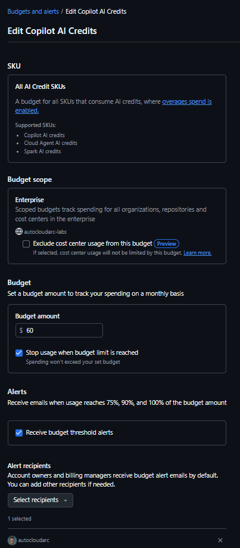
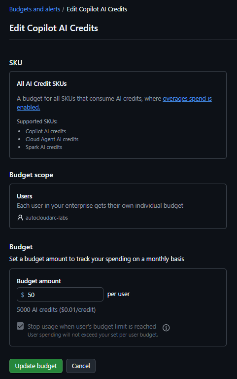
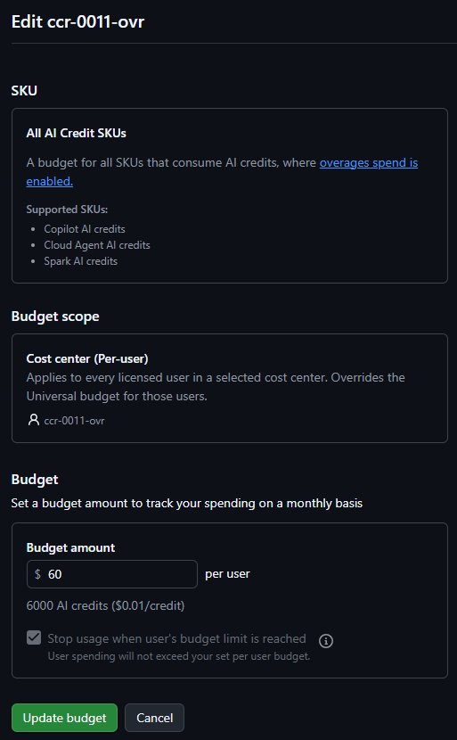
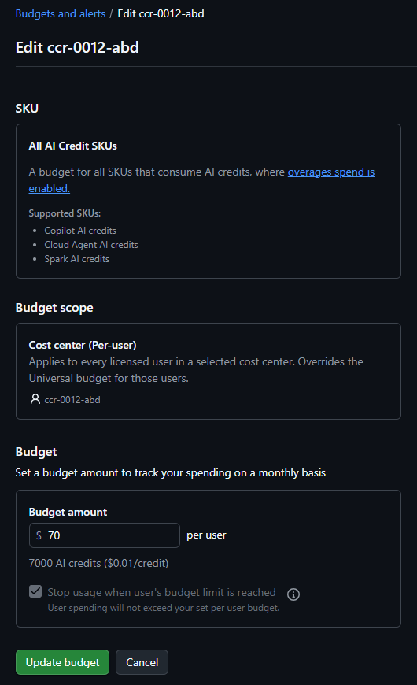
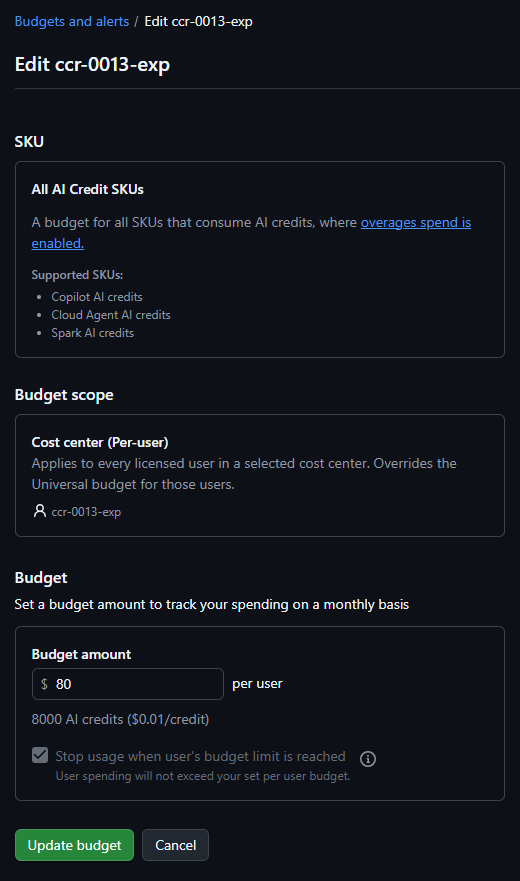
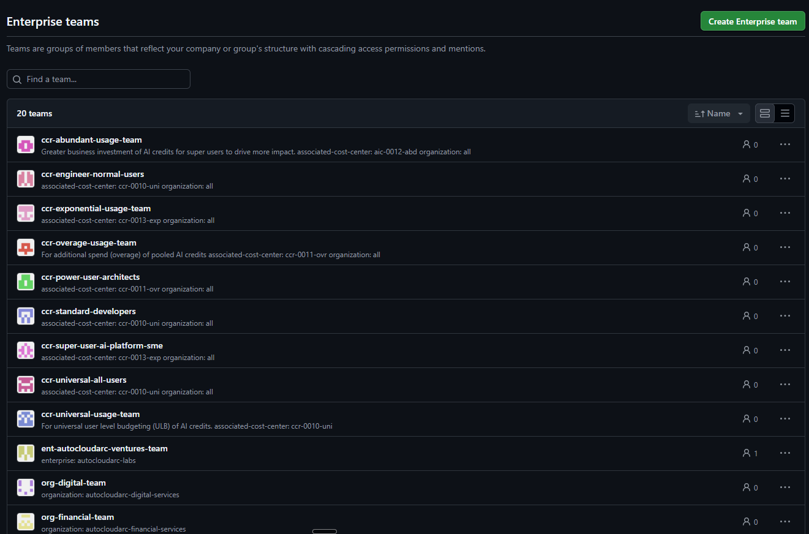
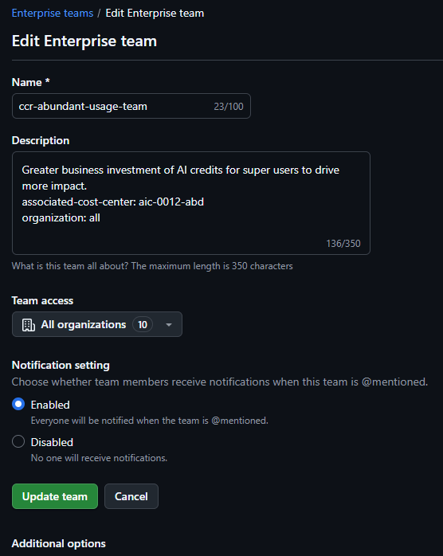
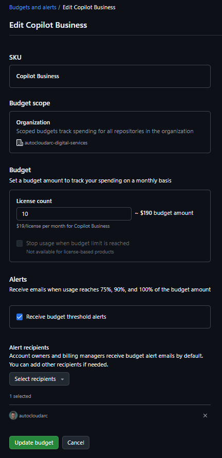
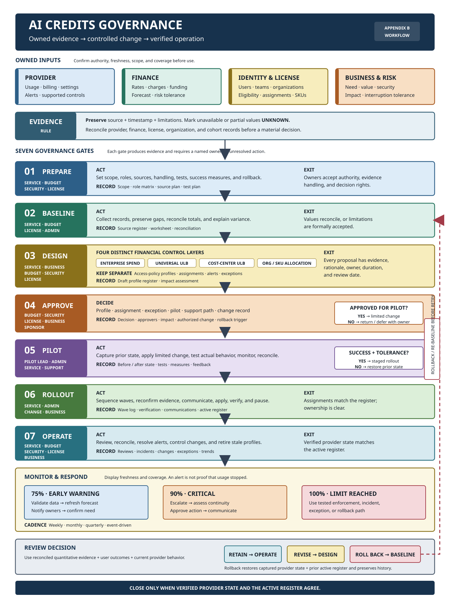

## Audience, scope, and outcomes

This guide is for customer budget owners, service owners, security teams, license managers, business owners, administrators, and assurance reviewers who govern usage-based AI services.

No software integration, source-code package, or particular assessment tool is required. Customers may use approved provider portals, exports, finance records, spreadsheets, scripts, or other approved tools.

AI Credit (AIC) means the provider-defined unit used to measure eligible AI consumption. User-Level Budget (ULB) means a customer-defined per-user spending or consumption boundary where the provider supports one.

The governance process should produce:

* A defined scope and accountable ownership model
* A reconciled consumption, entitlement, and cost baseline
* Configurable financial, user, cohort, and access-policy controls
* Approved profile assignments with evidence and review dates
* Tested alert, enforcement, exception, and rollback procedures
* An operating cadence that keeps records aligned with verified provider state

> [!IMPORTANT]
> Confirm current rates, entitlements, data availability, supported controls,
> control scope, precedence, alerts, and enforcement behavior from
> authoritative provider records and documentation. Use controlled tests to
> verify behavior environment before relying on any control.

## Roles and prerequisites

| Role                       | Accountability                                                       |
| -------------------------- | -------------------------------------------------------------------- |
| Executive sponsor          | Accepts risk posture and material unresolved exceptions              |
| Enterprise budget owner    | Approves financial exposure, response options, and variance          |
| Service owner              | Owns the method, registers, evidence, reviews, and control health    |
| Security owner             | Approves access posture, data handling, and compensating controls    |
| License owner              | Validates eligibility, entitlement, inventory, and assignment        |
| Business owner             | Confirms need, affected population, duration, and interruption risk  |
| Cohort or cost owner       | Accepts cohort membership, funding, and review obligations           |
| Authorized administrator   | Applies and verifies approved provider changes                       |
| Assurance reviewer         | Reviews evidence, approvals, reconciliation, and control operation   |

Complete these prerequisites before design begins:

* Name role owners and escalation delegates
* Define enterprise, organizations, AI Credit SKUs, population, and period scope
* Approve evidence storage, retention, access, and data handling
* Confirm access to authoritative provider, license, and finance records
* Establish change, incident, exception, and rollback processes
* Define acceptable reconciliation tolerance and unresolved-data treatment
* Document planned controlled tests

## 1. Get AI Included Credits

*Retrieve the current AI included credits for the enterprise.*

AI included credits are the provider-defined units bundled with eligible licenses or services for a specific billing period. Establish the enterprise
total from current license inventory, applicable SKU rates, assignment dates, and authoritative provider records. Record both the total and the assumptions
used to calculate or retrieve it. *Tip: Navigate to: Enterprise->Billing and licensing (tab)->AI Usage Pane*

This value is the baseline for forecasting when metered overage could begin. It also allows budget owners to distinguish consumption already covered by an
entitlement from consumption that may create an additional charge.

Included credits are not a cash budget, and a displayed balance may not represent every organization, SKU, adjustment, or delayed usage record. Rates,
pooling rules, expiration behavior, and billing-period boundaries can change. Treat unavailable or partial values as unknown and reconcile the total before using it for a financial decision.

## 2. Set Enterprise Spending Budget

*Set the enterprise spending budget for AI credits as a universal buffer.*

The enterprise spending budget is the approved aggregate boundary for metered AI Credit charges after included entitlements are exhausted. Define its scope,
currency or credit unit, billing period, alert thresholds, recipients, decision owners, and the response expected when each threshold is reached.

This control provides a financial backstop across the enterprise. It limits unplanned exposure, gives owners time to investigate abnormal consumption, and
establishes clear authority for increasing, pausing, or retaining the limit.

A provider budget may be informational, alert-only, or enforcing. Do not assume that reaching the displayed amount stops usage. Confirm whether prior
commitments, delayed events, excluded products, or organization-specific spend sit outside the boundary, and test enforcement and rollback behavior before relying on it.

*Figure: 1 - Enterprise spending budget configuration.*

## 3. Establish User Level Budget (ULB) Profiles

*Define user level budget profiles for AI credits.*

A User-Level Budget profile is a reusable per-user consumption boundary with a defined period, value, alert behavior, enforcement posture, ownership, and
eligible population. Establish an enterprise-wide default and, where justified, more specific profiles for approved cohorts with materially different needs.

Profiles make per-user treatment consistent and reviewable. They reduce the risk that one account silently consumes a disproportionate share of the pool
while providing a documented path for legitimate higher-usage work.

A ULB is a financial control, not proof of license eligibility, feature access, or business need. More specific assignments may override the universal default,
and overlapping assignments can produce unexpected precedence. Confirm how the provider evaluates limits, alerts, resets, and hard stops, then document
exceptions and interruption impact before assignment.

*Figure: 2 - User-universal budget configuration.*

*Figure: 3 - Cost-center per-user budget configuration for ccr-0011-ovr.*

*Figure: 4 - Cost-center per-user budget configuration for ccr-0012-abd.*

*Figure: 5 - Cost-center per-user budget configuration for ccr-0013-exp.*

## 4. Create a taxonomy for ULBs

*Define a taxonomy for user level budget profiles.*

A ULB taxonomy is the controlled classification scheme used to name and distinguish profiles. Define categories by business need, expected consumption
range, interruption tolerance, duration, funding owner, and review cadence rather than by usage volume alone.

The taxonomy gives reviewers a shared vocabulary for comparing profiles and helps administrators apply the same criteria across organizations. It also
supports reporting, exception management, and lifecycle decisions without embedding arbitrary amounts or temporary organizational details in every name.

Taxonomy labels do not automatically classify users or enforce a limit. Avoid terms that imply performance, seniority, or permanent entitlement, and do not
promote users solely because they crossed a threshold once. Define entry, exit, expiry, and reassessment criteria so categories do not become stale privileges.

## 4.1 Example ULB Budget Profiles Taxonomy

*user-universal-50*
The default per-user budget for all eligible users, with a monthly limit of 50 AI Credits.

*user-cost-center-ccr-0011-ovr-60*
A cost-center-specific profile for the "ccr-0011-ovr" cohort where "ccr" is the cost center prefix and "ovr" represents "overage usage" limit of 6,000 AI Credits.

*user-cost-center-ccr-0012-abd-70*
A cost-center-specific profile for the "ccr-0012-abd" cohort where "ccr" is the cost center prefix and "abd" represents "abundant usage" limit of 7,000 AI Credits.

*user-cost-center-ccr-0013-exp-80*
A cost-center-specific profile for the "ccr-0013-exp" cohort where "ccr" is the cost center prefix and "exp" represents "exponential usage" limit of 8,000 AI Credits.

## 5. Create Enterprise Team Naming Standards

*Define enterprise team naming standards in order to ensure consistency and clarity across the organization.*

An enterprise team naming standard is a documented grammar for team names and stable identifiers. Define required segments such as service, business unit,
purpose, environment, or governance class, together with approved values, character rules, length limits, examples, and an accountable owner.

Consistent names let administrators and reviewers understand a team's intended scope without relying on personal knowledge. They improve search, automation,
reporting, assignment reviews, and incident response, especially when similar teams exist across many organizations.

A name is metadata, not evidence of membership, ownership, entitlement, or policy enforcement. Provider restrictions and existing integrations may limit
which fields can change. Prefer stable identifiers for automation, preserve aliases or migration mappings when names change, and avoid embedding sensitive
information or values likely to become obsolete.

## 5.1 Enterprise Teams Naming Standard Examples

*Figure: 6 - Enterprise team naming standard examples with cost-center and organization mappings.*

*Add a clear description to every team. A description is a human-readable statement of the team's purpose, scope, and owner. It helps reviewers understand the intended membership and use of the team without relying on personal knowledge. It also improves search, reporting, and assignment reviews. For billing, consider including the cost center or organization in the description to make it easier to reconcile with finance records.*

*Figure: 7 - Enterprise team configuration for ccr-abundant-usage-team.*

## 6. Create or Update Enterprise Team Names or Properties

*Define or update enterprise team names or properties according to the standards established above.*

Create new enterprise teams or bring existing team names, descriptions, ownership fields, and other approved properties into alignment with the naming
standard. Record the provider identifier, prior value, proposed value, owner, reason, affected assignments, and effective date for every change.

Applying the standard turns a design convention into an operable inventory. It also creates reliable references for ULB cohorts, cost centers, policy profiles,
communications, and assurance evidence.

Renames and property changes can break scripts, reports, synchronization, or manual procedures that use a mutable name as a key. Membership changes may also
alter access or financial treatment. Assess those effects separately, stage high-impact changes, verify the resulting membership and assignments, and retain
a tested restoration path.

## 7. Establish Cost Center Naming Standards

*Define cost center naming standards in order to ensure consistency and clarity across the enterprise.*

A cost center naming standard defines how billing and governance groupings are identified across the enterprise. Specify which segments represent the service,
funding owner, business unit, environment, purpose, or profile class, and define how names map to authoritative finance identifiers.

The standard makes allocation and reconciliation repeatable. A reviewer should be able to connect a provider cost center to its owner, approved population,
budget treatment, and finance record without interpreting an informal label.

The provider name should not replace the finance system's immutable identifier, and creating a label does not establish charge-back authority or complete data
coverage. Account for provider length and character constraints, mergers and renames, shared funding, and one-to-many mappings between technical and finance structures.

## 7.1 Cost Center Naming Standard Examples

*ccr-0010-uni* Universal cost center for general-purpose AI Credit usage, where "ccr" is the cost center prefix and "uni" represents "universal usage".
*ccr-0011-ovr* Cost center for the "ccr-0011-ovr" cohort where "ccr" is the cost center prefix and "ovr" represents "overage usage".
*ccr-0012-abd* Cost center for the "ccr-0012-abd" cohort where "ccr" is the cost center prefix and "abd" represents "abundant usage".
*ccr-0013-exp* Cost center for the "ccr-0013-exp" cohort where "ccr" is the cost center prefix and "exp" represents "exponential usage".

## 8. Create or Update ULB-based Cost Center Names or Properties

*Define or update ULB-based cost center names or properties according to the standards established above.*

A ULB-based cost center represents an approved cohort whose members receive a specific per-user budget profile. Create or update its name, owner, mapped team
or population, profile reference, funding context, expiry, and review date in accordance with the cost center standard.

This mapping makes higher or otherwise specialized per-user limits traceable. It separates documented exceptions from the universal ULB and gives budget
owners a defined population to review, forecast, and reconcile.

This is still a collection of per-user controls, not necessarily a pooled cost center budget. Membership errors or overlapping mappings can assign the wrong
limit, and a provider may use different precedence rules than the design assumes. Verify effective assignments after every change and remove users when
their approved need or time-bound exception ends.

## 9. Establish Organization based Cost Center Naming Standards

*Define organization based cost center naming standards in order to ensure consistency and clarity across the enterprise.*

An organization-based cost center naming standard identifies billing groupings whose primary scope is a provider organization, license SKU, or accountable
business owner. Define how the name distinguishes organization allocation from ULB cohort allocation and how it links to the authoritative organization and finance identifiers.

The distinction supports SKU-level forecasting, ownership, and reconciliation without confusing an organizational boundary with a user-level exception. It
also helps reviewers identify whether a variance arises from license inventory, organization membership, usage, or an allocation rule.

Organizations and finance cost centers rarely have a permanent one-to-one relationship. Shared services, user transfers, multiple SKUs, and reorganizations
can create one-to-many or many-to-one mappings. Define effective dates and mapping ownership, and do not infer a provider budget or policy merely from the cost center name.

## 9.1 Organization based Cost Center Naming Standard Examples

*org-0001-dig* Organization-based cost center for the "org-0001-dig" organization where "org" is the cost center prefix and "dig" represents "digital services".
*org-0002-fin* Organization-based cost center for the "org-0002-fin" organization where "org" is the cost center prefix and "fin" represents "financial services".
*org-0003-hlt* Organization-based cost center for the "org-0003-hlt" organization where "org" is the cost center prefix and "hlt" represents "healthcare solutions".
*org-0004-mfg* Organization-based cost center for the "org-0004-mfg" organization where "org" is the cost center prefix and "mfg" represents "manufacturing group".
*org-0005-mar* Organization-based cost center for the "org-0005-mar" organization where "org" is the cost center prefix and "mar" represents "marine industries".
*org-0006-mil* Organization-based cost center for the "org-0006-mil" organization where "org" is the cost center prefix and "mil" represents "military operations".
*org-0007-opn* Organization-based cost center for the "org-0007-opn" organization where "org" is the cost center prefix and "opn" represents "open source initiatives".
*org-0008-rtl* Organization-based cost center for the "org-0008-rtl" organization where "org" is the cost center prefix and "rtl" represents "retail operations".
*org-0009-spc* Organization-based cost center for the "org-0009-spc" organization where "org" is the cost center prefix and "spc" represents "space fleet".
*org-0010-prp* Organization-based cost center for the "org-0010-prp" organization where "org" is the cost center prefix and "prp" represents "property management".

## 10. Create or Update Organization based Cost Center Names or Properties

*Define or update organization based cost center names or properties according to the standards established above.*

Create or update organization-based cost centers with their approved names, organization references, SKU scope, finance mapping, owner, and review date.
Capture the prior state and reconcile organization membership and license inventory before applying the change.

Maintaining these objects provides an auditable allocation layer between provider billing records and internal financial accountability. It allows
enterprise totals to be explained by organization and SKU while preserving a named owner for unresolved variances.

Allocation changes may apply only to future usage and may not restate historical charges. Moving an organization or user can also change reports without changing
actual consumption. Confirm provider effective-date behavior, avoid double counting users or usage across mappings, and verify both provider and finance records after the update.

## 11. Assess Current GitHub Copilot Policies

*Retrieve the current GitHub Copilot policies for the enterprise and organizational levels.*

Assessing current GitHub Copilot policies means creating a timestamped baseline of configured and effective settings at every relevant scope. Capture the source,
retrieval method, permissions, enterprise defaults, organization values, exceptions, unsupported fields, and any setting whose effective state cannot be confirmed.

The baseline is necessary for gap analysis, impact assessment, rollback, and independent verification. Without it, a desired-state change can unintentionally
remove an existing restriction, preserve hidden drift, or misidentify an inherited value as an organization decision.

An unavailable value is not equivalent to disabled or unrestricted. Portals, APIs, exports, and documentation may expose different portions of the policy
surface, and the effective result may depend on SKU, inheritance, precedence, or propagation delay. Reconcile sources and preserve unknowns explicitly.

### 11.1 Assess Enterprise GitHub Copilot Policy Set Profile

*Retrieve the current enterprise GitHub Copilot policy set profile.*

The enterprise policy assessment identifies the highest-scope Copilot defaults, constraints, assignments, and permitted organization variation. Record each
setting's configured value, source, owner, affected population, and observed effective behavior where a controlled test is appropriate.

This assessment defines the control envelope within which organization profiles operate. It reveals broad-impact settings, establishes the rollback baseline,
and prevents organization-level designs from depending on behavior the enterprise layer prohibits.

The provider may not expose a single object called an enterprise policy set profile. The profile can therefore be a customer-controlled record that maps to
several provider settings. Do not fill unsupported or inaccessible fields with assumed defaults, and verify whether changes affect existing organizations,
future organizations, or both.

### 11.2 Assess Organizational GitHub Copilot Policy Set Profile

*Retrieve the current organizational GitHub Copilot policy set profile.*

The organization policy assessment records each in-scope organization's local Copilot settings, inherited enterprise values, approved exceptions, eligible
SKUs, and effective user population. Compare organizations using the same field definitions so omissions and drift are visible.

Organization-level evidence is important because a compliant enterprise default does not guarantee a consistent effective posture. Local overrides, historical
configuration, licensing differences, or incomplete rollout can produce materially different access and risk outcomes.

A displayed organization value may be inherited, locked, stale, or inapplicable to some users. Do not treat configuration equality as proof of equal behavior.
Record inheritance and precedence separately, preserve inaccessible results as unknown, and validate representative organizations before generalizing.

### 11.3 Example Enterprise GitHub Copilot Policy Set Profile Schema

*Use the workbook schema as an editable policy catalog and governance baseline.*

The schema below is extracted from
[github-copilot-policy-sets.xlsx](../data/github-copilot-policy-sets.xlsx), whose source metadata was verified on August 5, 2026. The workbook states that
it is a reference catalog, not an API export of a specific enterprise or organization. Reconcile its values with current provider state before using it
as an approval or change record.

#### Workbook structure

| Worksheet | Purpose | Data rows | Observed scope | Observed statuses |
| --------- | ------- | --------- | -------------- | ----------------- |
| `notes-sources-legend` | Purpose, conventions, source links, conflict guidance, and budget-impact legend | Reference content | Not applicable | Not applicable |
| `ent-ghcp-policy-set-labs` | Enterprise policy baseline for `autocloudarc-labs` | 24 | `ent` | 2 `enabled`, 22 `let-orgs-decide` |
| `org-ghcp-policy-set-digi-svcs` | Organization policy baseline for `autocloudarc-digital-services` | 28 | `org` | 15 `enabled`, 13 `disabled` |

Each policy worksheet contains one row per policy and uses the same 13-column shape. The owner column changes from `ent-name` to `org-name` according to
scope. The first ten fields are populated in every current policy row. The three change-tracking fields are present but empty in the supplied baseline.

#### Policy record fields

| Source field | Type | Baseline population | Definition and constraints |
| ------------ | ---- | ------------------- | -------------------------- |
| `index` | Text | Required | Three-digit row identifier such as `001`; unique within each worksheet |
| `ent-name` or `org-name` | Text | Required | Enterprise or organization that owns the policy record; field must agree with `scope` |
| `policy-set-name` | Text | Required | Stable name that groups the policy rows into one profile |
| `policy-name` | Text | Required | Human-readable provider policy name; unique within each supplied profile |
| `scope` | Enum | Required | Excel list allows `ent` or `org`; current enterprise and organization sheets use their corresponding value |
| `description` | Text | Required | Plain-language statement of the capability governed by the policy |
| `status` | Enum | Required | Excel list allows `enabled`, `disabled`, or `let-orgs-decide` |
| `settings` | Text | Required | Human-readable allowed values, dependencies, surface coverage, and policy-specific caveats; not a machine-readable settings object |
| `conflict-behavior` | Text | Required | Provider precedence or cross-organization behavior; records “not specified” when the provider conflict table is silent |
| `budget-impact` | Enum | Required | Qualitative planning value: `low`, `medium`, or `high`; not a price or forecast |
| `change-date` | Date | Optional | Date of an approved change; cells use the workbook display format `d-mmm-yy` |
| `change-reason` | Text | Optional | Business, risk, support, or compliance rationale for changing the baseline |
| `notes` | Text | Optional | Supporting evidence, exception details, limitations, or follow-up actions |

Treat `(scope, owner name, policy-set-name, policy-name)` as the logical record key when combining worksheets. The three-digit `index` is a local display
sequence and is not globally unique. Keep `settings` as explanatory evidence; store provider-specific structured values separately if automation requires them.

#### Controlled-value interpretation

| Field | Value | Meaning |
| ----- | ----- | ------- |
| `status` | `enabled` | The policy permits or activates the capability at the recorded scope |
| `status` | `disabled` | The policy blocks or deactivates the capability at the recorded scope |
| `status` | `let-orgs-decide` | The enterprise delegates the effective choice to organizations where supported |
| `budget-impact` | `high` | The capability may materially increase metered consumption |
| `budget-impact` | `medium` | The capability normally contributes Copilot or premium-request consumption |
| `budget-impact` | `low` | The capability is primarily governance-oriented or has negligible usage impact |

Conflict behavior is policy-specific. The workbook uses least-restrictive, most-restrictive, and “not specified” descriptions rather than reducing all
policies to one precedence rule. For users licensed through multiple enterprises, the notes state that the most restrictive enterprise policy
usually applies, with exceptions for AI Credit paid usage and GitHub Spark.

#### Source references

| Subject | Provider reference |
| ------- | ------------------ |
| Policy concepts | [About policies for GitHub Copilot](https://docs.github.com/en/copilot/concepts/policies) |
| Enterprise policy management | [Manage policies and features for Copilot in your enterprise](https://docs.github.com/en/enterprise-cloud@latest/copilot/how-tos/administer-copilot/manage-for-enterprise/manage-enterprise-policies) |
| Organization policy management | [Manage policies for Copilot in your organization](https://docs.github.com/en/copilot/how-tos/administer-copilot/manage-for-organization/manage-policies) |
| Policy conflicts | [Policies for Copilot in multiple organizations and enterprises](https://docs.github.com/en/enterprise-cloud@latest/copilot/reference/enterprise-administrators/policy-conflicts) |
| Supported policy surfaces | [Copilot policy support by feature and client](https://docs.github.com/en/enterprise-cloud@latest/copilot/reference/supported-surfaces-for-policies) |

> [!CAUTION]
> The enterprise worksheet is named `ent-ghcp-policy-set-labs`, but every
> current `policy-set-name` value is
> `org-ghcp-policy-set-autocloudarc-labs`. Confirm whether that `org-` prefix is
> intentional before using it as a stable enterprise profile identifier.
>
> The workbook's `low,medium,high` list validation extends from
> `budget-impact` into `change-date` cells. On the organization sheet it covers
> only change-date rows 2 through 25. Correct those validation ranges before
> entering dates; otherwise Excel may reject valid dates or apply inconsistent
> validation across policy rows.

## 12. Define Desired State of GitHub Copilot Policy Set Profiles

*Establish the desired state of GitHub Copilot policy set profiles for the enterprise and organizational levels.*

The desired state is the approved target for Copilot feature, model, service, integration, and access posture at enterprise and organization scopes. Define
each target value with its business rationale, risk owner, eligible population, source requirement, exception path, validation method, and review date.

A documented target converts broad governance intent into testable decisions. It supports consistent implementation, exposes the gap from current state, and
lets approvers evaluate user impact before an administrator changes provider configuration.

Design only for capabilities confirmed in current provider documentation and the applicable SKUs. Keep access-policy profiles separate from financial budgets
and ULBs even when they share populations. Where the provider has no named profile object, maintain the profile in the controlled register and map it to
the individual settings that implement it.

*Note: You may reuse the same schema above for enterprise and organizational desired-state profiles.*

### 12.1 Enterprise Profile

*Set the desired state of the enterprise GitHub Copilot policy set profile.*

The enterprise profile is the default or mandatory access posture intended to apply across the enterprise. It should define which decisions are centralized,
which may be delegated to organizations, and what minimum controls no local profile may weaken.

This profile creates a stable baseline for security, compliance, support, and user experience. It reduces accidental variation and makes organization
exceptions explicit rather than allowing historical settings to become policy.

Enterprise settings have a wide blast radius and can interrupt critical work. Do not select restrictive or permissive values solely for consistency. Assess
license compatibility, data handling, operational dependencies, and fallback options, then validate representative use cases before broad application.

#### 12.1.1 Naming Standards

*Create a naming standard for Enterprise GitHub Copilot Policy set profiles that can be documented and referenced.*

Define a stable naming pattern for enterprise profiles that communicates scope, posture, lifecycle state, and version without encoding volatile settings in the
name. Document approved abbreviations, examples, uniqueness rules, and the relationship between a display name and the profile register identifier.

Consistent names allow approvals, tests, changes, reports, and rollback records to reference the same design unambiguously. Versioning also makes it possible to
compare an approved proposal with the profile actually applied.

The name does not enforce the profile and may not exist as a provider field. Respect provider character and length restrictions, avoid confidential details,
and never reuse an identifier for a materially different posture. Preserve the history of retired names and versions.

*Note: A simple approach may be to use `ent-ghcp-policy-set-<enterprise-name>` for enterprise profiles.*

#### 12.1.2 Policy Settings

*Define the policy settings for the enterprise GitHub Copilot policy set profile.*

Specify the enterprise target for each supported Copilot capability, including feature availability, model access, agent or automation modes, integrations,
data-sensitive functions, and organization delegation. For every setting, record allowed values, rationale, owner, dependencies, validation evidence, and
fallback behavior.

This level of detail turns the profile into an implementable and testable control rather than a descriptive label. It also helps support teams explain why a
capability is available, limited, or disabled.

Settings can vary by SKU, organization, client, or rollout status, and similar labels may not have identical effects. Confirm precedence and effective behavior
instead of relying on display text. Policy settings govern access posture; they must not be presented as spending limits unless the provider explicitly links
the behaviors and that linkage has been verified.

### 12.2 Organizational Profiles

*Set the desired state of the organizational GitHub Copilot policy set profile.*

Organizational profiles define approved variations from the enterprise baseline for populations with different business functions, risk exposure, licenses, or
operational needs. Each profile should state its qualifying criteria, owner, scope, duration, enterprise dependencies, and exception process.

These profiles allow local needs to be met without abandoning enterprise governance. A small, reusable catalog is easier to approve, support, test, and
review than one bespoke configuration per organization.

An organization profile cannot override an enterprise restriction unless the provider and governance model explicitly permit it. Too many profiles increase
drift and support cost, while overly broad profiles can grant unnecessary capability. Require a material rationale for every variation and retire profiles that no longer serve a distinct need.

#### 12.2.1 Naming Standards

*Create a naming standard for organizational GitHub Copilot policy set profiles that can be documented and referenced.*

Define an organizational profile naming pattern that identifies the reusable posture and, where necessary, its SKU, risk class, or lifecycle state. Keep the
profile name separate from the organization name so one approved design can be assigned consistently to several organizations.

The standard improves inventory, assignment review, change sequencing, and drift detection. It also prevents minor wording differences from hiding
materially identical or conflicting profiles.

Names should not imply that an organization is compliant or that settings are currently applied. Maintain the actual assignment and verification state in the
profile register, preserve prior versions, and account for provider constraints if the name must also be represented in an external system.

*Note: A simple approach may be to use `org-ghcp-policy-set-<organization-name>` for organizational profiles.*

#### 12.2.2 Policy Settings

*Define the policy settings for the organizational GitHub Copilot policy set profile.*

For each organizational profile, define the local target values and identify which settings are inherited, overridden, prohibited, or not applicable. Link
every deviation to an approved business need, license basis, risk decision, test, owner, and review date.

Explicit treatment of inheritance prevents reviewers from mistaking an omitted field for an intentional value. It also supports a deterministic comparison
between enterprise baseline, organization proposal, and observed effective state.

Do not copy every enterprise value into every organization record if inheritance is authoritative; duplication can conceal later drift. Conversely, do not rely
on inheritance without verifying it. Feature availability and effective behavior may differ by SKU or rollout, so test representative users without treating a
single successful result as universal coverage.

### 12.3 Apply GitHub Copilot Policy Set Profiles

*Apply the desired state of the GitHub Copilot policy set profiles for the enterprise and organizational levels.*

Applying profiles is the controlled translation of approved register values into provider configuration. Link the change to the current baseline, confirm
authority, capture prior state, sequence the affected scopes, apply only approved values, and independently verify the resulting effective behavior.

This procedure closes the gap between documented intent and operational state while preserving accountability and rollback evidence. A staged rollout limits
the effect of an incorrect precedence assumption or unsupported setting.

Provider updates may be asynchronous, partially accepted, or unavailable through the chosen interface. A successful request is not proof that every user received
the target behavior. Record per-scope results, propagation windows, warnings, and exceptions, and stop the rollout when verification or success criteria fail.

#### 12.3.1 Apply Enterprise Profile

*Apply the desired state of the enterprise GitHub Copilot policy set profile.*

Apply the enterprise profile through an authorized administrator after approval, impact assessment, and a representative controlled test. Change the smallest
practical set of values, retain the prior configuration, and verify enterprise defaults as well as the behavior of organizations with existing local settings.

Enterprise application establishes the baseline on which all later organization work depends. Performing it first, when precedence requires that order, makes
subsequent deviations visible and reduces ambiguity during verification.

Because the blast radius is broad, do not combine unrelated enterprise changes or assume rollback is instantaneous. Confirm communications, support readiness,
active sessions, propagation timing, and emergency exceptions before the change, then reconcile the provider state with the approved profile register.

#### 12.3.2 Apply Organizational Profiles

*Apply the desired state of the organizational GitHub Copilot policy set profile.*

Assign and apply approved organizational profiles in controlled waves. For each organization, confirm the intended profile version, enterprise dependencies,
SKU, owner, affected population, exception status, and prior state before an administrator changes configuration.

Wave-based application makes comparison and pause decisions possible. It allows the team to learn from representative organizations before exposing the entire
population and produces clear evidence for each assignment.

Do not infer success from the enterprise baseline or from another organization's result. Local history, licensing, and overrides can change the outcome. Verify
configured and effective state independently, record partial failures, and keep an organization on its prior approved profile until its change meets the defined
exit criteria.

## 13. Define Budgets

*Define enterprise user level and organizational budgets based on the previously established teams, cost centers, and organizational structures and configurations.*

Define the approved financial control hierarchy using the established teams, cost centers, organizations, SKUs, and profile assignments. Distinguish the
included-credit baseline, enterprise metered-overage boundary, universal per-user limit, cost-center ULB overrides, and organization or SKU allocations.

Layered budgets answer different questions: how much entitlement is available, how much aggregate overage the enterprise accepts, how much one user may consume,
and which owner is accountable for an allocation. Documenting those layers prevents a single value from being used for incompatible decisions.

Provider support, units, scope, precedence, reset periods, alerts, and enforcement can differ by control. Do not add per-user limits together and call the result an
enterprise cap, or count the same usage in several allocation views. Reconcile every proposed layer to authoritative billing behavior and keep organization
policy profiles separate from financial budget records.

### 13.1 Enterprise Level

*Set the enterprise level budgets for AI credits.*

Enterprise-level budgeting combines the aggregate metered-overage boundary with the default per-user ULB. Define their common billing period, applicable products
and organizations, owners, thresholds, responses, exception authority, and relationship to the included-credit pool.

Together these controls address both systemic and concentration risk. The aggregate limit constrains total exposure, while the per-user default reduces
the chance that one user consumes a disproportionate amount before enterprise owners can respond.

The two controls are not interchangeable and may be evaluated at different times. A user can reach a ULB while enterprise capacity remains, or enterprise
spend can reach its boundary while individual users remain below theirs. Test both paths and define which response takes precedence when several thresholds are reached together.

#### 13.1.1 Enterprise Spend Budget

*Configure the enterprise spend budget for AI credits.*

Configure the enterprise spend budget as the approved limit or monitoring threshold for aggregate metered AI Credit charges. Record the amount, currency
or credit basis, period, included and excluded services, alert recipients, enforcement selection, approval authority, and emergency decision path.

This budget is the final financial backstop after included credits and more specific usage controls are considered. It provides a clear boundary for
forecasting, escalation, and executive risk acceptance.

The amount may not equal the total provider invoice because licenses, commitments, adjustments, or other products can sit outside its scope. Alerts
may lag consumption, and a stop setting may affect supported metered activity without reversing charges already incurred. Validate the exact boundary and
retain response lead time below the limit.

#### 13.1.2 User-Universal (Universal ULB)

*Configure the user-universal budget for AI credits.*

Configure the Universal ULB as the default monthly per-user AI Credit boundary for every eligible user not assigned a more specific approved profile. Define
the value, reset period, alerts, enforcement posture, included population, exclusions, and exception route.

The universal profile establishes equitable baseline treatment and limits concentration risk without requiring an individual decision for every user. It
also makes higher-usage exceptions visible because they must be assigned to a separate profile.

A universal value should not be selected from the average alone; legitimate workloads and interruption impact can vary widely. Confirm whether the provider
counts all models and features toward the same boundary, how mid-period assignments behave, and whether the ULB stops usage or only signals. Monitor for
users whose approved work is repeatedly interrupted.

### 13.2 User-Cost-Center Level (Overage ULBs)

*Create the user-cost-center level budgets for AI credits.*

User-cost-center ULBs are more specific per-user profiles for approved cohorts whose needs differ materially from the universal default. Define each profile's
per-user value, qualifying criteria, mapped cost center and team, funding owner, duration, alerts, enforcement, and reassessment date.

These profiles provide a governed exception path for higher-usage or specialized work while preserving accountability. They can also support a lower boundary
where interruption tolerance or risk warrants tighter control.

An overage ULB is not a shared pool that any cohort member may consume, and the word "overage" does not itself authorize additional spend. Confirm that the more
specific profile overrides rather than adds to the universal ULB, prevent overlapping cohort assignments, and review membership frequently enough to remove stale exceptions.

### 13.3 Organization (SKU based)

*Develop organization (SKU based) budgets for AI credits.*

Organization and SKU-based budgets allocate or monitor expected AI Credit consumption for an accountable organization and license population. Define the
SKU, license count, included-credit basis, forecast, metered-overage tolerance, owner, reporting period, and reconciliation method for each allocation.

This view explains enterprise exposure by business boundary and entitlement type. It helps identify whether a variance is caused by population, rate,
consumption, or allocation changes and gives organization owners a meaningful planning target.

Use a provider-enforced organization budget only where that capability and scope are confirmed. Otherwise, label the value as an internal allocation or monitoring
threshold. Do not confuse it with an organization policy profile, and do not assume organization totals sum cleanly to enterprise totals when shared users,
direct enterprise assignments, delayed records, or exclusions exist.

#### 13.3.1 Copilot Business

*Configure the Copilot Business budget for AI credits.*

Define the Copilot Business allocation from the current number of eligible Business seats, the provider's applicable included-credit rate, observed usage,
planned population changes, and approved overage posture. Link the allocation to the organizations, cost centers, and owners responsible for those seats.

Separating this SKU supports accurate entitlement and consumption forecasting and prevents a blended enterprise average from hiding a Business-specific
variance or adoption pattern.

Do not reuse rates, features, or assumptions from another Copilot SKU. Seat counts and assignments can change during the period, and a billed seat record
may not match current membership at every point in time. Preserve the rate basis and effective dates, and reconcile provider totals before changing the budget.

*Figure: 8 - Copilot Business organization budget configuration for autocloudarc-digital-services.*

#### 13.3.2 Copilot Enterprise

*Configure the Copilot Enterprise budget for AI credits.*

Define the Copilot Enterprise allocation from the current eligible Enterprise seat inventory, applicable included-credit rate, supported capabilities,
observed consumption, and forecast demand. Record the responsible organizations, cost centers, owners, and any material workload expected to affect usage.

This separate allocation makes the financial effect of the Enterprise SKU and its usage patterns visible. It also supports informed decisions about license
mix, feature posture, training, and exceptions without distorting the Business baseline.

A higher entitlement or broader feature set does not prove that every user needs a higher ULB or that all consumption creates equal value. Rates and eligible
features can change, and cross-organization or enterprise-direct assignments may complicate attribution. Validate the current basis and evaluate outcomes as well
as volume.

## 14. Monitor Usage

*Examine enterprise GitHub Copilot usage insights for trends, adoption, and potential areas for optimization.*

Usage monitoring is the repeated observation of AI Credit consumption, burn rate, remaining entitlement, forecast exposure, alerts, data freshness, license
inventory, and profile assignments. Define the source, owner, frequency, thresholds, expected response, and escalation path for every monitored signal.

Monitoring provides early warning before a financial or user-level boundary is reached. It also reveals failed data collection, unexpected concentration,
assignment drift, and changes in adoption that require investigation.

Usage volume alone does not establish business value, misuse, or waste. Provider data can be delayed, revised, aggregated, or incomplete, and a dashboard trend
may reflect a population or entitlement change rather than behavior. Display freshness and coverage, preserve unknown values, and investigate causes before
changing a profile.

### 14.1 Weekly

*Review weekly GitHub Copilot usage insights for trends, adoption, and potential areas for optimization.*

The weekly review is an operational check of active alerts, rapidly changing burn rates, high-exposure cohorts, pilots, exceptions, incidents, failed data sources,
and assignments due to expire. Record actions, owners, acknowledgement status, and decisions that cannot wait for period close.

This cadence leaves time to validate an emerging issue, communicate with affected users, and choose an approved response before a monthly boundary is reached. It
is especially useful during rollout or when forecast uncertainty is high.

Weekly data is a partial-period signal and can be distorted by working-day patterns, releases, leave, or one-time workloads. Do not annualize a short spike
or penalize a cohort from an isolated week. Compare like periods and use the review to trigger investigation rather than to make automatic long-term changes.

### 14.2 Monthly

*Review monthly GitHub Copilot usage insights for trends, adoption, and potential areas for optimization.*

The monthly review reconciles the completed or substantially complete billing period across provider usage, included credits, license inventory, metered
charges, budgets, cost centers, organizations, and profile assignments. Compare actuals with forecast and explain material variances.

Monthly evidence supports budget decisions, chargeback or showback, profile reassessment, trend analysis, and executive reporting. A consistent close process
creates comparable baselines across periods.

Billing, finance, and calendar months may close at different times, and late events or provider adjustments can revise an apparent final value. Define a data
cutoff and restatement process, retain the original snapshot, and avoid declaring the period reconciled while material sources remain incomplete.

## 15. Analyze Monthly AI Credits Usage

*Review monthly AI credits usage for trends, adoption, and potential areas for optimization.*

Monthly analysis converts reconciled usage into explanations and decisions. Evaluate total and per-user consumption, concentration, SKU and organization
mix, forecast variance, overage, alert history, profile distribution, exceptions, and changes from comparable prior periods.

The purpose is to identify which factors drive exposure and whether controls are supporting approved outcomes. Segmenting by population and control profile helps
separate broad adoption from a small number of specialized or anomalous workloads.

Averages can hide concentration, and correlation does not prove that a policy, training event, or feature caused a change. Distinguish measured, calculated,
and forecast values; account for population and rate changes; and pair financial analysis with operational and qualitative evidence before recommending action.

## 16. Obtain Qualitative User Feedback

*Collect qualitative feedback from users regarding their experience with AI credits and GitHub Copilot.*

Qualitative feedback captures user outcomes and constraints that billing data cannot show. Use interviews, surveys, support themes, pilot reviews, or structured
retrospectives to ask about task value, interruption, model and feature fit, workarounds, latency, training needs, and the effect of current limits.

This evidence helps distinguish valuable high consumption from avoidable use and reveals controls that look effective financially but block approved work. It also
provides context for policy, budget, support, and training decisions.

Feedback is subject to selection, recall, and response bias and may contain sensitive code, business, or personnel information. Use approved collection and
retention methods, avoid requesting unnecessary content, include affected low-usage and interrupted users, and do not treat a small set of opinions as a
replacement for reconciled quantitative evidence.

## 17. Review and Adjust Policy Sets

*Review and adjust GitHub Copilot policy sets based on usage insights and qualitative feedback.*

Review policy profiles by comparing their approved objectives with current provider capability, effective settings, usage evidence, incidents, exceptions,
support findings, and user outcomes. Retain, revise, split, consolidate, or retire a profile only through the documented approval and change process.

Periodic adjustment keeps access posture aligned with business need and changing risk. It also removes stale exceptions and settings that no longer produce the
intended outcome.

Do not change policy settings merely to reduce a financial variance when a budget control is the correct mechanism. Avoid changing several settings and budgets at
once because the effects become difficult to attribute. Version the proposal, test representative use cases, stage rollout, and preserve rollback evidence.

## 18. Review and Adjust Budgets

*Review and adjust enterprise, user level, and organizational budgets based on usage insights and qualitative feedback.*

Review each budget layer against reconciled actual, forecast accuracy, business outcomes, interruption evidence, exception use, population changes, rates, and
risk tolerance. Adjust the enterprise overage boundary, universal ULB, cost-center overrides, or organization allocations independently according to
the decision each control serves.

This review keeps financial exposure intentional while allowing approved work to continue. It can correct a limit that is routinely ineffective, unnecessarily
restrictive, or based on an obsolete entitlement or population assumption.

Increasing a budget is not proof of value, and lowering one is not optimization. Do not chase a single anomalous month, normalize recurring overages without
approval, or use a larger ULB as a substitute for resolving inefficient behavior. Model the change, assess aggregate exposure and interruption, approve exceptions,
and monitor the next period against explicit success criteria.

## 19. Token Optimization Training

*Provide training on token optimization strategies to maximize the efficiency of AI credits usage.*

Token optimization training teaches users to obtain the required outcome with appropriate models, features, context, prompts, iteration patterns, and stopping
criteria. Tailor examples to approved workflows and show when a larger context or more capable model is justified rather than promoting minimum consumption in all
cases.

The goal is effective use: reduce avoidable repetition and unnecessary context while preserving quality, security, accessibility, and developer productivity.
Training can also reduce accidental high usage caused by unclear requests, unsupported workflows, or misunderstanding of model and agent behavior.

Tokens and AI Credits are not necessarily equivalent units, and conversion can vary by provider, model, feature, or time. Do not promise a fixed saving without
current evidence. Never encourage users to omit necessary context, bypass policy, expose sensitive data, or accept lower-quality results solely to reduce measured
consumption; evaluate outcomes as well as credit volume.

## 20. Continuous Improvement and Iteration (Sections 14-19)

*Loop continuously to review and iterate on the processes, policies, and budgets related to AI credits and GitHub Copilot usage to drive ongoing improvement and optimization.*

Continuous improvement is the governed cycle that connects monitoring, monthly analysis, user feedback, policy review, budget review, and training. At each
cycle, document the evidence baseline, hypothesis, approved action, owner, success measure, observation period, result, and decision to retain, revise, or roll back.

The cycle keeps controls current as provider capabilities, rates, populations, business needs, and risks change. It also turns isolated adjustments into an
auditable learning process and carries unresolved findings into the next review with named owners.

Continuous does not mean constant configuration change. Frequent overlapping changes create fatigue, obscure causality, and weaken baselines. Prioritize
material issues, allow enough observation time, preserve stable control periods, and balance cost with value, access, security, reliability, and user impact.

## Appendix A: Design and assignment criteria

Review usage evidence for explicit business decisions. Do not assign a profile solely because a user or group consumed more than an average.

| Criterion                   | Decision question                                                            |
| --------------------------- | -----------------------------------------------------------------------------|
| Usage evidence              | Are sources current, complete enough, owned, and reconciled?                 |
| Business need               | What approved outcome requires this control or access posture?               |
| Forecast exposure           | What consumption and financial range is plausible during the billing period? |
| Interruption tolerance      | What happens if alerts fire or usage is limited?                             |
| Security                    | Are data, feature, service, and integration risks accepted?                  |
| License eligibility         | Is each person eligible and correctly entitled for the proposed profile?     |
| Ownership                   | Who funds, approves, operates, supports, and reviews the assignments?        |
| Duration                    | Are the assignments standing, temporary, pilot-only, or event-bound?         |
| Review date                 | When must evidence, need and value be reassessed?                            |

Reject or defer an assignment when material evidence is unknown, ownership is missing, license eligibility is unresolved, or interruption impact has not been accepted.

## Appendix B: Governance architecture and workflow

*Figure: 9 - AI Credits governance architecture and workflow.*

## Appendix C: Lifecycle phases

Each phase is a gate. Record a named owner for every unresolved action before moving forward.

| Phase      | Owners                                        | Actions                                                                    | Evidence                                                 | Exit criteria                                                          |
| ---------- | --------------------------------------------- | -------------------------------------------------------------------------- | -------------------------------------------------------- | ---------------------------------------------------------------------- |
| Prepare    | Service, budget, security, and license        | Set scope, roles, sources, handling, tests, success measures, and rollback | Scope, role matrix, source plan, and test plan           | Owners accept scope, authority, evidence handling, and decision rights |
| Baseline   | Service, budget, license, and administrator   | Collect sources, mark gaps, reconcile totals, and document variances       | Source register, worksheet, and reconciliation record    | Required values are reconciled or limitations are formally accepted    |
| Design     | Service, business, budget, security, license  | Propose four-layer profiles, assignments, responses, names, and reviews    | Draft profile register and impact assessment             | Every proposal has evidence, rationale, owner, duration, and review    |
| Approve    | Budget, security, license, business, sponsor  | Decide each profile, exception, pilot, support path, and change record     | Decisions, approvals, exceptions, and authorized change  | Each proposal is approved, rejected, or returned with a named owner    |
| Pilot      | Pilot lead, administrator, service, support   | Capture prior state, apply a limited change, test, monitor, and reconcile  | Before and after state, tests, measures, and feedback    | Success and tolerance criteria are met, or rollback is completed       |
| Rollout    | Service, administrator, change, and business  | Sequence waves, reconfirm evidence, communicate, apply, verify, and pause  | Wave records, verification, communications, and register | In-scope assignments match the active register and ownership is clear  |
| Operate    | Service, budget, security, license, business  | Review, reconcile, resolve alerts, control changes, and retire profiles    | Reviews, incidents, changes, exceptions, and trends      | Controls operate on schedule and verified state matches the register   |

## Appendix D: Monitoring and response

Set triggers from risk tolerance, forecast uncertainty, lead time, and validated model or harness provider behavior. Do not assume that an alert blocks usage or that a displayed limit is enforced.

| Stage                | Configurable trigger                                    | Response                                                          | Evidence                                                     |
| -------------------- | ------------------------------------------------------- | ----------------------------------------------------------------- | ------------------------------------------------------------ |
| Early warning (75%)  | Customer-selected signal that leaves response lead time | Validate data, refresh forecast, notify owners, and confirm need  | Alert, owner acknowledgement, data check, and new forecast   |
| Critical (90%)       | Customer-selected signal requiring an owner decision    | Escalate, assess continuity, choose action, and communicate       | Decision, impact assessment, approval, and communication     |
| Limit reached (100%) | Verified boundary event or equivalent provider state    | Follow tested enforcement, incident, exception, or rollback path  | Provider event, action record, approval, and reconciliation  |

For each stage, record trigger logic, source, evaluation frequency, recipients, acknowledgement target, decision authority, supported actions, and fallback communication. Validate alert timing and delivery with controlled tests.

## Appendix E: Reconciliation and data quality

Use this procedure whenever sources disagree or coverage changes:

1. Preserve the original records, timestamps, scope, and warnings.
2. Classify each value by source and distinguish measured, calculated, forecast, and manually confirmed values.
3. Confirm period, account scope, population, service, entitlement, and rate basis from authoritative records.
4. Compare provider totals with finance, license, organization, and cohort records without treating unlike measures as interchangeable.
5. Separate expected coverage differences from unexplained variance.
6. Record the variance, cause, owner, tolerance decision, and due date.
7. Recalculate forecasts and reassess assignments with reconciled inputs.
8. Block approval when unknown data or information gaps could change eligibility, exposure, precedence, interruption impact, or enforcement decisions.

Treat failed, unauthorized, unsupported, delayed, hidden, or partial results as unknown. Never convert them to zero, an empty population, or evidence of no consumption.

## Appendix F: Exceptions, change control, and rollback

Every exception must record the affected profile and population, business reason, risk, compensating controls, forecast impact, approvers, start, expiry, review date, and rollback trigger.

Use this change procedure:

1. Link the request to the active profile version and evidence baseline.
2. Capture current provider state and a tested restoration method.
3. Assess financial, security, entitlement, business, support, and interruption effects.
4. Obtain required approvals and create the proposed register version.
5. Validate through a controlled test or approved pilot.
6. Have an authorized administrator apply the approved change.
7. Independently verify scope, precedence, alerts, and enforcement behavior.
8. Observe for the approved period and reconcile results.
9. Close the change only after evidence and the active register agree.

Roll back when assignment is wrong, access is unauthorized, interruption is unexpected, variance exceeds tolerance, evidence is incomplete, or approved success criteria fail.
Restore the captured prior provider state and prior active register version. Preserve decision, incident, test, and reconciliation history.

## Appendix G: Review cadence

Choose the cadence that matches exposure and operating maturity. More than one cadence can apply.

| Option         | Review focus                                                                |
| -------------- | --------------------------------------------------------------------------- |
| Weekly         | Active alerts, pilots, high-exposure cohorts, incidents, and exceptions     |
| Monthly        | Entitlements, consumption, cost, forecast, assignments, and reconciliation  |
| Quarterly      | Profile design, access posture, ownership, evidence, training, and drift    |
| Event-driven   | Rate, entitlement, feature, organization, risk, incident, or control change |

At each review, confirm that source availability, rates, supported controls, scope, precedence, alert behavior, and enforcement assumptions remain current.

## Appendix H: Getting-started checklist

1. Name the service, budget, security, license, business, and operating owners.
2. Define the first account, population, service, and reporting period.
3. Create the evidence source register and baseline worksheet.
4. Reconcile entitlement, consumption, cost, and existing control coverage.
5. Document provider-validation questions and controlled tests.
6. Draft one profile for each needed governance layer.
7. Approve a limited pilot, success measures, communications, and rollback.
8. Run the pilot, reconcile results, and decide whether to revise or roll out.
9. Start the selected review cadence and keep the active register current.

## Appendix I: Evidence checklist

Before approving a profile or closing a change, confirm the evidence set has:

* Defined scope, owners, period, exclusions, and authorization context
* Current provider documentation and authoritative records used for decisions
* Completed source register with limitations and retrieval timestamps
* Reconciled baseline and approved variance treatment
* Profile version, assignment rationale, values, owners, and review dates
* Business, budget, security, license, and operating approvals as applicable
* Controlled test results for scope, precedence, alerts, and enforcement
* Exception records with compensating controls and expiry
* Prior state, approved change, independent verification, and observation record
* Communications, incidents, rollback actions, and post-change reconciliation

## Appendix J: Glossary

| Term                      | Definition                                                                   |
| ------------------------- | ---------------------------------------------------------------------------- |
| AI Credit (AIC)           | Provider-defined unit for eligible AI consumption                            |
| User-Level Budget (ULB)   | Customer-defined per-user boundary where supported                           |
| Financial guardrail       | Approved control intended to bound aggregate financial exposure              |
| Cohort override           | Time-bound or standing profile for an approved higher-usage population       |
| Access-policy archetype   | Reusable access posture managed separately from financial controls           |
| Profile register          | Controlled record of profile versions, assignments, owners, and evidence     |
| Reconciliation            | Comparison that explains differences among authoritative and derived records |
| Unknown                   | Value that cannot be established from a complete, authorized source          |
| Controlled test           | Limited validation of actual provider behavior under approved conditions     |
| Rollback                  | Restoration of the captured prior provider state and active profile version  |
